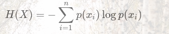
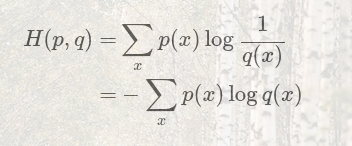
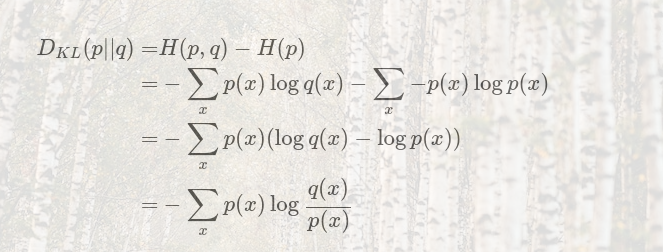
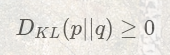
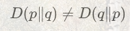
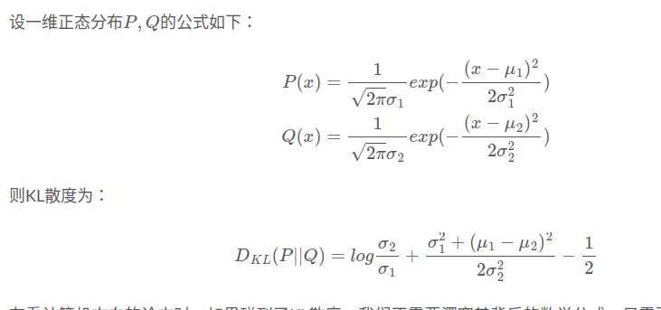

# 性能评估
二分类指标

当数据异常不平衡时，Accuracy评估方法的缺陷尤为显著。

# 损失函数

L1，L2损失，利用均方差更容易求解，但平方绝对误差则对于异常值更稳健

 平方误差损失函数（线性回归用的，在Gaussian噪声的假设下，最大似然可以推导出最小二乘）
 对outlier点很敏感（因为惩罚是指数增长的，左图的两个outlier将分类面强行拉到左边，得不到最优的分类面）

最小二乘是在欧氏距离为误差度量的情况下，由系数矩阵所张成的向量空间内对于观测向量的最佳逼近点

 L1正则化假设了模型的先验概率分布服从拉普拉斯分布；L2正则化假设了模型的先验概率分布服从高斯分布。

 对数损失函数， 或者叫最大似然损失函数

# 信息熵

信息论中，熵代表着根据信息的概率分布对信息编码所需要的最短平均编码长度。
最短的平均编码长度 = 信源的不确定程度 / 传输的表达能力

信息熵是求-log2(p)的期望，可以看做概率高的就给尽可能短的编码，
这样的话，平均下来，对于一定的信息总量，需要的编码总长度就会少一些,log2就表示用二进制进行编码, 负数相当于是log2(1/p)，这个过程跟Huffman编码很相似

https://zhouyifan.net/2022/10/13/20221012-entropy/

## 交叉熵

交叉熵作为深度学习常用的损失函数，可以理解为是KL散度的一个特例

可理解为用q(x)编码p(x)时，需要的信息量

在机器学习中，我们会为分类任务使用交叉熵作为损失函数。这正是利用了交叉熵不比熵更大这一性质。让我们以猫狗分类为例看看这是怎么回事。

## kl散度

KL 散度通常用来度量两个分布之间的差异。KL 散度全称叫kullback leibler 散度，也叫做相对熵（relative entropy）

kl(p||q) 散度相当于我们使用q(x)作为编码时，丢失的信息量，或者说增加的平均编码长度

公式相当于把信息熵的1/p替换成q/p. 也可以理解成交叉熵和真实信息熵之间的差

https://zhuanlan.zhihu.com/p/292434104

其他性质:
https://hsinjhao.github.io/2019/05/22/KL-DivergenceIntroduction/

1. 在统计学意义上来说，KL散度可以用来衡量两个分布之间的差异程度。若两者差异越小，KL散度越小，反之亦反。当两分布一致时，其KL散度为0。正是因为其可以衡量两个分布之间的差异，所以在VAE、EM、GAN中均有使用到KL散度。
2. KL散度在信息论中的专业术语为相对熵。其可理解为编码系统对信息进行编码时所需要的平均附加信息量。其中信息量的单位随着计算公式中log
运算的底数而变化。
    * log底数为2：单位为比特(bit)
    * log底数为e：单位为奈特(nat)

3. kl散度具有正定性, 这个性质很好理解，因为信息熵就是最小编码，用q(x)建模怎么也有信息损失, 公式

4. KL散度并不是一个真正的度量或者距离，因为它不具有对称性：

KL散度常用来描述正态分布之间的差异。比如VAE（变分自编码器）中，就用了KL散度来比较估计的分布和标准正态分布。计算正态分布间的KL散度时，我们不用从头推导，可以直接去套一个公式。

## 互信息

https://mxxhcm.github.io/2018/12/23/entropy-cross-entropy-kl-divergence/

