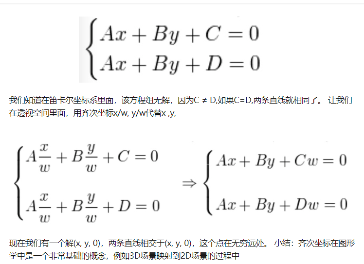
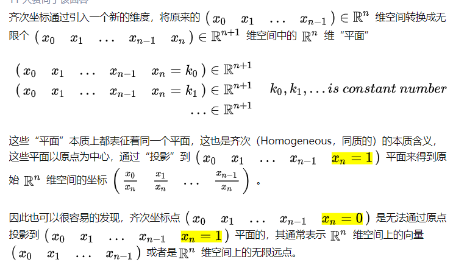

射影几何的话Hartshorne的Foundations of Projective Geometry不错…
后续的分支就是代数几何…里面会先讲affine再讲projective 

# 和其他领域的关系
图像处理、计算机图形学、计算机视觉和模式识别领域的区别和联系编程

计算机图形学是给定关于景象结构、表面反射特性、光源配置及相机模型的信息，生成图像。 而计算机视觉是给定图象，推断景象特性实现的是从模型到图像的变换，也就是说从图象数据提取信息，包括景象的三维结构，运动检测，识别物体等。 模式识别则是从特征空间到类别空间的变换。研究内容包括特征提取（ PCA，LDA，LFA，Kernel，Mean Shift，SIFT，ISOMAP，LLE）

图形学讲的是图形，也就是图形的构造方式，是一种从无到有的概念，从数据获得图像。数字图像处理是对已有的图像进行变换、分析、重构，获得的还是图像。PR本质就是分类，根据常识或样本或两者结合进行分类，能够对图像进行分类，从图像获得数据。

Computer Graphics和Computer Vision是同一过程的两个方向。Computer Graphics将抽象的语义信息转化成图像，Computer Vision从图像中提取抽象的语义信息。Image Processing探索的是从一个图像或者一组图像之间的互相转化和关系，与语义信息无关。

Computer Graphics，简称 CG 。输入的是对虚拟场景的描述，一般为多边形数组，而每一个多边形由三个顶点组成，每一个顶点包括三维坐标、贴图坐标、rgb颜色等。输出的是图像，即二维像素数组。
        
Computer Vision，简称 CV。输入的是图像或图像序列，一般来自相机或usb摄像头。输出的是对于图像序列对应的真实世界的理解，好比检测人脸、识别车牌。

Digital Image Processing，简称 DIP。输入的是图像，输出的也是图像。Photoshop中对一副图像应用滤镜就是典型的一种图像处理。常见操做有模糊、灰度化、加强对比度等。并发

能够简单地理解为：图像学更侧重于图像的字母表和语法部分；而计算机视觉更侧重于图像从语法到语义的部分；而数字图像处理侧重于图像的状态空间转化过程及总结其通常规律

CG 中也会用到 DIP，现今的三维游戏为了增长表现力都会叠加全屏的后期特效，原理就是 DIP，只是将计算量放在了显卡端。CV 更是大量依赖 DIP 来打杂活，好比对须要识别的照片进行预处理。最后还要提到近年来的热点——加强现实（AR），它既须要 CG，又须要 CV，固然也不会漏掉 DIP。它用 DIP 进行预处理，用 CV 进行跟踪物体的识别与姿态获取，用 CG 进行虚拟三维物体的叠加。

  数字图像处理主要是对已有的图像，好比说可见光的图像、红外图像、雷达成像进行噪声滤除、边缘检测、图像恢复等处理，就像用ps 处理照片同样的。人脸识别啊、指纹识别啊、运动物体跟踪啊，都属于图像处理。去噪有各类滤波算法；其余的有各类时频变化算法，如傅里叶变化，小波变换等，有不少这方面的书籍。

# 基础

比如那个圆锥曲线可以表示成切线乘以切点弦，竟然和特征矩阵有关，至于那个分式线性函数、透视与对合中心，都是计算机图形学里的必修内容。

冯克勤的《射影几何趣谈》。
任何椭圆，双曲线（其实就是二次型

# 齐次坐标

在欧氏几何空间，同一平面的两条平行线不能相交，这是我们都熟悉的一种场景。

然而，在透视空间里面，两条平行线可以相交，例如：火车轨道随着我们的视线越来越窄，最后两条平行线在无穷远处交于一点。
平行线在透视空间的无穷远处交于一点，但是在欧氏空间却不能，数学家发现了一种方式来解决这个问题。那就是齐次坐标。

简而言之，齐次坐标就是用N+1维来代表N维坐标

$$ (x,y,w) = (\frac{x}{w}, \frac{x}{w})  $$
你会发现(1, 2, 3), (2, 4, 6) 和(4, 8, 12)对应同一个Euclidean point.任何标量的乘积，例如(1a, 2a, 3a) 对应 笛卡尔空间里面的(1/3, 2/3) 。因此，这些点是“齐次的”， 于无穷远的点，w等于0。

简而言之，齐次坐标就是用N+1维来代表N维坐标。
我们可以在一个2D笛卡尔坐标末尾加上一个额外的变量w来形成2D齐次坐标

欧式空间中，使用用笛卡尔坐标系 ，对应的， 在透视空间中，使用齐次坐标系 。
齐次坐标用n+1维，对应表示笛卡尔坐标的n维，比如：(x', y', w) -> (x'/w, y'/w, w), 相应的无穷远也就可以用(x', y', 0)表示。
第三个维度 w=0 代表二维平面的向量，w=1 代表二维平面的一个点。

仿射变换，是一次空间线性变换，或多次不同空间线性变换的组合 。经过仿射变换后，直线还是直线，圆弧还是圆弧，互为平行线还是互为平行线，但是，不能保证线段的长度和线段之间的夹角角度不变。
引入齐次坐标的变换矩阵可以表示平移（仿射变换）。

在机器人及自动驾驶中，经常用齐次变换矩阵将旋转和平移进行统一。也可用于坐标系转换（坐标系不变换角度的话，都是直角坐标的情况，只涉及平移和旋转）

https://zhuanlan.zhihu.com/p/116014583

