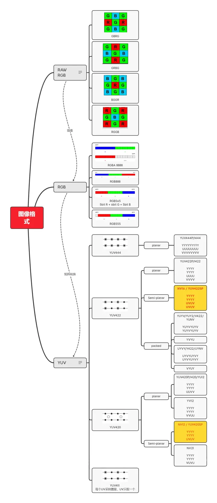
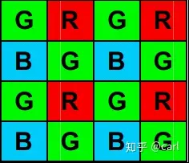
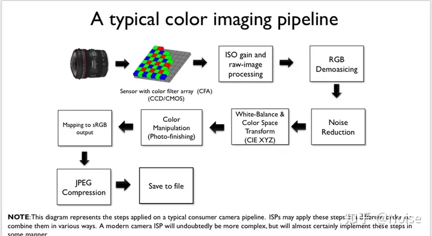
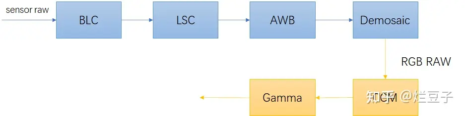

# 图像格式

## raw 格式

一般称为bayer raw

对于彩色图像，需要采集多种最基本的颜色，如rgb三种颜色，最简单的方法就是用滤镜的方法，红色的滤镜透过红色的波长，绿色的滤镜透过绿色的波长，蓝色的滤镜透过蓝色的波长。如果要采集rgb三个基本色，则需要三块滤镜，这样价格昂贵，且不好制造，因为三块滤镜都必须保证每一个像素点都对齐。当用bayer格式的时候，很好的解决了这个问题。bayer 格式图片在一块滤镜上设置的不同的颜色，通过分析人眼对颜色的感知发现，人眼对绿色比较敏感，所以一般bayer格式的图片绿色格式的像素是是r和g像素的和。

由于采集到的bayer raw呈周期性的排列，我们也把这个叫做mosaic图，重建还原RGB raw的算法，也就叫做demosaic算法。

https://zhuanlan.zhihu.com/p/539846781
https://zhuanlan.zhihu.com/p/72581663

bayer raw格式后续需要通过isp算法转换成人眼方便看的图像，这个过程可能丢失信息.

图像从曝光到isp处理，再通过专用芯片压缩图像，通过usb线缆或者以太网线缆到计算机会有60ms到170ms的延时，传输yuyv格式大约60ms，mjpeg大约170ms，这其中很大一部分时间都花在了图像压缩与解码中

特斯拉尝试直接使用raw图像

接使用bayer pattern作为输入，少了很多为了人眼而hand-crafted的流程，也减少了很多因此而产生的不稳定性。举例两个比较直接的：由于光源突变导致的白平衡突变。夜间低信噪比的时候，为了迎合人眼去做不必要的denoise。但是，这个做法为工程同学带来了大量的不便，无论从存储，传输还是可视化上。也是举例几个比较直接的难题：raw image没有合适的codec，传输方面，一路10Hz 8bit的1080P图大概就要占据20M/s的带宽。存储方面，如果直接存储的话同样硬盘爆炸，如果用通用的压缩算法的话，cpu资源爆炸。raw image无法直接展示，replay和debug的时候还是需要至少经过demociaking。

https://njuvision.github.io/rho-vision/

## yuv

YUV 是一种色彩编码方法，Y 表示明亮度（Luma），就是灰度图。U 和 V 分别对应 Cb（蓝色色度分量） 和 Cr（红色色度分量），代表色度（Choma），作用是描述影像色彩及饱和度，用于指定像素的颜色。

YUV 格式可以比 RGB 格式储存空间小。

分类方式根据采样的不同，分为 YUV444，YUV422，YUV420。

YUV444：每个像素点同时包含 Y/U/V 3个参数。
YUV422：每2个像素点共享一组 U/V 参数，同时每个像素拥有自己的 Y 参数。
YUV420：每4个像素点共享一组 U/V 参数，同时每个像素拥有自己的 Y 参数。

确定了采样方式之后，数据的排列又分为3种：

planar：把 Y 数据，U 数据和 V 数据单独放置3块位置，形成3个平面。
semi-planar：把 Y 数据独立，UV 数据放在一起，形成2个平面。
packed：YUV 数据打包在一起，无论单独的 Y 数据 U 数据还是 V 数据，地址都不是连续的。

https://zhuanlan.zhihu.com/p/559189793

# codec

https://www.zhihu.com/question/22501094

https://zhuanlan.zhihu.com/p/553864743

https://zhuanlan.zhihu.com/p/638259036

https://zhuanlan.zhihu.com/p/647390304

# isp

如何从bayer raw转换得到一张勉强凑活能看的rbg图呢？一般来说，在不考虑过多的效果要求下(又不是不能看.jpg)下，一个极简的isp pipe应该图3.1这个样子的:

BLC：black level correction
LSC：Lens shading correction
AWB：Auto white balance
CCM：Color correction Matrix

https://zhuanlan.zhihu.com/p/645873125

https://zhuanlan.zhihu.com/p/570361279
https://zhuanlan.zhihu.com/p/142349249
https://zhuanlan.zhihu.com/p/552749584

https://www.zhihu.com/question/580402114

H.264 是视频压缩标准。H.264 压缩已成为主流，今天几乎每个 IP 相机和录像服务器都提供这种压缩方法。H.264 消除了 MJPEG（高品质、高带宽和高存储耗费）和 MPEG-4（低质量、低带宽和低存储耗费）之间的巨大差距。H.264 还包含选项的第二“层”，称为“配置文件”。这些配置文件提供不同的编解码器的效率，并将影响传输视频的整体质量以及带宽和存储空间的消耗。目前提供了不同的 H.264 配置文件。其中仅有三种是监控应用中所常用的，包括：Baseline 配置文件 (BP)、Main 配置文件 (MP)和 High 配置文件 (HiP)。

存raw大概一分钟5g，存h264一分钟才15mb，的确差好多了[捂脸]

# 视频压缩

视频压缩原理
视频数据中的冗余信息
时间冗余：视频中的相邻两帧之间内容相似，存在运动关系。
空间冗余：视频中的某一帧内部的相邻像素存在相似性。
编码冗余：视频中不同的数据出现的概率不同。（参考熵编码，比如游程编程、哈夫曼编码）
视觉冗余：观众的视觉系统对视频中的不同部分敏感程度不同。（参考JPEG压缩）

## h264

https://www.erenship.com/posts/1db7.html

http://www.enkichen.com/2017/11/26/image-h264-encode/
https://juejin.cn/user/1311062343296222/posts

https://linzhipeng.top/2021/04/24/%E9%9F%B3%E8%A7%86%E9%A2%91/H.264%E5%9F%BA%E7%A1%80%E7%9F%A5%E8%AF%86%E6%80%BB%E7%BB%93/

H266

https://www.midlane.top/wiki/pages/viewpage.action?pageId=49677194
