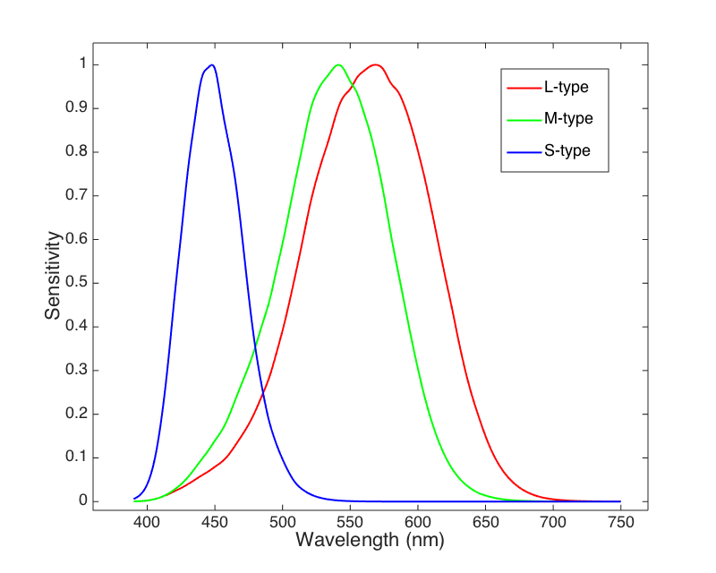
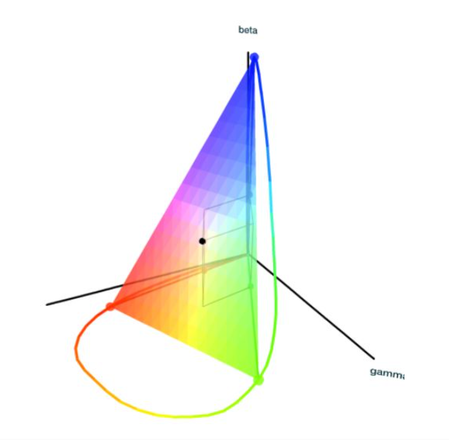
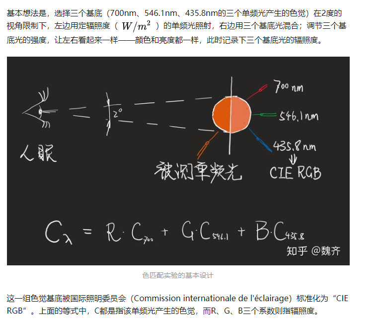
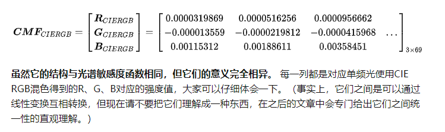
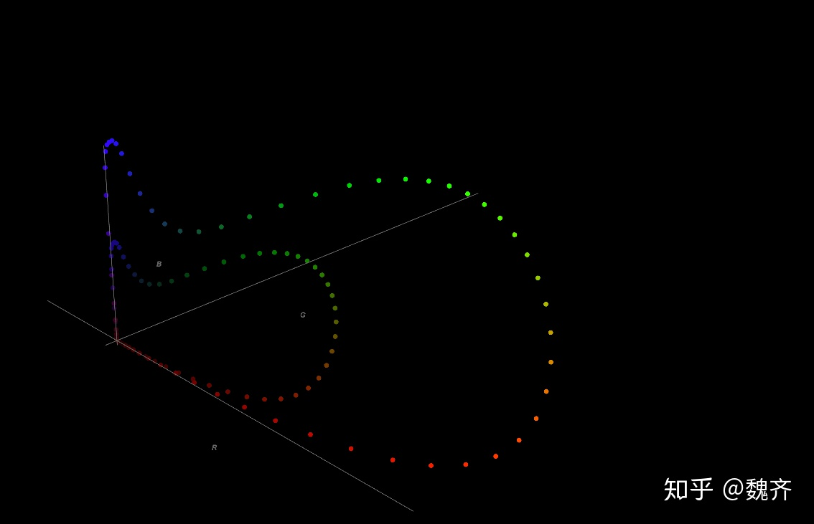
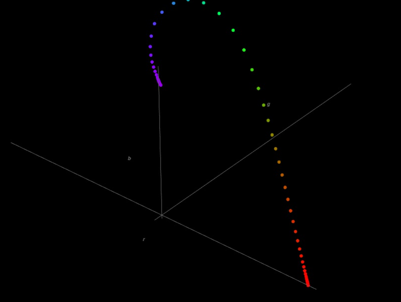
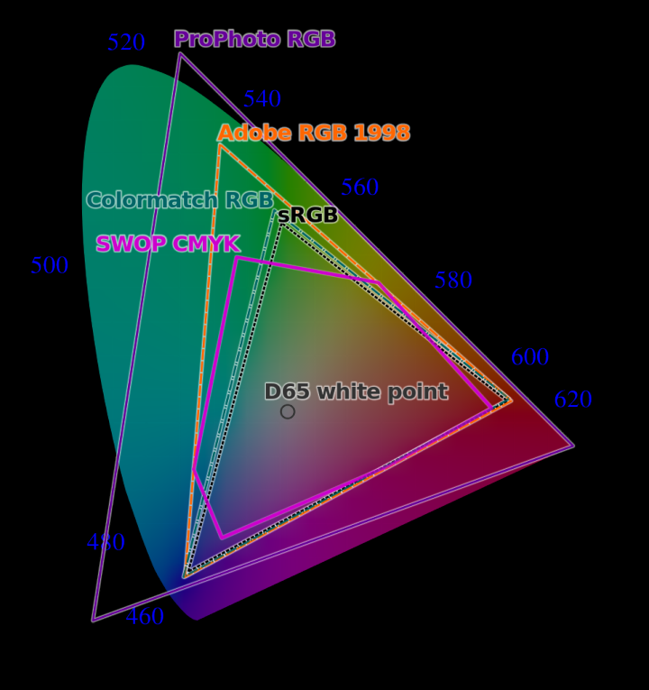
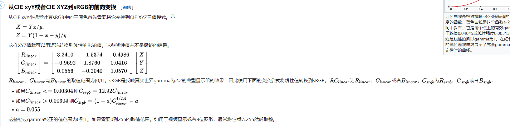

# 图像概念

像素：pixel，这个单词是picture和element两个单词字母组成，像素是图像显示的基本单位。通常说一张图片的分辨率大小是1920*1080，意思是长度是1920个像素点，宽度是1080个像素点，乘积是1920*1080=2073600，也就是说这个图片是200万像素。

PPI：Pixels Per Inch，即每英寸像素。也就是手机屏幕上每英寸面积到底能存放多少个像素点。理论上屏幕PPI越高，屏幕越精细，画质相对更出色。

分辨率：图像的尺寸，长和宽。

1080P：一种视频显示格式，P是逐行扫描，数字1080表示垂直方向有1080条水平扫描线。通常1080p的画面分辨率为1920*1080。

帧率：每秒显示的图片数。

码流(码率)：是指视频文件在单位时间内使用的数据流量。同样分辨率下，视频文件的码流越大，压缩比就越小，画面质量就越好。

RGB：从颜色发光的原理推演出来的，自然界的任何颜色都可用红黄绿三色混合而成，亮度等于三色亮度之总和，越混合亮度越高，即加法混合。

YUV：优化彩色视频信号的传输，使其向后兼容老式黑白电视。Y表示明亮度（Luminance或Luma），也就是灰阶值；而UV则表示色度（Chrominance或Chroma），描述影像色彩及饱和度，用于指定像素颜色。YUV是大多数视频编码所需要的的数据格式。

YCbCr：YUV经过缩放和偏移的翻版。其中Y与YUV中Y含义一致，Cb和Cr同样指色彩，只是在表示方法上不同而已。Cb指蓝色色度分量，Cr指红色色度分量。

PTS：Presentation Time Stamp，显示时间戳，用来告诉播放器什么时候显示这一帧数据。是一个持续增长的数字，可以通过一个时间基数除以“帧率（fps）”来获得。
-----------------------------------
图像基础
https://blog.51cto.com/u_15067237/4293984

# 色彩空间

所谓颜色，只是眼镜对接受到的光谱的一种响应，不同的光，眼睛也可能看做成相同的颜色，所以，并不是红光加绿光变成了另一个波长的黄光，而是我们的眼睛无法将二者区分。
除了单频光产生的颜色之外，其它所有颜色都可以通过无数种光谱能量分布达到，这就是常说的异谱同色现象。实际的光-眼睛做了损失信息的信息转换-信息在心理上产生色觉。而色觉本身可以自由地线性混合。

光本身只是一种波，不同频率，振幅的波，人眼会有不同的识别反应（色彩）。
大部分人类的视网膜上有三种感知颜色的感光细胞，叫做视锥细胞，分别对不同波长的光线敏感，称为 L/M/S 型细胞。三种视锥细胞最敏感的波长分别是橙红色（长波，Long），绿色（中波，Medium），蓝色（短波，Short）。这三种视锥细胞的归一化感光曲线如下图

红绿两个曲线很相近，这也是红绿色盲产生的原因之一。

我们感受到的颜色，就是三种细胞对某一个波长（频率）的光的响应（三个强度值），这通常称为色觉，色觉有绝对性，可用三个值定量描述。

人类眼睛对不同颜色光线混合的反应还是 线性 的， 线性组合后的响应就是单独响应的线性组合。只要定量描述了每一频率下单频光的色觉，就可以通过加权相加的方式求出任意光谱能量分布的色觉。
正因为这种线性特性，除了单频光产生的颜色之外，其它所有颜色都可以通过无数种光谱能量分布达到（所有不同频率的光，响应强度相加，得到的三维强度相同），这就是常说的异谱同色现象。

正因为这种特性我们可以用线性代数的方法建模颜色（光谱响应）。
最直观的想法就是，因为三种细胞分别对三种特定波长的光100%响应，然后又因为线性叠加性质，我们可以用这三种光叠加，使得产生的光跟某一特定波长的光得到相同的色觉。
因此我们可以直接对色觉进行建模，然后衡量每一种波长光的色觉信息，按照线性叠加原则我们就可以求解出任意光信号（光谱能量分布，多种光波的混合）的色觉。

## 色匹配函数

色觉明显是一个三维空间，各种不同波长的光波对应了三维空间中的某个点，我们可以找到三个单频光产生的色觉作为基，用色匹配实验定量测量了所有单频光的值，以辐照度为单位。就可以得到色匹配函数。而光谱上每种光的强度是三维空间中的一条曲线。

这实际上是一个锥体（因为由曲线上的向量线性组合得到。按照线性代数，我们可以找到一组新的基，将所有的向量投影到这一组基上。
很明显我们可以选择三个单频光产生的色觉（三个强度值）作为基底，构建一个变换矩阵，但是实际上我们是不知道具体的强度值的，但是我们可以通过控制光幅度，来算出比例即可。

最后得到的色匹配方程（Color Matching Function）（波长范围取380nm-720nm，波长梯度为5nm）

就这样，整个可见光范围的所有单频光产生的色觉，就被定量表示成三个基底色觉的混合值了。
将等能量单频光产生的色觉（并以CIE RGB为基底表示）画在直角坐标系内，会形成一个闭合曲线，380nm和720nm的两个端点将在原点相交。就这样，我们得到了第一个“色觉地图”，它的基底是CIE RGB，坐标值与基底色光的辐照度成正比。

## rgb色彩空间

这个色彩地图实际上呢并不完善，因为同一颜色、不同亮度对应着不同的色觉坐标。
色匹配实验是以“辐照度（W/m^2）”为坐标值的，但是辐照度与人所感知的“亮度“并不是一回事：人对亮度的感知可以抽象成一个独立于色彩感知之外的“光感受器”。这意味着它有一个单独的“光谱敏感度函数”.
称为V（lambda), 通过这个函数，对每一波长的辐照度进行加权运算，得到的就是人所感知的亮度.

在上面我们构造的色觉地图中，对于同一个颜色、不同的辐照度，在“色觉地图”中将对应不同的点：各种色彩、明暗显然都会带来不同的感觉。但是如果我们想把同一个颜色用一个坐标表示，建立一个“颜色图”呢？

可以用“相对值”来表示， 我们分别计算r = R/(R+G+B), 经过这样一处理，rgb空间中的任何颜色都与辐照度无关，每一个点都代表了所有辐照度下的同一个颜色。而且rgb三者之和为1，所以有知二求三的性质。

最后我们得到的“单频光色”轮廓为

我们应当心里清楚rgb空间是从CIE RGB坐标系转换过来的（也许它应当叫CIE rgb），所以三个坐标轴必然与“单频光色”轮廓相交.
由于rgb坐标有“知二求三”的性质，所以我们可以垂直着看rg面，而不损失任何信息。

至此，我们获得了一个“色觉地图”（CIE RGB坐标系表示），和一个“颜色图”（rgb坐标系表示，且色彩间亮度不同），需要特别注意的是，它们之间不可以通过线性变换互相转换，RGB到rgb的转换过程是损失信息的。

“色觉地图“的混色方式：向量运算， “颜色图“（舌型图)的混色方式：“凸集内一点“， 因为颜色图实际上色觉地图做了归一化后得到的（也就是在x+y+z平面的投影）。
所以我们在“颜色图”中，只能知道几个基色混合的所有结果的集合，但并不能在图中进行精确地计算。
我们选取一组基底，实际上只是构成这个图中的一个三角形。

## CIE-XYZ

从色觉的线性性中得知，我们可以任意选择一组基来表示“色觉地图”，也就是说，对于一组色匹配实验数据（如CIE 1931 2-deg），通过线性变换，可以有无限种方式去表达它。
为了解决之前CIE RGB坐标系和其对应的rgb空间的问题，设计了XYZ坐标系和对应的“颜色图”——xyz空间，考虑到了：XYZ下全为正数；xy中全小于1；在CIE RGB到XYZ的变换中，绝对中灰的坐标不变；XYZ引入了亮度信息，可以不再被“辐照度”所束缚。

（RGB坐标表示的）色觉空间是描述所有色觉的，既包含颜色，也包含亮度；而rgb空间企图把颜色和亮度分离开来，但可惜的是，它只做到了“辐照度无关”：简而言之，rgb中的颜色之间的亮度大不相同。我们需要找到别的表示方式/色觉空间，来表达亮度，饱和度。

https://zhuanlan.zhihu.com/p/100228286
## 非线性色彩空间
 RGB 颜色空间是一种均匀性较差的颜色空间。如果颜色的相似性直接用欧氏距离来度量，其结果与人眼视觉会有较大的偏差。对于某一种颜色，我们很难推测出较为精确的三个分量数值来表示。

所以，RGB 颜色空间适合于显示系统，却并不适合于图像处理。

色品图的边界，可以发现不同波长的光分布的疏密程度是不同的，这意味着在这个空间中，颜色的分布是不均匀的，这种不均匀性是人们不愿意看到的。
麦克亚当椭圆（MacAdam ellipse）这个实验证实了，在一定范围（比如上图中的椭圆）内，人是无法分辨颜色差异的。这个实验结果重要的意义在于，它直观明了地揭示了 CIE XYZ 这个空间在色彩分布上的不均匀。而麦克亚当椭圆，在这里的意义近似于微分几何中的 度规张量（Metric Tensor 微分几何）

https://zhuanlan.zhihu.com/p/72803768

很明显除了RGB，我们还能找到别的正交基来构建新的色彩空间，比如亮度。
亮度≠辐照度。若假设视觉对亮度的感知是色匹配函数的线性组合，便可以把”亮度“作为三个基中的一个，而它就是Y。

# 亮度
颜色是存在在人类的知觉里的，并不存在在现实中，混合颜色实际上是在知觉（响应）上混合

光度学与辐射度滨区别就是，光度学只限于可见光范围内（380nm-780nm），并以人眼的视觉特性为基础。
到底什么是人眼的视觉特性呢？就是“眼前的黑不是黑 你说的白是什么白”，人眼看到的亮，不一定真的亮，要用辐射通量乘上视觉函数才可以，视觉函数V(lambda), 代表波长lambda的光的单位辐射的响应亮度函数。

每一种颜色都具备亮度/明度，饱和度和色相，也就是给定一个RGB，其中每一个分量都包含都三种信息。
可以这么简单的理解:色相反映rgb三个值都减去最小值(灰色)之后剩下的值的比例关系，亮度反映三个值的绝对大小，饱和度反映灰色含量的大小，饱和度越高灰色越小，当然这些关系实际上都不是线性变换的关系。

如何区分并记忆光度、照度、发光强度、光强、亮度等以及对应的单位？ - 李刚的回答 - 知乎
https://www.zhihu.com/question/53080536/answer/133398317

亮度、饱和度、对比度，所有的颜色属性都是建立在操作像素之上的。转到不同的颜色空间，对其对应的值进行调整，就产生了亮度、饱和度等颜色属性的调整。比如，亮度的调整，先将rgb转到hsl或者其他带亮度的颜色空间，对于l通道的每个像素值进行调整，如果要调亮，就全部加一定的数值，调暗就减数值，这个数值的大小，完全随心情，并没有什么科技含量。

