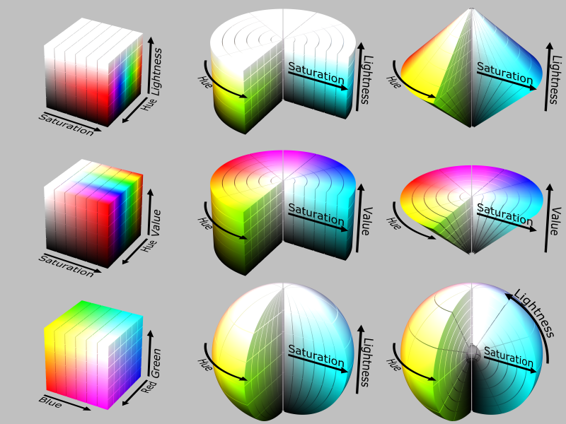
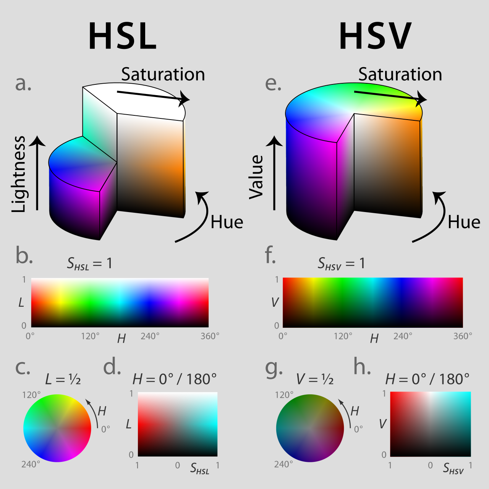
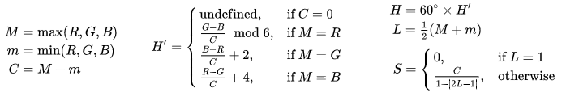
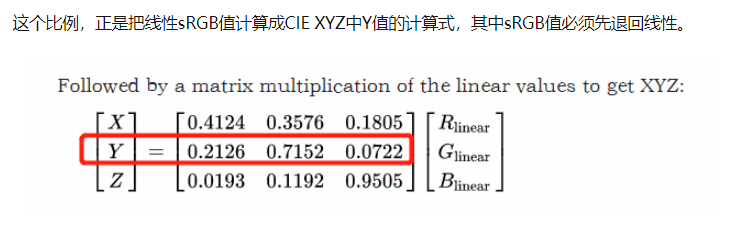
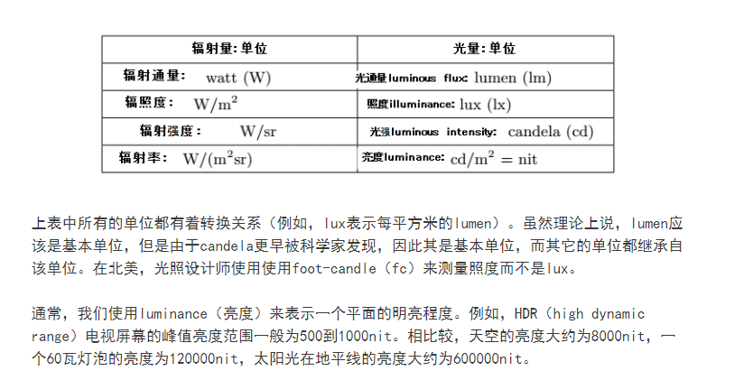
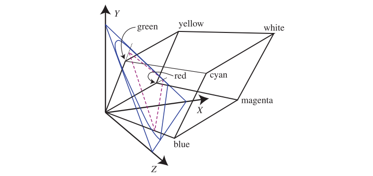
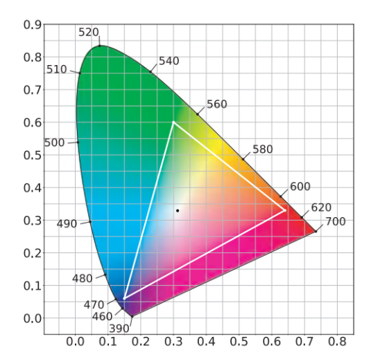
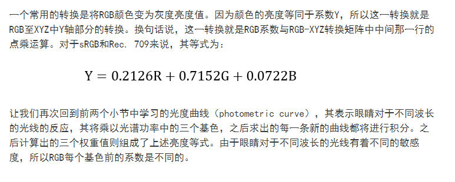
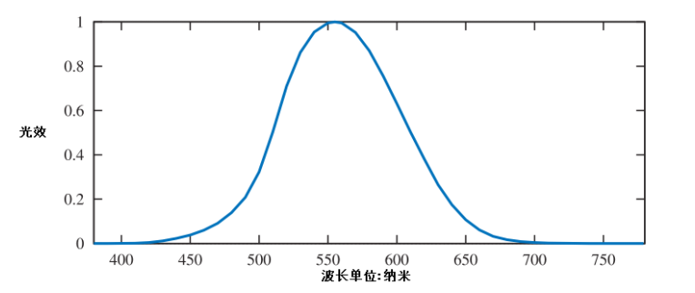
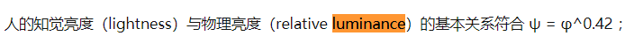

# HSL和HSV

HSL 空间是把 RGB 空间经过一个非线性变换得到的。在一个空间中改变一个参数，往往导致另一个空间中三个参数都改变，体现出「牵一发而动全身」的效果。

常见颜色rgb.
 白色RGB(255，255，255）, 灰色r=g=b, 黑色r=g=b=0, 灰色是黑色到白色之间的过渡，他们的饱和度都是0.

1. 色相（hue）是色彩的基本属性，就是平常所说的颜色名称，如红色、黄色等。它是光波混合中与主波长有关的属性。注意灰度图像是没有色相的概念的。
2. 饱和度（S）是指色彩的纯度或者某种颜色混合白光的数量。饱和度越高色彩越纯，低则逐渐变灰，最终变为白色，取0-100%的数值。饱和度为0时，图像就为灰度图像。
3. 明度（V）可以理解为某种颜色混入黑色的数量。取0-100%。
亮度（L）是一种主观的描述子，实际上它是不可度量的。它体现了无色的强度概念，并且是描述彩色感觉的关键因子。取0-100%。  

HSL和HSV二者都把颜色描述在圆柱坐标系内的点，这个圆柱的中心轴取值为自底部的黑色到顶部的白色而在它们中间的是灰色，绕这个轴的角度对应于“色相”，到这个轴的距离对应于“饱和度”，而沿着这个轴的高度对应于“亮度”、“色调”或“明度”。
饱和度的取值范围从0到1，0对应于垂直轴的中心线（也就是说这条线上没有色彩，只有灰度）.

这两种表示在目的上类似，但在方法上有区别。二者在数学上都是圆柱，但HSV（色相、饱和度、明度）在概念上可以被认为是颜色的倒圆锥体（黑点在下顶点，白色在上底面圆心），HSL在概念上表示了一个双圆锥体和圆球体（白色在上顶点，黑色在下顶点，最大横切面的圆心是半程灰色）。注意尽管在HSL和HSV中“色相”指称相同的性质，它们的“饱和度”的定义是明显不同

灰度图只对应于圆柱的中心轴。

 

W3C的CSS3规定声称“HSL的优点是它对称于亮与暗（HSV就不是这样）…”，这意味着：

在HSL中，饱和度分量总是从完全饱和色变化到等价的灰色（在HSV中，在极大值V的时候，饱和度从全饱和色变化到白色，这可以被认为是反直觉的）。
在HSL中，亮度跨越从黑色经过选择的色相到白色的完整范围（在HSV中，V分量只走一半行程，从黑到选择的色相）。

一般说来，人眼最大能区分128种不同的色彩，130种色饱和度，23种明暗度。如果我们用16Bit表示HSV的话，可以用7位存放H，4位存放S，5位存放V，即745或者655就可以满足我们的需要了。

HSV在用于指定颜色分割时，有比较大的作用。用H和S分量来表示颜色距离，颜色距离指代表两种颜色之间的数值差异。     Androutsos等人通过实验对HSV颜色空间进行了大致划分，亮度大于75%并且饱和度大于20%为亮彩色区域，亮度小于25%为黑色区域，亮度大于75%并且饱和度小于20%为白色区域，其他为彩色区域。

HSL 中的  （Lightness）分量为亮度，亮度为100，表示白色，亮度为0，表示黑色；HSV 中的 （value，Brightness） 分量为明度，明度为100，表示光谱色，明度为0，表示黑色。

在Hue一定的情况下，饱和度减小，就是往光谱色中添加白色，光谱色所占的比例也在减小，饱和度减为0，表示光谱色所占的比例为零，导致整个颜色呈现白色。

明度（value）减小，就是往光谱色中添加黑色，光谱色所占的比例也在减小，明度减为0，表示光谱色所占的比例为零，导致整个颜色呈现黑色。

HSV 对用户来说是一种比较直观的颜色模型。我们可以很轻松地得到单一颜色，即指定颜色角，并让V=S=1，然后通过向其中加入黑色和白色来得到我们需要的颜色。增加黑色可以减小V而S不变，同样增加白色可以减小S而V不变

## rgb和HSL的转换

1. Hue 叫色相，表示了颜色在色环上的角度。纯红色位于 0 度，纯绿色位于 120 度，纯蓝色位于 240 度。具体计算时，角度主要由 RGB 中最大的那个决定，由次大的那个进行修正。
2. Lightness 叫亮度，具体计算公式是 RGB 中最大值与最小值的平均值。
3. Saturation 叫饱和度，表示的是 RGB 三个值的对比有多强烈。其算式中分子 C 是 RGB 中最大值与最小值的差值，但当 L 特别大或特别小的时候，C 的范围有限，为了把它归一化到 [0,1]，又除了个与亮度有关的分母。

相应地调整方法
1. 调整色相：由于亮度、饱和度都只与 RGB 中的最大、最小值相关，所以若要仅调整色相，就要调整绿色 G 的值。增大 G 的值会让色相更偏向绿色，即减小，G = B 时色相最小，为 180 度；反之，减小 G 则会让色相增大，G = R 时色相最大，为 240 度。

2. 调整亮度：要调整亮度，主要靠调整值最大和最小的 B 和 R，但要注意保持色相和饱和度不变。当 L < 0.5 时，饱和度 S 的公式可以简化为 (M - m) / (M + m)。为了保持饱和度不变，B 和 R 要同比例增减，增时亮度增加，减时亮度降低。为了保持色相不变，G 也要同比例增减。

3. 调整饱和度：同样，调整饱和度靠的也是 B 和 R。为了保持亮度不变，其中一个增加多少，另一个就要减小多少。增大 B、减小 R 可以让饱和度增加；减小 B、增大 R 可以让饱和度降低。为了保持色相不变，也要调整 G 使它与 B、R 的差值之比与原来相同。上面的各种调整都要注意不能超过 0 <= R <= G <= B <= 1 的范围。一旦超过，调整方法也会改变。

# gamma

当前在计算机硬件中采取每一像素用24比特表示的方法，所以三种原色光各分到8比特，每一种原色的强度依照8比特的最高值28分为256个值

RGB三个通道的像素值表示的是R、G、B的强度，这里的强度不同于HSV空间中的明度V，也不同于HSL空间的亮度L。

由于gamma校正，在计算机显示设备上的颜色输出的强度通常不是直接正比于在图象文件中R, G和B像素值。计算机显示器在显示 (0.5, 0.5, 0.5)时候的光强度通常（在标准2.2-gamma CRT/LCD上）是在显示 (1.0, 1.0, 1.0)时候的大约22%，而不是50%。通过三元素相加模型，可以组合出各个颜色的光，但是人类对于暗部信息比较敏感，所以显示器会经过gamma校正，让人眼看起来更加舒服。由于gamma校正，对于显示器而言，256级别不表示同等间隔的强度。

# 亮度与灰度

rgb和hsv空间都是与亮度无关，都是将辐射强度设置为常数时，测量处理的颜色属性。

saturation are defined as attributes of perception, they can not be physically measured.
灰色的RGB值相等，位于白色和黑丝之间。灰色的饱和度都是0.

需要强调一点，灰度不是仅仅指灰色的属性，所有颜色都具有灰度属性，灰度属性表示的是这个颜色具有的亮度（intensity)

a greyscale or image is one in which the value of each pixel is a single sample representing only an amount of light; that is, it carries only intensity information. 
The intensity of a pixel is expressed within a given range between a minimum and a maximum, inclusive.

Greyscale images can be the result of measuring the intensity of light at each pixel according to a particular weighted combination of frequencies (or wavelengths).

here are 8 bit s in the binary representation of the gray level, this imaging method is called 8-bit grayscale.

白色是明亮的颜色，而灰色被认为是不太亮的白色。换句话说，白色和灰色的色度是一样的，而明度不同。
颜色的亮度代表的是同样的单位辐射下，人眼对这种颜色感受到的亮度，亮度是完全基于人眼的响应的。

而灰度是衡量色彩的光照密度的一种方法，也可以理解为亮度。
人眼对RGB每个分量的亮度响应都不一样，因此需要不同的系数计算灰度。

提取灰度的方法有很多，最常见的有
1. r,g,b平均值
2. luma就是指的CIE XYZ中的相对Y值在sRGB的gamma下的表达，也是rgb的加权平均，因为人眼对rgb颜色的响应都不一样，所以用不同的权重更准确。
3. 也可以用HSL中的L表示（也就是rgb最大值，最小值的平均）。
甚至直接用rgb的平均值表示。

二值化则是直接作用于灰度图，按照阈值，划分为0或者1

The critical task is to find a suitable threshold. There are two main methods:

Local thresholding — calculates the threshold pixel by pixel
Global thresholding — calculates the threshold once for all pixels

计算Golbal thresholding, 常见的一个方法就是用直方图。
The image histogram is a type of statistical graph with grayscale value on the x-axis and the number of pixels for each grayscale on the y-axis.   
直方图：表示图像中具有某种灰度级的像素的个数，反映了图像中每种灰度出现的频率。是图像最基本的统计特征。
The basic idea is to find a point between the peak of the foreground pixel values and the peak of the background pixel values.

https://zhuanlan.zhihu.com/p/31840238

Sometimes the scale is reversed, as in printing where the numeric intensity denotes how much ink is employed in halftoning, with 0% representing the paper white (no ink) and 100% being a solid black (full ink).

只是区分的话我就不把这两个量的定义抄上来了。知道并用过这两个量定义的人应该很容易区分。先讲总结，后面补上例子。第一个区别，亮度是人去描述光能的量，而灰度是一个强行认为去定义的量。第二个区别，亮度可以描述任何颜色（波长）的光能，而灰度只能描述黑白（灰）。例子一，一格黑白电影的底片，其上每一个图案的灰度都是固定的，但其亮度取决于放映机的灯光打得多亮。

# 光度学和辐射测量学
辐射度量能够测量不同类型电磁辐射：能量，功（一段时间内的能量），与基于区域，方向或者两者皆有的功的密度。这些单位都总结在下表中。

在辐射度量中，基本单位是辐射通量（radiant flux），Φ。辐射通量是一段时间内的辐射能量，单位为瓦特 （watts，W）。

辐照度（irradiance）则是某一区域内的辐照通量的密度，例如，dΦ/dA。辐照度基于区域，面积进行定义，一般为物体的表面。其单位为瓦特每平米。

辐照强度（radiant intensity），I，其是基于方向，更准确地说，是基于立体角（dΦ/dω）的辐射通量。其单位是瓦特每立体弧度。

最后是辐射率（radiance），L，其表示单一射线中的电磁辐射。更准确地说，它是基于面积与立体角的辐照通量的密度（d2Φ/dAdω）。该面积是与射线垂直的平面的面积。如果辐照率以某种方向通过物体的表面，那么我们需要使用余弦因子进行调整，计算出投影面积。

辐照率由眼睛或者camera测量（我们将在第九章中学习），所以这一变量对于渲染来说非常重要。而我们计算着色等式的目的就是计算射线的辐照率。因此，射线的辐照率L是第五章中的cshaded基于物理渲染的变量。而辐照率的单位是瓦特每平方米每立体弧度。

我们可以将辐照率认为是一个带有五个或者六个参数（包括，波长）的函数，其也被称为辐照率分布（radiance distribution）。其中的三个变量表示位置，另两个则表示方向。这个函数描述了空间中所有的光线。渲染的过程，我们可以理解为，眼睛与屏幕定义了一个坐标点以及一组方向（例如，光线穿过每一个像素），该函数将基于眼睛的位置计算每一个射线方向。而基于图像的渲染（我们将在第十三章中学习）使用了一个相关的理念，其被称为light field。

在着色等式中，辐照率通常以Lo(x,d)或者Li(x,d)的形式出现，其表示辐照率从点x射出或者进入该点。方向向量d表示射线的方向，一般来说意味着射线从点x以d的方向射出。

辐照率的一个重要的特点是其不受距离影响。换句话说，无论物体表面距离camera多远，其辐照率不会改变。

所有的辐射量都拥有光谱分布。由于这些分布就是波长上的密度，它们的单位是原始的辐射量除以纳米。例如，辐照度的光谱分布的单位是瓦特每平米每纳米。

在渲染时，我们并不会使用所有的光谱功率而是使用RGB来表示辐射量。在之后的小节中，我们将为大家解释这三个变量是如何与光谱分布相关联的。

辐射测量学只研究物理量，不考虑人的感知。而亮度其实是人对光的感知。我们需要通过一个光度函数/曲线将辐射通量，转换成光照。

radiometry（辐射度量）只与物理量有关，其并未考虑人类的感知。另一相关的领域，photometry（光度测量），其类似于辐射度量，但是其通过人类眼睛的敏感度来测量所有的变量。辐射量的计算结果将乘以CIE photometric curve（光度曲线）转换光度测量单位，该曲线表示眼睛对于不同波长的光的反应。

光度学的单位如下

色度空间有CIE-RGB， CIE-XYZ， CIE-XYZ现在是最流行的，他在单位辐射强度下测量出来的色匹配函数（每一个单位辐射强度下的光波，对应的x,y,z分量），此时Y可以看作在单位辐射强度下，这个颜色光波，眼睛能感知出来的相对亮度。X,Y,Z三种颜色实际上并不存在，只是给色彩空间找了一组比较好的正交基。

In the CIE 1931 model, Y is the luminance, Luminance is a photometric measure of the luminous intensity per unit area of light travelling in a given direction. It describes the amount of light that passes through, is emitted from, or is reflected from a particular area, and falls within a given solid angle.

The CIE XYZ color space encompasses all color sensations that are visible to a person with average eyesight. That is why CIE XYZ (Tristimulus values) is a device-invariant representation of color.

总结来说无论是，CIE-XYZ还是CIE-RGB，还是s-RGB,都是限制在单位辐照度的条件下，测量出的匹配函数（三个分量相应的系数），CIE-XYZ中的Y其实就是亮度，单位是Luminance. 但是要注意HSL中的L虽然是亮度，但是跟Y不一样，它没有单位，他是个百分比，或者说是相对亮度。
Z is quasi-equal to blue (of CIE RGB), and X is a mix of the three CIE RGB curves chosen to be nonnegative

将Y直接定义成亮度是有很明显的好处的，
一般来说，我们会将颜色分为亮度（luminance，brightness）和色度（chromacity）。色度指的是一个颜色的属性，其与亮度无关。例如，两种蓝色，一种较暗一种较亮，它们可能拥有相同的色度，但是亮度却不同。

因此，我们将颜色投影到X+Y+Z=1的平面，然后只保留x,z的值，因为Y代表的只是亮度，而没有色度信息，因此 for any given Y value, the XZ plane will contain all possible chromaticities at that luminance.

总的来说，我们会使用三个单一波长的光源来匹配其他波长的光源，从中计算出每个光源的占比。有时候，这三种单一波长的光源需要加上一些采样量以匹配待检测的光源。这意味着我们需要使用一组颜色匹配函数来修正三种光源的权重值，以保证其不为负数。有了非负颜色匹配函数之后，我们可以将任何光谱分布转换至一个定义颜色的色度与亮度的XYZ坐标系中，之后我们将该坐标系投影至xy平面，其表示颜色的色度，并将亮度变为常量。

现在我们只有一个x,y来表示色度，还需要一个维度表示亮度，一般用Y表示，最后得到的坐标称为xyY坐标，这里Y就是还没有归一化的Y，通过色匹配函数计算出来的，这里的Y就代表的单位亮度， Y的单位是Luminance。

色度能够告诉我们两种颜色是否匹配，但是其并不能告诉我们两个颜色的实际表现。而一个XYZ颜色的表现极大地取决于各种因素，例如光照，周边的颜色以及之前的状态。Color appearance models（CAM，颜色表现模型），例如CIECAM02，则试着告诉我们每一种颜色最终的表现。

由RGB空间至XYZ红箭的转换是线性的，我们可以通过RGB空间的基色与白点求出矩阵，来进行该转换。

色度能够告诉我们两种颜色是否匹配，但是其并不能告诉我们两个颜色的实际表现。而一个XYZ颜色的表现极大地取决于各种因素，例如光照，周边的颜色以及之前的状态。因为它其实只是在单位辐照度下测量出来的，Color appearance models（CAM，颜色表现模型）

严格意义上讲，RGB值代表了一种感知而非某种物理量。使用它们进行PBR（physically based rendering，基于物理的渲染）本身就是一种错误。正确的方法应该是基于光谱的数据进行所有的渲染计算，并在最后再进行RGB转换。

在渲染过程中计算物体的反射光。物体表面可能更容易反射某一种波长的光线，该属性被称为spectral reflectance curve（光谱反射曲线）。严格意义上，正确计算反射光的颜色需要将入射光的SPD（光谱功率）乘以每个波长下的光谱反射，之后我们就能得到反射光的SPD，在将其转换为RGB颜色。但是，在RGB渲染系统中，光线的RGB颜色将乘以物体表面的RGB颜色，以此求出反射光的RGB。大多数情况下，这一种计算方式并不能得到正确的结果。为了便于大家理解，我们将展示某些极端情况下的例子，如下图所示。

在实践中，大多数材质的光谱反射曲线都较为平滑，如下图所示。同时，大多数光源的光谱功率都类似于D65光源而不是上文中的激光投影仪。由于光源的SPD与物体表面的光谱反射都较为平滑，因此RGB渲染所造成的误差也较小。

在某些渲染应用中（例如，predictive rendering），上文中我们所提到的那些由RGB造成的微小误差将变得尤为重要。

RGB是“一个像素的 红绿蓝”液晶屏幕亮度是“背光亮度 * 屏幕透光度”Y = ((R*299)+(G*587)+(B*114))/1000 算出来的是一个像素的“黑白亮度”这个Y与屏幕亮度没有任何关系Y是像素的RGB数据决定的屏幕亮度是显示器厂商制造时决定，然后用户可以手动设置的

# 明度
如何区分并记忆光度、照度、发光强度、光强、亮度等以及对应的单位？ - 李刚的回答 - 知乎
https://www.zhihu.com/question/53080536/answer/133398317

光通量的单位是流明(luma), 光照度就是光通量密度(luma/m^2)。相对流明是针对别的颜色，所产生的流明密度比例。

明度（brightness）对应的是人主观感觉的亮度。对应HSV里的V，Valu, HSB里面的B。

在颜色不变的前提下，明度和光的能量只能说是正相关，说是指能量大小则比较牵强。HSB里的明度（HSB貌似只是HSV的别名https://en.wikipedia.org/wiki/HSL_and_HSV）计算是直接取的RGB中的最大数值作为明度（https://www.zhihu.com/question/360707881），这种算法显然是为了计算方便，并不是真的很符合人眼的感觉。
明度实际上也是相对其他颜色而言的，是单位辐射度下测量出来的。

Luminance 是客观测量发光体的亮度，是个客观值，代表的就是光照度，是单位辐射在单位面积和角度上激发的视觉刺激。正比于辐射光能量.
光照度光通量等一系列全都是根据人眼制定的。是能量功率辐射强度那一系根据频率加权的，因为人眼对于不同频率电磁波的感触不同。
亮度（Luminance）：单位是 cd/m^2 ，常用替代写法是 [公式] 。它可以计量光源的亮度，如总（产生亮度的）功率/光源面积；也可以计量反光面，如反光面接受的照度*反光率/反光面面积。亮度与距离无关，同一亮度的物体距离越远，观看处的光通量越小，但亮度不变。

真的和光的能量对应的是XYZ系统里的那个Y，叫相对光照度（relative luminance），在颜色不变时是和光能成正比的。这个相对光照度乘以参考光的光能再经过视效函数（luminosity function）校正，是可以得到那种颜色的辐射能量的。

颜色系统/空间的最初目的是用来描述光的波长特性和人类的视觉感受（颜色）的数量对应关系，所以才有了像XYZ、LAB这一类颜色系统。那么对这种系统来说，当然是设备独立的(当然LAB和XYZ也有不同，但均独立于设备)。而当我们试图用显示设备生成颜色的时候，才会有RGB这种会依赖于设备的颜色系统（依赖于white point这些特性， 白点定义了RGB转换系数)；或者在印刷颜色时常用的CMYK。

## CIE-XYZ
In the CIE 1931 model, Y is the luminance, Z is quasi-equal to blue (of CIE RGB), and X is a mix of the three CIE RGB curves chosen to be nonnegative
XYZ使用的是relative Luminance. 也就是单位辐照度下的人眼感知亮度。
网站中的luma很大可能就是指的CIE XYZ中的相对Y值在sRGB的gamma下的表达。

C

这些系统都涉及物理和生物测量，生物测量的部分主要在那个视效函数、颜色匹配函数以及光度和光照度的非线性对应关系上，物理的部分主要是积分运算、坐标变换、光能叠加的线性关系。

对于颜色的实际测量和量化他们就是这样算的。总之如果你知道颜色坐标和拍照时的参考光的光谱能量分布，是可以算出相机接收到的那个部分的辐射能量的。所以说亮度对应辐射能也可以，只不过还受别的因素影响。。

RGB转灰度的疑问?? - OverDrive的回答 - 知乎
https://www.zhihu.com/question/58398472/answer/376436966

如何区分并记忆光度、照度、发光强度、光强、亮度等以及对应的单位？ - 李刚的回答 - 知乎
https://www.zhihu.com/question/53080536/answer/133398317

For RGB color spaces that use the ITU-R BT.709 primaries (or sRGB, which defines the same primaries), relative luminance can be calculated from linear RGB components: 
1. first convert the gamma-compressed RGB values to linear RGB, and then
2. Y = 0.2126R + 0.7152G + 0.0722B
The formula reflects the luminosity function: green light contributes the most to the intensity perceived by humans, and blue light the least.

# Luminance 

http://www.workwithcolor.com/color-luminance-2233.htm

Once an sRGB color value is converted to the linear light value of luminance (Y), that luminance value can be used relative to another color's luminance to determine a contrast ratio, or used to predict a perceptual contrast. This is an important part of determining the readability of text on the page.

# 渲染

https://www.zhihu.com/question/273634512/answer/374021598

https://zhuanlan.zhihu.com/p/140503179

#  gamma
https://www.zhihu.com/question/275503679/answer/402949512
https://www.zhihu.com/question/53080536
https://www.zhihu.com/column/c_1129083002797633536

https://zhuanlan.zhihu.com/p/375909220