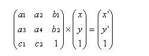

yolov5的数据增强中，透视、仿射变换统一使用了random_perspective一个函数进行处理，包含了旋转、缩放、平移、剪切变换(shear,实际是按坐标轴方向变换，具体可看下文)、透视



透视变换就是上面的c1, c2不为0， 如果c1c2为0那就是仿射变换


https://medium.com/@conghung43/image-projective-transformation-with-opencv-python-f0028aaf2b6d

https://zhuanlan.zhihu.com/p/590328293


```python
def perspective_size(im, x_ratio, y_ratio):
    w, h, c = im.shape
    left_up = [-w/2, -h/2]
    right_up = [w/2, -h/2]
    left_bottom = [-w/2, h/2]
    right_bottom = [w/2, h/2]
    def transform(p):
        x, y = p
        print(p)
        new_x = (x) / (x_ratio * x + y_ratio * y + 1)
        new_y = (y) / (x_ratio * x + y_ratio * y + 1)
        p[0] = new_x
        p[1] = new_y
        print(p)
    max_x, max_y = 0, 0
    min_x, min_y = w, h
    for point in [left_up, right_up, left_bottom, right_bottom]:
        transform(point)
        x, y = point
        max_x = max(x, max_x)
        max_y = max(y, max_y)
        min_x = min(x, min_x)
        min_y = min(y, min_y)
    new_h = max_y - min_y
    new_w = max_x - min_x
    origin_y = min(left_up[1], right_up[1])
    origin_x = min(left_up[0], left_bottom[0])
    move_x = max(abs(max_x), abs(min_x))
    print((origin_x, origin_y), new_h, new_w)
    return (origin_x, origin_y), new_h, new_w


def random_perspective(im,
                        perspective=0.0,
                        border=(0, 0)):
    # torchvision.transforms.RandomAffine(degrees=(-10, 10), translate=(0.1, 0.1), scale=(0.9, 1.1), shear=(-10, 10))
    # targets = [cls, xyxy]
    height = im.shape[0] + border[0] * 2  # shape(h,w,c)
    width = im.shape[1] + border[1] * 2
 
    # Center
    C = np.eye(3)
    C[0, 2] = -im.shape[1] / 2  # x translation (pixels)
    C[1, 2] = -im.shape[0] / 2  # y translation (pixels)
 
    # Perspective
    P = np.eye(3)
    P[2, 0] = perspective[0]  # x perspective (about y)
    P[2, 1] = perspective[1]  # y perspective (about x)
    print(P)
    T = np.eye(3)
    new_left_up, new_h, new_w = perspective_size(im, P[2, 0], P[2, 1])
    origin_x, origin_y = new_left_up
    T[0, 2] = abs(origin_x)
    T[1, 2] = abs(origin_y)
    M = T @ P @ C
    im = cv2.warpPerspective(im, M, dsize=(int(new_w), int(new_h)), borderValue=(114, 114, 114))
    return im
```