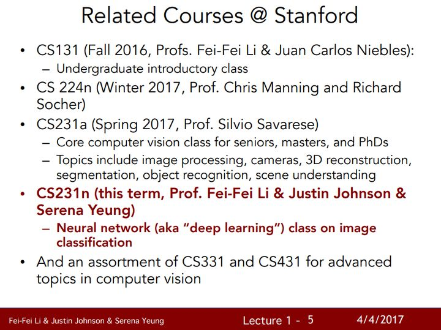
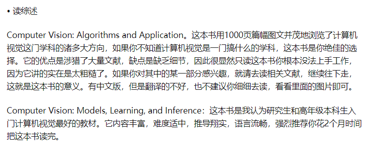

# 学习路线

# 课程

[CS 330: Deep Multi-Task and Meta Learning](http://cs330.stanford.edu/)

[os-rust](https://cs140e.sergio.bz/)

[theory](https://www.cs.virginia.edu/cs302/)

[graphics](http://15462.courses.cs.cmu.edu/spring2021/)

[Unsupervised Learning](http://www.cs.columbia.edu/~verma/classes/uml/)

https://www.cs.columbia.edu/~amueller/comsw4995s18/schedule/

[Computer Graphics] (https://www.cs.ubc.ca/~sheffa/dgp/)

 ## 3d vision
 https://web.stanford.edu/class/cs231a/index.html

 https://cse291-i.github.io/WI18/index.html

https://www.cc.gatech.edu/~hays/7476/

[object detection](https://www.di.ens.fr/willow/teaching/recvis17/)

 https://www-users.cs.umn.edu/~hspark/CSci5980/csci5980_3dvision.html

## Advanced Computer Vision
https://web.eecs.umich.edu/~justincj/slides/eecs498/498_FA2019_lecture01.pdf
http://www.cs.columbia.edu/~vondrick/cs6998/

# 书籍

计算机视觉中的多视图几何。
最有意思的是：在很多论文中，有很多高大上的创新点总能在这里找到出处。
视觉几何，优化算法，Jacobi 矩阵，相机标定
还需要射影几何基础，统计和最优化也最好了解一点。
1. 建议先精读第1，2，5，6。第一和第二章告诉你什么是研究计算机视觉的基本数学工具：射影变换，以及各种元素在射影变换下的计算，这是基础中的基础。
2. 第五和第六章告诉你什么是摄像机模型，这就解释了为什么我们可以用摄像机进行测量及解决其他问题。
3. 第二篇双目原理相对简单，只需要理解对极几何即可深入。
4. 第三篇和第四篇相对较难，首先必须理解什么是张量。
5. 结合一些三维重建的论文看，明白MVG中的知识在三维重建中的哪些子算法处起什么样的作用，比如为什么要有齐次坐标，坐标系变换有哪些，什么样的情况对应什么样的变换，摄影相机模型，对极几何中的基本矩阵和本质矩阵如何导出、可以用来干嘛，为什么本质矩阵做奇异值分解可以得到相机外参等等
推荐VGG组的Andrew Zisserman写的textbook:“Multiple View Geometry in Computer Vision”以及Stanford Silvio Savarese的CS231a3D Vision + DL的推荐UCSD Haosu的CSE-291F.

https://www.bilibili.com/read/cv6446489

推荐VGG组的Andrew Zisserman写的textbook:“Multiple View Geometry in Computer Vision”以及Stanford Silvio Savarese的CS231a3D Vision + DL的推荐UCSD Haosu的CSE-291F.

请用一天时间读一下两本书 每个 chapter 的 abstract：《Multiple View Geometry in Computer Vision Second Edition》  Andrew Zisserman (官方免费版：  http://www.robots.ox.ac.uk/~vgg/hzbook/)《Digital Image Processing》 Richard Eugene Woods

图形学教材首先推荐《计算机图形学与几何造型导论》，这本书用流畅的语言介绍了图形学的基础知识，选材有趣，推导简洁但是绝不跳步走，保证你能看懂而且不会看烦。
光线追踪器我看过一本薄的《Realistic Ray Tracing》和一本厚的《Ray Tracing from the Ground Up》

计算机视觉的顶级期刊有两个PAMI和IJCV，顶级会议有ICCV和CVPR，

SLAM十四讲
第三，四，六章不错，讲解刚体的运动，算法的求解。配合modern robotics食用效果更佳。早点看到就好了

## VR

建议研究最新的 ARCore/ARKit，虽然 AR 没有特别成熟的产品，但跟紧大厂的方向是最简单不会出错的选择。SLAM 作为核心关键技术，也需要我们特别关注。

建议阅读 Thrun 的《Probabilistic Robotics》，了解下概率学是如何解决机器人中的问题的。

针对优化的话，建议学透最小二乘优化和数学推导，因为最后很多问题都归结到最小二乘优化，然后就是梯度下降、求 Jacobian 等。

研究生方向是增强现实（AR）方向，需要如何入门，看哪些书呢？ - 小觅智能的回答 - 知乎
https://www.zhihu.com/question/268366554/answer/525909050

[State Estimation for Robotics] 这本书能够帮你很快建立整套关于状态估计理论的框架，同时在三维运动方面，提供了充分但不那么困难的学习途径

# 感知算法

1 python

2 c++

cmakelist.txt

3 ros

4 pytorch

5 linux 操作

负责计算机视觉或深度学习算法相关的前沿技术研发工作

负责图像或三维点云中的目标检测、跟踪，图像理解等相关算法研发工作

负责SLAM、VIO等相关算法的研发工作

负责camera、lidar、radar等多传感器融合算法研发工作

以下几个子方向至少在其中一个有专长：
熟练掌握至少一种 Deeplearning 框架，例如 Caffe、TensorFlow、MXNet 等，拥有一年以上实际项目经验，对网络结构设计、训练、大规模数据处理有丰富的实践经验
熟悉 CUDA/OpenCL 开发，掌握多线程优化方法，熟悉基本的资源调度方法
熟悉大规模并行计算的基本原理并具有实现并行计算算法的基本能力
熟悉点云处理算法，熟练使用 PCL 库，有一年以上实际项目经验
了解 SLAM 相关算法，例如 ORB-SLAM、LSD-SLAM 等，熟悉 PnP 求解，EKF，会使用g2o 等常见优化库，有一年以上实际项目经验

02 感知

感知：包括各类传感器的感知和融合计算，包括RADAR、LIDAR、Camera、惯导传感器（IMU），感知要解决的问题是理解自动驾驶车的周围环境，像障碍物检测，运动目标跟踪，红绿灯识别，道路标志识别，车道线检测（根据需要而定，比如有些地图直接用路标或者特征匹配实现定位，车道线就是由地图给出）都是感知的任务。更高级的任务会涉及对周围其他物体的行为预测，比如行人，尤其是路口行人过马路的预测，比如行驶车辆，到底是打算cut-in还是仅仅偏离了车道，在高速入口的车辆，到底是想加速先过还是减速等你，这些都是“老司机”很擅长的，而提供线索的恰恰是感知模块。

03 定位

包括（高精度）GPS和惯导系统，要解决的是我在哪儿的问题，“你搞清楚自己的定位没有？”

04 预测与规划

预测与规划可以放在一起：规划分三个层面，路径规划（任务规划），行为规划和运动规划。最后一个运动规划，和后面的控制模块捆在一起，基本上L2-L4都通用了，除非软硬件联合开发，L2和L4用的运动规划（经典的有RRT，Latticeplanner）及控制（PID，MPC之类）没啥变化。路径规划，就是基于道路网络确定地图上A点到B点的路径，这个以前导航地图也是要做这个任务。那么，剩下一个最新的问题就是行为规划了。

05 控制

控制和规划是密不可分的，但控制这部分更多是来自于成熟的汽车控制本身，再针对自动驾驶的策略做些标定和适配。

https://www.zhihu.com/question/39461335/answer/105158321
# 其他

数字图像：一幅图像可定义为一个二维函数 f（x，y），其中 x 和 y 是空间（平面）坐标，而在任何一对空间坐标（x，y）处的幅值对应为函数值 f（x,y），该幅值称为图像在该点处的强度或灰度级。当 x，y 和灰度值 f 是有限的离散数值时，我们称该图像为数字图像

视觉是人类最高级的感知，但人类的感知仅限于电磁波谱的视觉波段，而成像机器几乎可以覆盖从伽马射线到无线电波的整个电磁波谱。它们可以对非人类所习惯的那些图像源进行加工，这些图像源包括超声波、电子显微镜和计算机产生的图像。因而，数字图像处理涉及很宽泛的各种各样的应用领域。

图像的生成需要成像的各种能量，最常见的生成图像的能量是电磁波，另外还有声波、超声波和电子。

电磁波为各种波长传播的正弦波，是无质量的粒子流，每个粒子包含一束能量以光速传播，每束能量称为一个光子。

低级处理：涉及图像的初级操作，如降噪处理、对比度增强、锐化处理，其特征是输入、输出都是图像；

中级处理：输入为图像，但输出是从图像中提取的特征，如边缘、轮廓、物体标识的识别

高级处理：识别图像整体、与视觉相关的认知。

波变换（Wavelets）：小波是以不同分辨率描述图像的基础，在本章节没有展开介绍，老猿拷贝一网上的介绍：小波变换是将图像信号分解为由原始小波位移和缩放之后的一组小波。小波在图像处理里被称为图像显微镜，原因在于它的多分辨率分解能力可以将图片信息一层一层分解剥离开来。剥离的手段就是通过低通和高通滤波器

灰度化之后矩阵维数下降，运算速度大幅度提高，并且梯度信息仍然保留。

就是在performance和efficiency之间做一个权衡罢了。
我们可以把灰度图像看作图像的强度(Intensity)，来求一些梯度特征。比较常用的有 HOG，LBP，SIFT等等。

那些基础的还是很有用的，什么直方图均衡啊，频域变换啊，高通低通滤波器啊，颜色空间之类的，非常基础的知识建议看看；那些用深度学习可以完成的大方向，比如什么图像分割、光流追踪之类的，个人觉得如果你的研究方向是这个，就可以看看。

# 总结
https://zhuanlan.zhihu.com/p/374921390

https://xie.infoq.cn/article/e701ca2cccc957296a2572cb3

在计算机视觉方向如何快速提升自己? - Eternity的回答 - 知乎
https://www.zhihu.com/question/337889115/answer/770797118

有一些计算机视觉、深度学习方向的课和书籍，比如 @李沐 老师的《动手学深度学习》，有课有jupyter notebook，非常好，相见恨晚，还有花书《深度学习》、《计算机视觉：算法与应用》、《计算机视觉——一种现代方法》、《计算机视觉：模型、学习和推理》等。课的话，可以看cs231n，非常经典的计算机视觉课程，cs224d，虽然这门课是nlp的课，但是RNN这些东西对时间序列建模有非常大的帮助，可以也关注一下。最近需要的关注的还有GNN paper list，用图的思想去处理一些计算机视觉问题，以及CV和NLP结合还有一些任务，比如很早之前就有的VQA、caption等，这里有一篇论文可以参考一下，Trends in Integration of Vision and Language Research: A Survey of Tasks, Datasets, and Methods。

第三、针对具体的任务，去阅读经典论文和前沿的论文，比如针对目标检测、语义分割、姿态估计、文字识别、人脸识别、三维重建等等，选一个方向去学，可以先看综述，看博客，再看论文，看开源代码，对照论文的网络结果和代码细节去学，然后跑实验，学会调参，看看能不能跑出一个好的效果。

现在机器视觉在工业上的应用主要就是视觉引导机器人、2D及3D测量，以及缺陷检测。前两者需要的根本是摄像头标定。这其中运用到了线性代数、线性优化和三维几何的知识。最后一种可能会用到形态学处理，也就是数字图像处理的知识，而数字图像处理的基础就是线性代数。

除了 
@野合菌
 所说的，我还推荐可以学学：
Multi-View Geometry

Robotics Vision and Control

《视觉测量》张广军编著

《机器视觉算法与应用》该书对机器视觉处理系统和各种处理算法进行了详尽解述。里面讲解了机器视觉算法：图像、区域、轮廓、图像增强、几何变换—-仿射投影极坐标变换、图像分割、特征提取、形态学、边缘提取、分割和拟合、摄像机标定、立体、模板匹配、OCR等。
可以发现机器视觉主要还是侧重于实际应用，与工程项目结合起来才是王道。掌握光源，相机，镜头，采集卡是主要的，数学知识不会很难，相信这话一说，很多朋友会从事机器视觉了。但是个人觉得计算机视觉与深度学习结合才是发展趋势，不过工业4.0的趋势，应用很广监控、检测、测量、定位、识别，机器视觉大有可为，赋予机器一双眼睛嘛。

机器视觉 和 计算机视觉 还是有一定区别的。机器视觉是一个子类，它的应用领域多为工业自动化、工业检测领域应用。对环境可控、光照有要求。要求算法和设备紧密结合。理论方面：线性代数、坐标变换、立体几何、优化、信号处理、图像处理硬件方面：工业相机、镜头、光学、各类机械臂及linear stage软件：C、C++，数据结构、嵌入式编程、代码优化

机器视觉MV和计算机视觉CV是有区别的，机器视觉面向工业应用获得图像中目标的几何信息（尺寸、面积、有无、位姿等），机器视觉的工程应用并不需要太多数学知识。而计算机视觉需要通过模式识别和概率统计等基础。

机器视觉中，仅仅是图像的保存与矩阵相似而已。由于他的主要目标是获得几何信息，更多的是像素数的加减乘，以及连通域数像素个数。几个关键的概念：像素宏块(Macro Block，N X N个像素区域)SAD（对位置差的绝对值累加和，用于比较两个MB相似度，值越小越接近）卷积（这个还是比较重要的，不过在真正使用时就是两个矩阵的点乘求和）。

基础课程就不说了，像矩阵论，随机过程，泛函分析，图论什么的也都遛了遍。哪怕就是有个概念，后面看论文也大有益处，因为好多文章也就是用了一个流行高深的概念
# 目标检测
检测任务实际是输出目标的位置和概率，位置就是用bounding box圈出目标物体。目标检测大概的发展是这样（本人水平有限，难免会有错误，欢迎批评指正），在一张图中密集生成候选框，然后提取特征+机器学习分类器，这里就有一个问题如何生成候选框，滑窗法、随机搜索法等，不断发展。2014年出现了一个很出名的文章——RCNN，将深度学习用到目标检测中，但是仅仅是将CNN作为特征提取器。在此就不再赘述，RCNN系列（RCNN、Fast RCNN、Faster RCNN、Mask RCNN）、YOLO系列（YOLO v1、YOLO v2、YOLO v3）以及SSD，从去年开始涌现了一些anchor-free的工作，在ECCV 2018上出现了一个工作——CornerNet，提出了一个想法——把目标检测问题转换成关键点检测问题，之后涌现了CenterNet、ExtremeNet等一系列基于关键点的目标检测工作。最近谷歌有一些NAS和目标检测的工作，以及用强化学习的方式选择数据增广策略（近期我会复现该论文的数据增广策略）

像分割任务，是像素级的分类问题，同样也有传统方法和深度学习方法，深度学习比较经典的方法是FCN，输出大小和输入大小应该是一致的（这里大小是长宽）。目标追踪任务和检测任务有一些相似，但有一些不同之处，对每一帧进行检测的效果和追踪十分类似，但是目标检测通常检测的是已知类别，追踪可以追踪给定的第一帧里的内容，有一些传统方法、相关滤波方法以及深度学习方法，比如孪生网络系列的文章。再衍生出来的话，还有Re-ID。除此以外，还有很多很多计算机视觉任务，比如超分辨率、三维重建（还涉及计算机图形学等），由于篇幅有限就不一一介绍这些任务的基本发展了，可以找一些论文自己研读，注意不仅仅是最近的文章，还有上个世纪的文章，最好写个综述，看个几十上百篇文章，读读代码。

在计算机视觉方向如何快速提升自己? - Eternity的回答 - 知乎
https://www.zhihu.com/question/337889115/answer/770797118