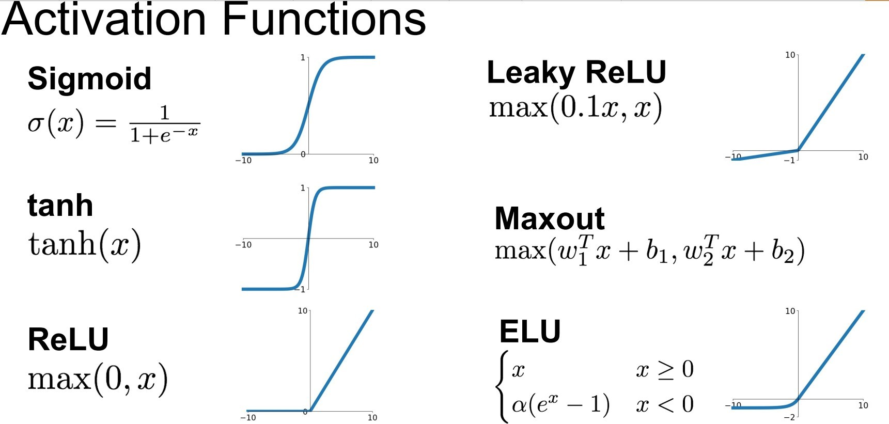
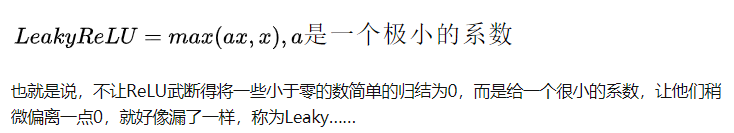
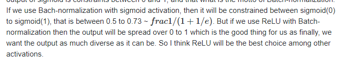

# 激活函数

1. sigmoid

 Saturated neurons “kill” the gradients 。在远离0点的地方，梯度变得非常微小
 
 2. Sigmoid outputs are not zero-centered  3. exp() is a bit compute expensive 
2. tanh 
 zero centered (nice) - still kills gradients when saturated :(
3. ReLU
Rectified Linear Unit 
Does not saturate (in +region)
- Very computationally efficient
- Converges much faster than
sigmoid/tanh in practice (e.g. 6x)
- Actually more biologically plausible
than sigmoid  Not zero-centered output

what is the gradient when x < 0?  
dead ReLU will never activate => never update，它在反向传播的过程中很快让一些神经元的导数永远是0，这种方式加快了训练. 
dead一些神经元也不一定是坏事，这样就造成了网络的稀疏性，并且减少了参数的相互依存关系，缓解了过拟合问题的发生

LeakyReLU可以改进这个问题

ReLU比sigmoid效果好的分析都是基于深度神经网络的前提，比如网络足够深时sigmoid会有明显的梯度消失问题，如果是浅层神经网络的话这些问题并不存在。另一方面，它们的用处不同，sigmoid输出范围是01之间，可以当作概率。深度神经网络中sigmoid可以用作门控单元（比如LSTM的三种门都是sigmoid）或attention（比如SENet中excitation部分），这些ReLU并不能取代。

ReLUs可以防止梯度消失，

