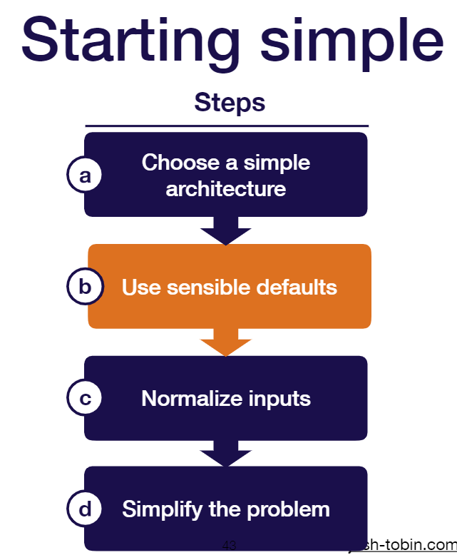
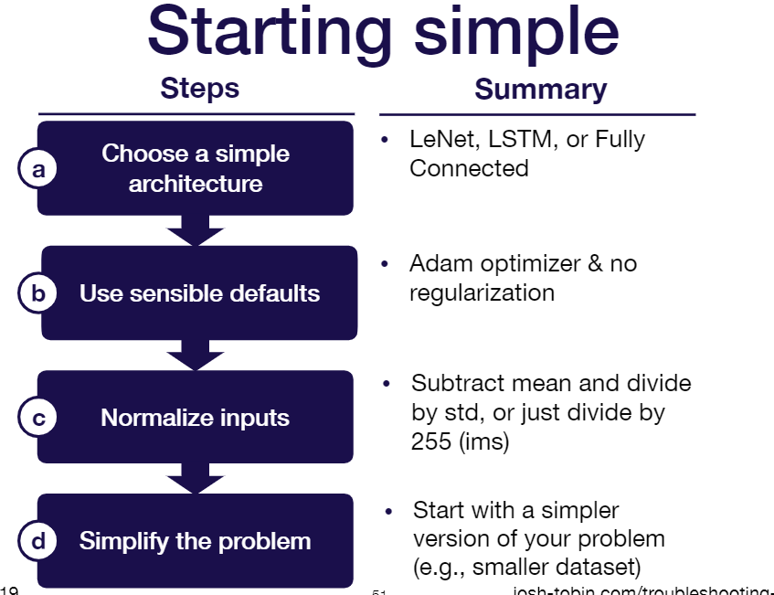

Common sentiment among practitioners: 80-90% of time debugging and tuning 10-20% deriving math or implementing things

深度学习调试难度在于，难以定位bug, 这个bug往往是概念上的，或者逻辑上的，而不是像编程时的编译错误，or runtime错误，runtime错误我们可以通过debugging.
因此关键在于找到bug在哪，什么情况会触发。

# bug定位

Most DL bugs are invisible.

超参数，尤其是学习率非常重要。

why is troubleshooting hard?•
1. Hard to tell if you have a bug
2. Lots of possible sources for the same degradation in performance
3. Results can be sensitive to small changes in hyperparameters and dataset makeup

可以采用Pessimism策略。
Since it’s hard to disambiguate errors, Start simple and gradually ramp up complexity!26

# 1. start simple

sensible指的是敏感的超参数，我们先使用最简单的默认值.

* Optimizer: Adam optimizer with learning rate 3e-4
* Activations: relu (FC and Conv models), tanh (LSTMs)
* Initialization: He et al. normal (relu),  Glorot normal (tanh)
* Regularization: None
* Data normalization: None

可以尝试先用一小部分数据，train一个demo.
优点在于可以快速迭代。

# 数据质量
Not enough data•Class imbalances•Noisy labels•Train / test from different distributions•(Not the main focus of this guide)

# 重现
如果模型大体问题没问题，个别样本或者场景有问题(corner case)，那么我们需要做一个现场还原或者说replay来重现bug, 观察是哪一块的逻辑出错了.
