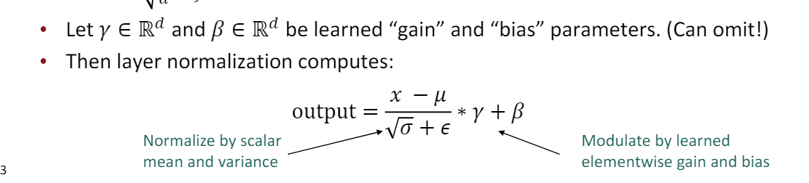
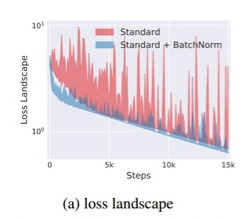
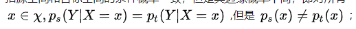
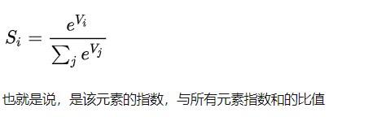
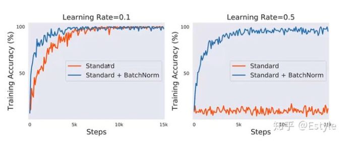
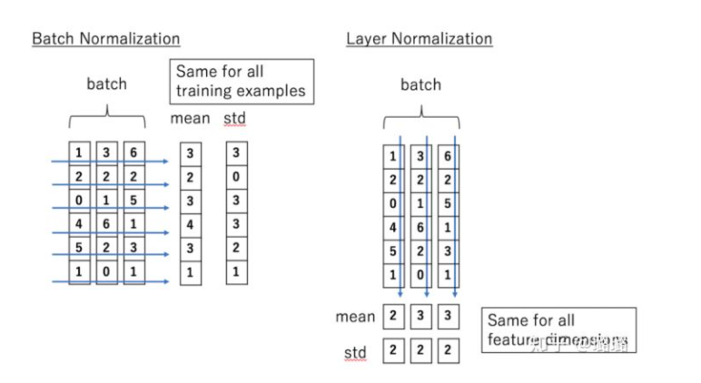
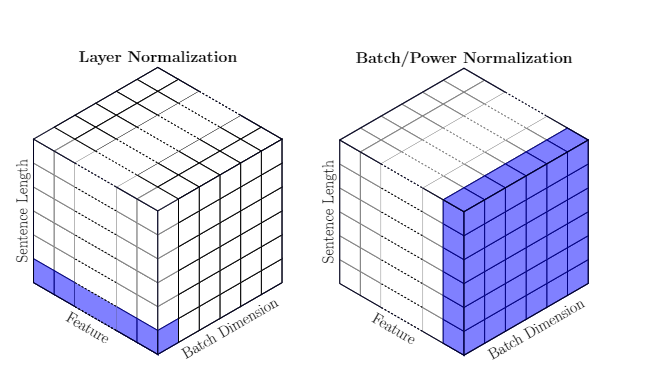
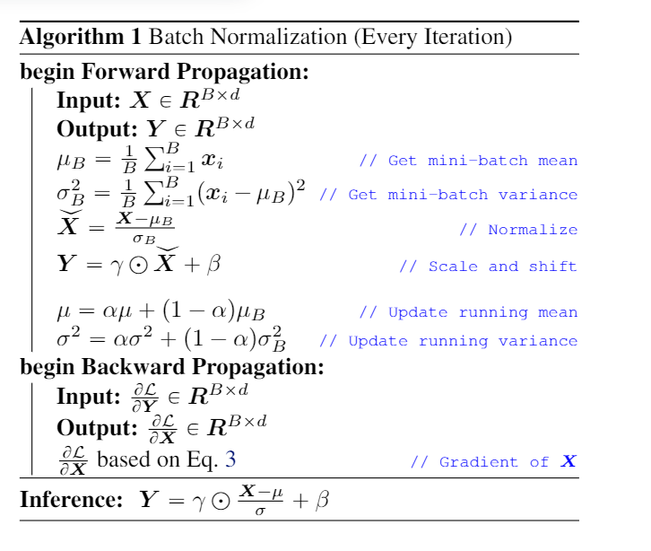
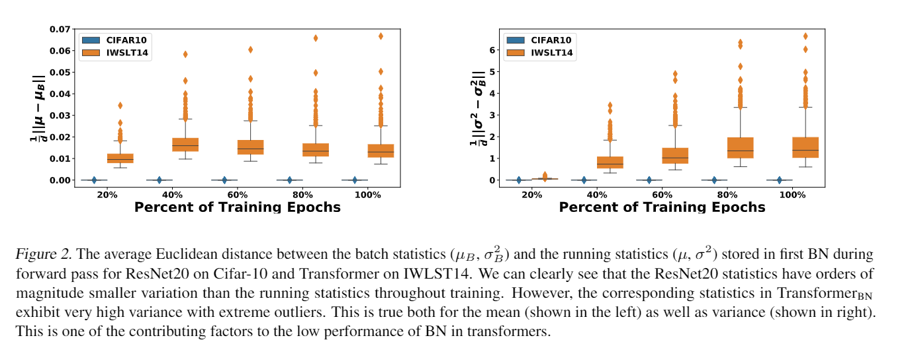

# 1. 总结
都有regularization的功效，在于加入了noise。

过拟合的原因，就是使用了对问题而言过于复杂的表述，所以缓解过拟合的基本方法就是降低对问题表述的复杂度。

BN实现这一点的机制是尽量在一个更平滑的解子空间中寻找问题的解，强调的是处理问题的过程的平滑性，隐含的思路是更平滑的解的泛化能力更好，Dropout是强调的鲁棒性，即要求解对网络配置的扰动不敏感，隐含思路是更鲁棒的解泛化能力更好。


## 1.1 BN
normalization本质是针对每一个batch，计算batch mean, variance, 进行归一化(mean为0，variance为1)后，再进行一个仿射变换。
推断阶段需要使用训练时计算出来的全局统计量（mean, variance)




核心idea是 cut down on uninformative variation in hidden vector values by normalizing to unit mean and standard deviation within each layer.

nor(malization的作用有
1. BN可以防止梯度爆炸或弥散、可以提高训练时模型对于不同超参（学习率、初始化）的鲁棒性、可以让大部分的激活函数能够远离其饱和区域
2. loss空间光滑，不容易陷入鞍点，加快模型学习速度.
3. BN使得模型对网络中的参数不那么敏感，简化调参过程，使得网络学习更加稳定,我们经常会谨慎地采用一些权重初始化方法（例如Xavier）或者合适的学习率来保证网络稳定训练。使用BN的网络将不会受到参数数值大小的影响。
4. BN具有一定的正则化效果,不同mini-batch的均值与方差会有所不同，这就为网络的学习过程中增加了随机噪音，与Dropout通过关闭神经元给网络训练带来噪音类似，在一定程度上对模型起到了正则化的效果。

通常由normalization就不需要dropout了

仿射变换的作用是为了增加网络层中本身数据因改变分布损失的表达能力。
也就是归一化后使得能够再还原回去，这是为了使得BN不剥夺底层辛苦训练出的数据分布信息，大佬们是叫做保证了模型的capacity


我们知道数据被我们规范之后，可能损失了某些信息，这些信息可能是有用的，可能是无用的，我们引入一个线性变换让模型具有还原的能力。
这就是说，如果神经网络发现我们规范数据分布之后损失的数据是有用对模型有利的，那他可以通过更新线性变换里面的两个参数，让数据分布变回去，给了网络多一个“选择”。


normalization有效的关键(How Does Batch Normalization Help Optimization?)
1. 过去的错误理解是减少了ICS（Interval Covariate Shift， 前向传播归一化使得每个batch的分布稳定）。详细来说就是BatchNorm stabilizes the distribution and improves training efficienc,  by controlling the mean and variance of layer inputs across mini-batche.
2. 其能够让优化空间（optimization landscape）变的平滑（去除了不必要的波动）,对于没有BN的神经网络，其loss函数是不仅非凸，并且还有很多flat regions、sharp minimal。这就使得那些基于梯度的优化方法变得不稳定，因为很容易出现过大或者过小的梯度值。
优化空间平滑以后，训练速度变快，也不容易进入鞍点，对学习率的敏感度也降低。

注意BN并不是万能的，并不能使得所有损失函数都平滑，这个还需要研究。

https://zhuanlan.zhihu.com/p/72912402
https://zhuanlan.zhihu.com/p/66683061




norm直接作用了loss函数，将loss函数变成了一个一阶、二阶均平滑的函数。
来自MIT的研究人员做了三个实验作为对比：不适使用norm的普通网络、使用nrom的普通网络及添加噪音的Norm网络。

Norm网络添加噪音是考虑到原作者认为是同分布造成的性能提优。那么来自MIT的研究人员就在Norm网络的基础上，给各层再手动添加噪音，这样使得第三个网络虽然使用了norm，但每层的分布已经被打乱，不再满足同分布的情况

即使nrom网络添加了噪音(具有ICS)，但性能仍然和添加norm的网络差不多

## 1.2 LN, layer normalization

LN和BN,区别在于作用维度不同，LN是针对单个样本所有特征的normalization, BN则是一个batch中，某个维度的特征做normalization。


同时也有工作证明，LN work的根本原因，是因为在网络的训练阶段

1. LayerNorm 中引入的 gain 和 bias，可能会导致 overfitting，去掉他们能够在很多情况下提升性能
2. forward normalization has little to do with theeffectiveness。
norm 操作之中因为均值和方差而引入的梯度在稳定训练中起到了更大的作用.
LayerNorm’ ssuccess may be due to its normalizing gradients,
find that the derivatives of means re-center gradients（回到 0 附近） and the derivatives of variances re-scale gradients.
这二者，被作者称为 gradient normalization

所以总结一下，LayerNorm 起作用的原因：一方面通过使得前向传播的输入分布变得稳定；另外一方面，使得后向的梯度更加稳定。二者相比，梯度带来的效果更加明显一些。

 gain 和 bias 都是模型在 training set 上直接学出来的，而没有考虑到具体的 input，是非常有可能出现过拟合（即， training 和 test 不匹配）。


Understanding and Improving Layer Normalization


BN无法应用与NLP的关键在于。
1. 在使用BN的Transformer训练过程中，每个batch的均值与方差一直震荡，偏离全局的running statistics, 这是的train,test阶段的BN参数有一定的差距。
2. BN使得Transformer在统计量贡献的梯度方面也表现出很多outliers。

相关工作中了ICML20, rethink ba.


选择什么样的归一化方式，取决于你关注数据的哪部分信息。
如果某个维度信息的差异性很重要，需要被拟合，那就别在那个维度进行归一化。


https://zhuanlan.zhihu.com/p/34879333


# 白化
前的研究表明如果在图像处理中对输入图像进行白化（Whiten）操作的话，单位方差的正态分布——那么神经网络会较快收敛


白化。白化是机器学习里面 常用的一种规范化数据分布的方法，主要是PCA白化与ZCA白化。白化是对输入数据分布进行变换，进而达到以下两个目的：
（1）使得输入特征分布具有相同的均值与方差。
（2）去除特征之间的相关性。

但是白化也存在两个问题：（
1）计算成本太大，像PCA白化还要算协方差矩阵等。
（2）白化过程由于改变了网络每一层的分布，因而改变了网络层中本身数据的表达能力。
底层网络学习到的参数信息会被白化操作丢失掉。

# ICS 

 Internal Covariate Shift，简称 ICS. 什么是 ICS 呢？

大家都知道在统计机器学习中的一个经典假设是“源空间（source domain）和目标空间（target domain）的数据分布（distribution）是一致的”。如果不一致，那么就出现了新的机器学习问题，如 transfer learning / domain adaptation 等。而 covariate shift 就是分布不一致假设之下的一个分支问题，它是指源空间和目标空间的条件概率是一致的，但是其边缘概率不同，即




，对于神经网络的各层输出，由于它们经过了层内操作作用，其分布显然与各层对应的输入信号分布不同，而且差异会随着网络深度增大而增大，可是它们所能“指示”的样本标记（label）仍然是不变的，这便符合了covariate shift的定义。由于是对层间信号的分析，也即是“internal”的来由。

ICS导致的问题
简而言之，每个神经元的输入数据不再是“独立同分布”。

其一，上层参数需要不断适应新的输入数据分布，降低学习速度。

其二，下层输入的变化可能趋向于变大或者变小，导致上层落入饱和区，使得学习过早停止。

其三，每层的更新都会影响到其它层，因此每层的参数更新策略需要尽可能的谨慎。
# softmax

softmax值得是soft版本的max, 因此softmax实际上是一个加权求和，当然最后的结果中，最大的值占据最主要部分。hardmax不可导，所以softmax才被采用，
softmax直白来说就是将原来输出是3,1,-3通过softmax函数一作用，就映射成为(0,1)的值，而这些值的累和为1（满足概率的性质），那么我们就可以将它理解成概率。


softmax会将这组数的差距拉大（由于exp函数），然后归一化。得到的向量接近一个one-hot向量（接近程度根据这组数的数量级有所不同）。

得到的向量接近一个one-hot向量（接近程度根据这组数的数量级有所不同）。

如果令Q=K，假设所有q的norm差不多，那么相同向量的点积大概率大于不同向量的点积, 此时由于softmax会将输入放到的指数级别，那么得到的attention score大概率会得到一个类似单位矩阵的attention矩阵，这样self-attention就退化成一个point-wise线性映射。这样至少是违反了设计的初衷。

也有特例，比如Reformer里面为了方便LSH的计算，就令Q和K相同。Reformer里面很关键的一步就是mask掉自身的点积，所以才不会被对角线主导.


由于softmax先指数缩放再归一化的本质，使其极易受到极大值影响，特别是长序列，得到的分布几乎总是稀疏的，这种稀疏性分布是有现实含义的：序列中的某个元素一般只会和少数几个元素具有较高的相似性/关联性。


# layer normalization

Batch Normalization 的处理对象是对一批样本， Layer Normalization 的处理对象是单个样本。Batch Normalization 是对这批样本的同一维度特征做归一化， Layer Normalization 是对这单个样本的所有维度特征做归一化。


Layer normalization is a trick to help models train faster.


LayerNorm’ssuccess may be due to its normalizing gradients.
(Understanding and Improving Layer Normalization, ).

之前有一种错误的观点， forward normalization是BN性能好的关键属性

 forward normalization. BatchNorm stabilizes the distribution and improves training efficienc,  by controlling the mean and variance of layer inputs across mini-batche.


 Through a series of analyses,we find that the derivatives of the mean and variance are important by re-centering and re-scaling backward gradients. 

 主要的发现有
 1. The derivatives of the mean and variance are more important to LayerNorm than forwardnormalization. 
      * 之前的研究认为 forward normalization是关键属性，it makes the input distribution more stable,  thus brings better conver-gence.
      * experimental results show  the derivatives of the mean and variance play a significant role in LayerNorm
      * DetachNorm, preserves there-centering and re-scaling fact but cuts off the derivative of the mean and variance
      * we analyze the gradients in LayerNorm and DetachNorm, and find that the derivatives of means re-center gradients and the derivatives of variances re-scale gradients. 
1. The parameters of LayerNorm, including the bias and gain, increase the risk of over-fitting anddo not work in most cases.
   * The bias and gain are applied for affine transformation on normalizedvectors.  They are expected to enhance the expressive power by re-shaping the distribution.

norm直接作用了loss函数，将loss函数变成了一个一阶、二阶均平滑的函数。
来自MIT的研究人员做了三个实验作为对比：不适使用norm的普通网络、使用nrom的普通网络及添加噪音的Norm网络。

Norm网络添加噪音是考虑到原作者认为是同分布造成的性能提优。那么来自MIT的研究人员就在Norm网络的基础上，给各层再手动添加噪音，这样使得第三个网络虽然使用了norm，但每层的分布已经被打乱，不再满足同分布的情况

即使nrom网络添加了噪音(具有ICS)，但性能仍然和添加norm的网络差不多


公式


上面的计算过程实际上就是 first enforce szero mean and unit variance, and it then performs an affinetransformation。

代码

```python
# output = (gamma * (tensor - mean) / (std + eps)) + beta
# eps : # An epsilon to prevent dividing by zero in the case the layer has zero variance.
    def forward(self, tensor: torch.Tensor):  # pylint: disable=arguments-differ
        # 注意，是针对最后一个维度进行求解~
        mean = tensor.mean(-1, keepdim=True)
        std = tensor.std(-1, unbiased=False, keepdim=True)
        return self.gamma * (tensor - mean) / (std + self.eps) + self.beta
```

BN可以减少模型对超参数的敏感性，图二在lr=0.5时，不加norm的网络直接震荡了，但加nrom的仍然表现良好。




# batch normalization 




Batch Normalization 的处理对象是对一批样本， Layer Normalization 的处理对象是单个样本。Batch Normalization 是对这批样本的同一维度特征做归一化， Layer Normalization 是对这单个样本的所有维度特征做归一化。

假设这三个特征是【身高、体重、年龄】。那么BN是针对每一列（特征）进行缩放，例如算出【身高】的均值与方差，再对身高这一列的10个数据进行缩放。

而layer方向相反，它针对的是每一行进行缩放。即只看一笔数据，算出这笔所有特征的均值与方差再缩放。这是一种“行缩放”。


简单的理解是，如果我们将一批文本组成一个batch，那么BN的操作方向是，对每句话的第一个词进行操作。但语言文本的复杂性是很高的，任何一个词都有可能放在初始位置，且词序可能并不影响我们对句子的理解。而BN是针对每个位置进行缩放，这不符合NLP的规律。

LN则是针对一句话进行缩放的，且LN一般用在第三维度，如[batchsize, seq_len, dims]中的dims，一般为词向量的维度，或者是RNN的输出维度等等，这一维度各个特征的量纲应该相同。因此也不会遇到上面因为特征的量纲不同而导致的缩放问题。




batcj normalization的计算公式实际上跟LN相似，只是作用维度不同。



 The BN layer first enforceszero mean and unit variance, and it then performs an affinetransformation


Internal Covariate Shift
BN的原论文作者给了ICS一个较规范的定义：在深层网络训练的过程中，由于网络中参数变化而引起内部结点数据分布发生变化的这一过程被称作ICS。举个例子：在我们训练网络的过程中，我们的参数时刻在发生变化，这就导致了每一层输出的数据分布会因为时刻更新的参数而改变，这是一种不好的现象。我们知道机器学习中有一个经典假设：源空间和目标空间的数据分布是一致的。如果不一致，就会出现新的问题，而我们现在条件分布相同，但边缘密度却不一定相同，所以就引发了问题。（虽然很有道理，但是最后还是被人用实验推翻）


早期对BN有效性的解释是其有助于缓解神经网络“内部协方差漂移”（Internal Covariance Shift，ICS）问题。

而BatchNorm这类归一化技术，目的就是让每一层的分布稳定下来，让后面的层可以在前面层的基础上安心学习知识。顾名思义，BatchNorm就是通过对batch size这个维度归一化来让分布稳定下来。

近期也有一些研究[3][4]表明BN之所以有助于训练深度神经网络，是因为它可以让loss曲面变得更加平滑。Anyway，这依然是一个未完全解开的老谜。


有人认为同一个batch中输入的数据长短不一，不同的时态下需要保存不同的统计量，无法正确使用BN层。
考虑到多数实现中，加载数据时都会把长度接近的文本放在同一个batch中（很常见的trick了），这种影响也应当是不太大的。我认为BN效果不好的原因，主要还是NLP数据与CV数据特性的差别对训练过程产生了影响，使得训练中batch的统计量不稳定。

伯克利的论文，PowerNorm，BN为什么在NLP问题上不work的其中一个原因，即数据分布的震荡和异常值导致train/test不一致。
在使用BN的Transformer训练过程中，每个batch的均值与方差一直震荡，偏离全局的running statistics。

Rethinking Batch Normalization in Transformers。

CNN卷积将分布式信息抽象出类离散信息；你说的RNN我可以理解成NLP领域，典型的layer Norm一般在Bert和Transform用。这些网络都是将离散信息重新组织成分布式信息，相比之下layer Norm更合适。


pytorch

```python
class BatchNorm1d(_BatchNorm):
    r"""Applies Batch Normalization over a 2D or 3D input (a mini-batch of 1D
    inputs with optional additional channel dimension) as described in the paper
    `Batch Normalization: Accelerating Deep Network Training by Reducing Internal Covariate Shift`_ .

```

# 应用场景

总结来说， BN为什么在NLP问题上不work的其中一个原因，即batch统计量分布的方差过大和异常值导致train/test不一致。


一般来说LN用于nlp, BN用于CV。
BN用在NLP任务里实在太差了（相比LN），此外，BN还难以直接用在RNN中[1].

1. there are clear differences in the batchstatistics of NLP data versus CV data
2.  batch statistics（例如均值，方差，梯度） for NLP data have a very large variance throughout training. This variance existsin the corresponding gradients as well.In contrast,CV data exhibits orders of magnitude smaller variance.
3.   Transformer signifi-cantly larger distances between the batch statistics and the running statistics than  ResNet， this distance between variance significantly increases throughout training, butwith extreme outliers
4. During inference, we have to use therunning statistics. However, such large fluctuations wouldlead to a large inconsistency between statistics of the testingdata and the BN’s running statistics.
5. 训练梯度方面。During inference, we have to use therunning statistics. However, such large fluctuations wouldlead to a large inconsistency between statistics of the testingdata and the BN’s running statistics.

另一个直观的角度上看，
CNN中使用BN，对一个batch内的每个channel做标准化。多个训练图像的同一个channel，大概率来自相似的分布。(例如树的图，起始的3个channel是3个颜色通道，都会有相似的树形状和颜色深度)RNN中使用BN，对一个batch内的每个position做标准化。多个sequence的同一个position，很难说来自相似的分布。(例如都是影评，但可以使用各种句式，同一个位置出现的词很难服从相似分布)

其实也是方差过大的意思。



