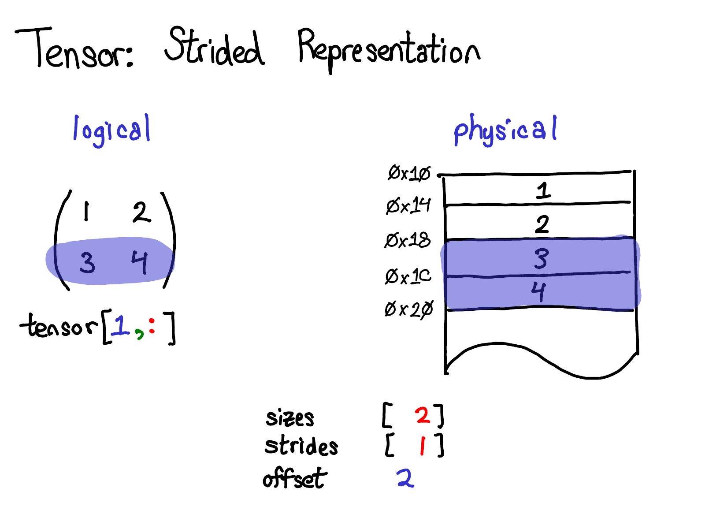
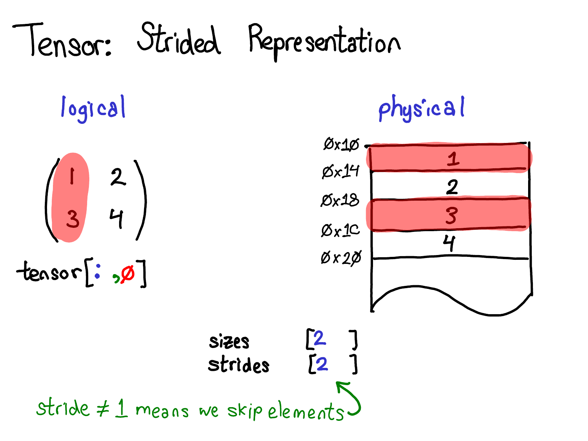
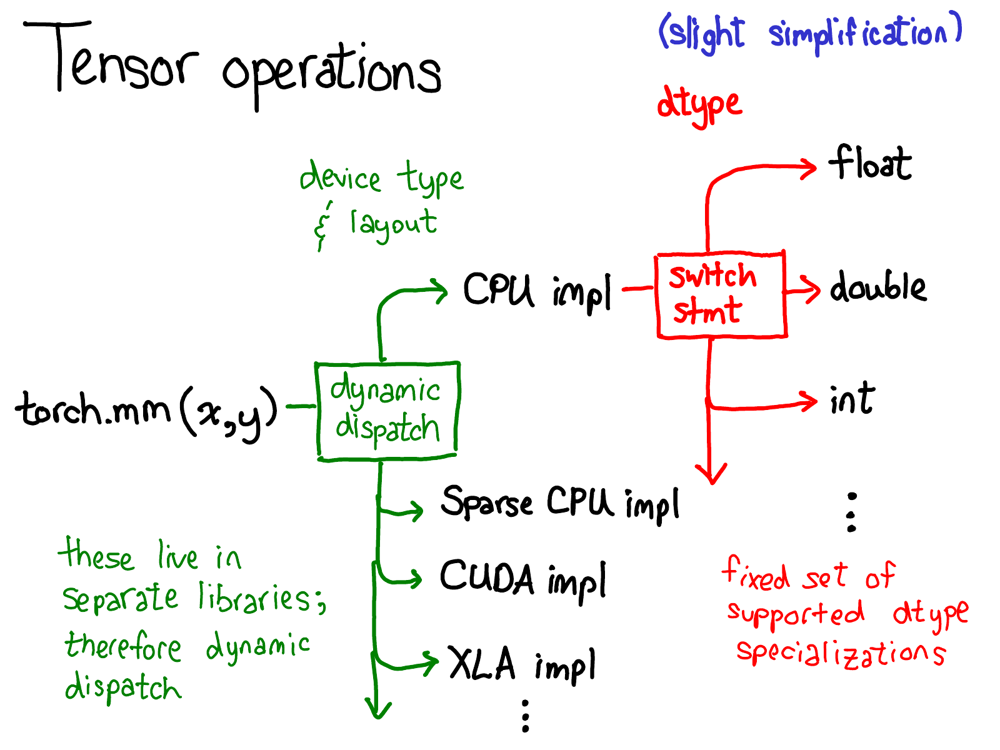

# tensor

存储采用类似numpy的方式，通过strides, sizes和offset来做多维索引和reshape:
0. 使用一维连续内存存储所有数据.
1. strides保存每一个维度的元素尺寸.
2. sizes则保存每一个维度的元素数量.
3. offset保存开始位置
4. get元素时，使用sum(index[i] * strides[i])的方式来计算地址 + offset.

假设我们有一个初始tensor A, 他的shape是[2, 2], 那么他的strides是[2, 1], sizes是[2, 2], offset是0

pytorch下面的操作都只是改变tensor的strides和sizes, 相当于浅拷贝
1. 部分slice操作, A[1, :],  strides: [1], sizes: [2], offset: 2

2. 部分slice操作, A[:, 0],  strides: [2], sizes: [2], offset: 2

3. view函数，torch.Tensor.view()只能操作contiguous的tensor，且view后的tensor和原tensor共享存储，reshape（）对于是否contiuous的tensor都可以操作， 
A.view(4, 1) -> strides:[1, 1], sizes:[4, 1], offset: 0

view函数注意点， 使用transpose、permute等函数改变tensor在内存内连续性后需使用contiguous()方法返回拷贝后的值再调用该函数

这样的实现不是没有缺点的，不注意的话会导致内存泄露，类似java的substring,
# tensor operations

At the very most abstract level, when you call torch.mm, two dispatches happen:

1. The first dispatch is based on the device type and layout of a tensor,  It is a dynamic dispatch because these kernels may live in separate libraries (e.g., libcaffe2.so versus libcaffe2_gpu.so)
2. The second dispatch is a dispatch on the dtype in question. This dispatch is just a simple switch-statement for whatever dtypes a kernel chooses to support. 