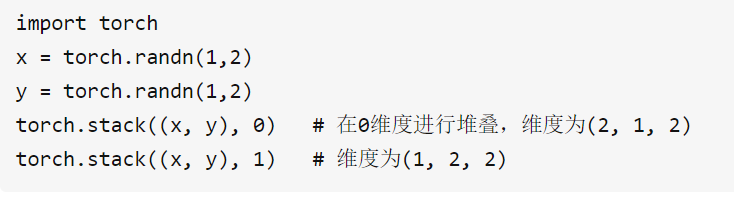
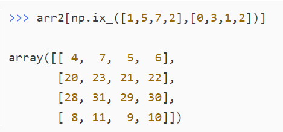
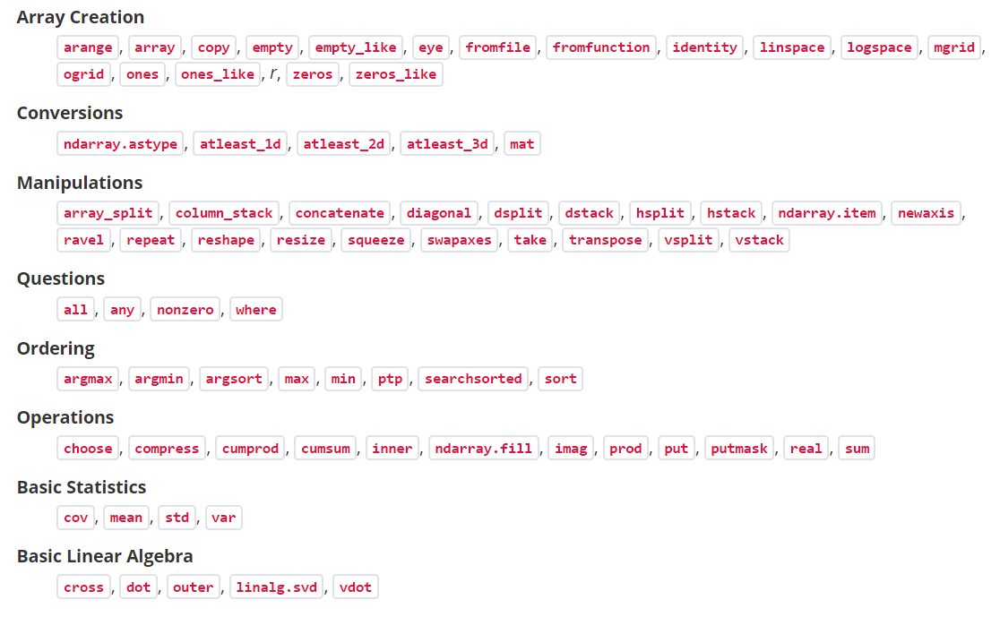

# shape manipulation
转置矩阵的定义是将一个矩阵的横行写为转置矩阵的纵列，把纵列写成转置矩阵的横行。这个定义的是二维的矩阵，本质上来说，转置操作其实是将一个矩阵沿着矩阵的大对角线进行翻转。翻转之后，显然这个矩阵的各个维度都会发生变化。

transpose并不改变a本身的形状，将改变的一个副本赋值给b，相当于先拷贝了一份，然后再改变这份拷贝的。
permute() 和 tranpose() 比较相似，transpose是交换两个维度，permute()是交换多个维度。permute适用高维tensor的转置.

x = torch.randn(2, 3, 5)
y=x.permute(2, 0, 1)
print(y.shape)#torch.Size([5, 2, 3])

reshape也就是再次shape的意思按照参数重排列。

view()方法只能改变连续的(contiguous)张量，否则需要先调用.contiguous()方法；而.reshape()方法不受此限制；如果对 tensor 调用过 transpose, permute等操作的话会使该 tensor 在内存中变得不再连续。
view 函数只能用于 contiguous 后的 tensor 上，也就是只能用于内存中连续存储的 tensor。如果对 tensor 调用过 transpose, permute 等操作的话会使该 tensor 在内存中变得不再连续，此时就不能再调用 view 函数。因此，需要先使用 contiguous 来返回一个 contiguous copy.

.view()方法返回的张量与原张量共享基础数据(存储器，注意不是共享内存地址)；.reshape()方法返回的可能是原张量的copy，也可能不是，这个我们不知道

torch.stack, cat可以在某一维度拼接两个tensor. stack可能会产生新的维度

 用于stack tensor. torch.split用于切割tensor

squeeze(dim)为压缩的意思，即去掉维度数为1的dim，默认是去掉所有为1的，当然也可以自己指定。
unsqueeze(dim)则与squeeze(dim)正好相反，为添加一个维度的作用。

# 创建tensor

zeros, range, linspace(start, stop, num = 50,endpoint = True) 给出size，自己决定间隔

random, zeros_like, fromfunction

以上都支持给定参数shape

# tensor间运算
支持tensor之间的加减乘除。

二维矩阵乘法 torch.mm(). 三维带batch的矩阵乘法 torch.bmm(). 
该函数的两个输入必须是三维矩阵并且第一维相同（表示Batch维度）， 不支持broadcast操作

多维矩阵乘法 torch.matmul().
支持broadcast操作，使用起来比较复杂。针对多维数据 matmul() 乘法，可以认为该乘法使用使用两个参数的后两个维度来计算，其他的维度都可以认为是batch维度。

矩阵逐元素(Element-wise)乘法 torch.mul().

torch.einsum()

# tensor内部运算

sum max, min 基本统计 还有map, reduce, flatMap之类的 默认agg全部，通过axis参数可以指定运算的维度

逐元素(Element-wise)运算，

# 广播机制

当tensor间互相运算时，从低维到高维，如果A,B某个维度为1，后者没有，那么就自动拓展那个维度到跟另一个相同。

# subtensor

有时我们需要通过Index方式获取subtensor.

我们直接通过tensor[a:b]可以做简单的slice.

numpy有，np.ix_函数，能把两个一维数组 转换为 一个用于选取方形区域的索引器(笛卡尔积), 这样我们就不需要添加:的形式了.

# tensor存储

有些tensor并不是占用一整块内存，而是由不同的数据块组成，而tensor的view()操作依赖于内存是整块的。

# einsum

einsum记法是一个表达以上这些运算，包括复杂张量运算在内的优雅方

# 总结

