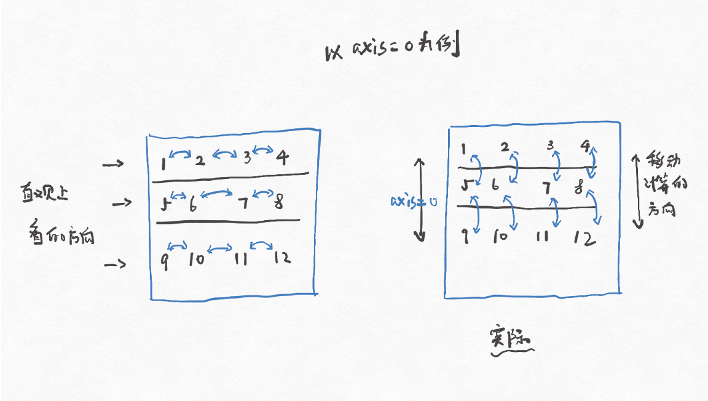
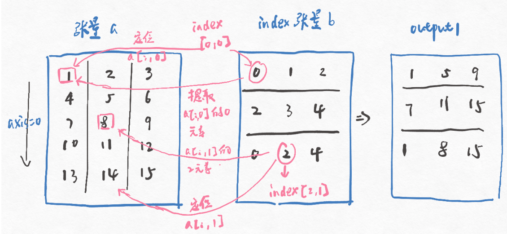
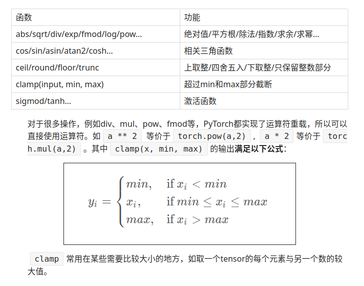
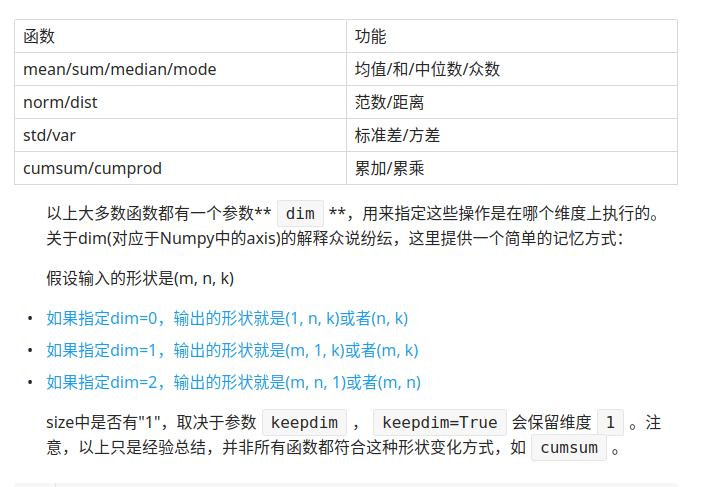

https://zhuanlan.zhihu.com/p/479931221
https://thoughts.teambition.com/share/600ab3815a28b400465022d2

# 一. tensor 创建


|  算子   |  作用  |   示例 |  tensorflow ops | numpy ops |
| :-:|:-: | :-: | :-:|:-:|
|zeros, ones, zeros_like, ones_like| 创建全0或1的tensor | | | |
| as_tensor, from_numpy, to_numpy| list或者numpy和tensor互相转换|  | | |
|range, arang， linspace| [start, end, step] 形式的tensor | | | |
| full, full_like |指定数值的tensor | | | |

# 二. 维度概念

```python
import numpy as np
a = np.arange(1, 13).reshape(3, 4)
"""
result:
a = [[1, 2, 3, 4],
      [5, 6, 7, 8,],
      [9, 10, 11, 12]]
"""


# 对a维度0求最大值
a.max(axis = 0)
"""
result:
[9, 10, 11, 12]
"""

# 对a维度1求最大值
a.max(axis = 1)
"""
result:
[4, 8, 12]
"""
```

如果对a矩阵在维度0上找最大值，根据我们直观上的经验应该是[4, 8, 12]。即从[1, 2, 3, 4]找到4，从[5, 6, 7, 8]找到8，从[9, 10, 11, 12]找到12。
实际numpy（pytorch）运算应该理解为往给定的维度进行移动运算


# 三. tensor indexing and slicing

|  算子   |  作用  |   示例 |  tensorflow ops | numpy ops |
| :-:|:-: | :-: | :-:|:-:|
|operator [idx1, idx2, ...]| 普通索引，指定每个维度的索引，或者用...替代 | A[2,..., 3], 第二行第三列 | | |
|operator [start, end, step]| 访问指定元素, :省略一个维度, ...省略多个维度 | A[2:10:3, ...], 跳跃元素 | | |
|整数数组索引| 使用同形状的多个数组分别指定元素的所有维度| 取出其(0,0)，(1,1)和(2,0)位置处的元素, index = \[[0,1,2],  [0,1,0]], y = x[index], 也支持内部再分组和广播|||
|bool索引| 通过一个bool数组索引，支持广播|x[x >  5], a[~np.isnan(a)] |||
|花式索引| 整数数组索引的拓展版，支持广播， | x=np.arange(32).reshape((8,4)), print (x\[[4,2,1,7]]), 分别取4,2,1,7行 ||
|index_select(input, dim, index)| 根据索引在某一维度取, index必须是一维Tensor，表示索引下标的范围 | 取第0， 2行, torch.index_select(a, 0, torch.tensor([0, 2])), 等价于a\[[0,2]] ||
|masked_select(input, mask) | 通过掩码条件来选择元素 | torch.masked_select(a, a>0.5) # 结果和a[a > 0.5]等价 ||
| torch.gather(input, dim, index, out=None) | 按照给定的索引从输入张量中收集指定的元素。输入和index尺寸维度相同，index和input维度相同， 但是要满足index.size(d) <= input.size(d) for all dimensions d != dim | | | 
| torch.take(input, dim, index, out=None) | 展平按索引取值 | | | 
| torch.take_along_dim(input, indices, dim, *, out=None)  | 在指定维度上，按照index读取值，通常和argmax, argsort配合使用 | max_idx = torch.argmax(t); torch.take_along_dim(t, max_idx) | | 
|nonzero函数 | 找到非零元素的index, 等价于torch.argwhere(t) |  ||

## 索引例子

```python
print(a[0])  # 第0行（下标从0开始）
print(a[0][2])  # 第0行第三个元素
print(a[0, -1])  # 第0行最后一个元素
print(a[:2])  # 前两行
print(a[:2, 0:2])  # 前两行，第0， 1列
print(a[0:1, :2])  # 第O行，前两列
print(a>1)  # 返回bool矩阵
print(a[a>1])  # 等价于a.masked_selsect(a>1),选择的结果不共享内存
print(a[t.LongTensor([0,1])])  # 第0行和第1行
```
显然切片和索引可以进行组合，效果就是将所有切片操作的维度在切片之后构成整体，看作是排列的元素，剩余索引的维度就是取出对应的这些元素。例如：

d[[2, 0, 1], 1:2, 0:2]

在 Pytorch 中，支持基本的 [ ][ ] ...[k] 标准索引方式 ，当数组的维度数较高时，为了方便书写，可以采用[ , , ... , ]的方式索引，它们是等价的。

narrow 取指定维度 dim 的连续张量切片，从 start 索引开始，长度为 length


## gather 


gather(input, dim, index)具体就是除了dim指定的那一维索引用index中给出的，其它的索引和output中元素所在位置索引相同

dim除了代表往维度dim的方向提取元素外，还有一个特权---提取结果output可以在这个维度上的长度与a不同

例如
```python
a = torch.arange(1, 16).reshape(5, 3)
"""
result:
a = [[1, 2, 3],
      [4, 5, 6],
      [7, 8, 9],
      [10, 11, 12],
      [13, 14, 15]]
"""

b = torch.tensor([[0, 1, 2], [2, 3, 4], [0, 2, 4]])

# axis=0
output1 = a.gather(0, b)
"""
result:
[[1, 5, 9],
[7, 11, 15],
[1, 8, 15]]
"""

# 结合max函数

input1 = torch.randn(2,2,3)
input2 = torch.randn(2,2,3)

values1, indices1 = input1.max(dim=-1, keepdim=True)
torch.gather(input2, -1, indices1)

# 麻烦版本
values1, indices1 = input1.max(dim=-1)
# 也等价于
torch.take_along_dim(input2, -1, incices1)
indices1 = indices1.T.unsqueeze(dim=-1)
torch.gather(input2, -1, indices1)


```


## scatter_
Tensor.scatter_(dim, index, src, reduce=None) 

与gather相对应的逆操作是scatter_，gather把数据从input中按index取出，而scatter_是把取出的数据再放回去。注意scatter_函数是inplace操作, 但是需要注意
1. index and src (if it is a Tensor) should all have the same number of dimensions
2. index.size(d) <= src.size(d)  for all dimensions d
3. index.size(d) <= self.size(d) for all dimensions d != dim
4. reduce参数可以指定src和self之间对应元素的合并方式，can be either 'add' or 'multiply'


```python
>>> src = torch.arange(1, 11).reshape((2, 5))
>>> src
tensor([[ 1,  2,  3,  4,  5],
        [ 6,  7,  8,  9, 10]])
>>> index = torch.tensor([[0, 1, 2], [0, 1, 4]])
>>> torch.zeros(3, 5, dtype=src.dtype).scatter_(1, index, src)
tensor([[1, 2, 3, 0, 0],
        [6, 7, 0, 0, 8],
        [0, 0, 0, 0, 0]])
>>> torch.full((2, 4), 2.).scatter_(1, torch.tensor([[2], [3]]),
...            1.23, reduce='multiply')
tensor([[2.0000, 2.0000, 2.4600, 2.0000],
        [2.0000, 2.0000, 2.0000, 2.4600]])
```


# 四. joining


|  算子   |  作用  |   示例 |  tensorflow ops | numpy ops |
| :-:|:-: | :-: | :-:|:-:|
| torch.cat(inputs, dimension=0), concat, concatenate | 在给定维度进行拼接操作 ，除了给定维度其他维度尺寸必须相等，torch.cat()可以看做 torch.split() 和 torch.chunk()的反操作| A.shape: [m, n], B = torch.cat(A, A, dim=1) , B.shape: [m, 2*n] | | | | 
| torch.stack(seq, dim=0, out=None) | .cat 和 .stack的区别在于 cat会增加现有维度的值,可以理解为续接，stack会新加增加一个维度，可以理解为叠加 | A.shape: [m, n], B = torch.stack(A, A, dim=1) , B.shape: [m, 2, n] | | |
| vstack | cat的简略版，全都在第一个维度合并 | torch.vstack(A, A) => [2*m, n] | | |
| hstack()/column_stack() | cat的简略版，全都在第二个维度合并 | torch.hstack(A, A) => [m, 2*n] | | |

hstack()/column_stack()


# clicing

|  算子   |  作用  |   示例 |  tensorflow ops | numpy ops |
| :-:|:-: | :-: | :-:|:-:|
| torch.split(tensor, split_size_or_sections, dim)  | 将tensor 拆分成相应的组块, 可以指定每一块的尺寸, split_size_or_sections是整数时等价于chunk, split_size_or_sections也可以是一个int list, 和必须等于相应维度尺寸 | | | | 
| torch.chunk(tensor, chunks, dim) |分割成相同尺寸的组块(除了最后一块), chunks必须是整数 | | |
| torch.chunk(tensor, chunks, dim) |分割成相同尺寸的组块, 最后一块会小一些如果不能整除的话 | | |

# mutation ops


能实现3种功能，（1）将数组展平，（2）调换维度，（3）重塑形状。

|  算子   |  作用  |   示例 |  tensorflow ops | numpy ops |
| :-:|:-: | :-: | :-:|:-:|
| torch.transpose(input, dim0, dim1, out=None) | 返回dim0和dim1交换后的tensor, swapdims和swapaxes效果一样 | | | | 
| torch.t(input, out=None) |0 维度和 1 维度的张量不会有变化，维度为 2 的张量就交换它的两个维度，只能接受维度为 2 及以内的张量 | | |
| torch.movedim(input, source, dest)  | source, dest代表要交换的维度，可以是list或整数，等价于moveaxis | torch.movedim(x, (1,2),(0,1)) | |
| torch.permute(input, dims)  | 调换张量的维度位置，返回一个视图，也就是实质并不改变张量的存储 | torch.permute(x, (2,0,1)), 转成channel-first | |
| torch.squeeze(input, dim, out=None)  |默认移除所有size为1的维度，当dim指定时，移除指定size为1的维度. 返回的tensor会和input共享存储空间，所以任何一个的改变都会影响另一个 | | |
| torch.unsqueeze(input, dim, out=None) | 扩展input的size, 如 A x B 变为 1 x A x B |||
| torch.where(condition,x,y)  | 根据condition的值来相应x,y的值，true返回x的值，false返回y的值，形成新的tensor |||
| ravel()与flatten()  | 将数组拉成一维，从结果来看，二者效果一样。但ravel()更特殊，它有点c++里面引用的感觉，就是将拉长后的数组进行某个值的修改，然后拉长前的值会同时发生改变；而flatten()显得更独立，是一个崭新独立的数组 |||


# 数学

clamp

|  算子   |  作用  |   示例 |  tensorflow ops | numpy ops |
| :-:|:-: | :-: | :-:|:-:|
| torch.max(input, dim, keepdim=False, *, out=None) | 获取最大值和对应索引，keepdim会保持输出各维度size和input相同, 除了dim维度尺寸是1,  Otherwise, dim is squeezed  |  | | | 
| torch.argmax(input, dim, keepdim=False)  | 返回max索引  |  | | | 
| torch.sort(input, dim=- 1, descending=False, stable=False, *, out=None) | 获得排序后的数值和对应索引，keepdim会保持输出各维度size和input相同, 除了dim维度尺寸是1,  Otherwise, dim is squeezed  |  | | | 
| torch.argsort(input, dim=-1, descending=False, stable=False)  | 返回sort索引  |  | | | 


# 其他

数组反转(列)：fliplr()作用是将数组在左右方向上翻转。需要注意的是，fliplr() 在左右方向上翻转每行的元素，列保持不变，但是列的显示顺序变了。跟 numpy 中的同名函数不同的是，pytorch 中的是复制数据，而 numpy 中只是返回一个视图。


```python
torch.fliplr(input)
import torch
a = torch.tensor([[1,2,3],[11,22,33]])
b = torch.fliplr(a)
print(b)   # tensor([3,  2,  1]) tensor([33, 22, 11])
```

深拷贝：clone()

浅拷贝：=/detach()

detach()函数可以返回一个完全相同的tensor,与旧的tensor共享内存，脱离计算图，不会牵扯梯度计算。

```python

```

# point-wise操作



# reduce 操作

此类操作会使输出形状小于输入形状，并可以沿着某一维度进行指定操作。如加法sum，既可以计算整个tensor的和，也可以计算tensor中每一行或每一列的和。





# inplace

In PyTorch, all operations on the tensor that operate in-place on it will have an _ postfix. Eg. we have both add() and add_().


# 高级算法

## multi-head

import torch
h = torch.randn(50,200)
r_idx, c_idx = torch.meshgrid(torch.arange(50), torch.arange(50))
muilti_h = torch.cat(h[r_idx], h[c_idx],dim=-1)# (50,50,200)


# 自定义算子
pytorch支持自定义算子，
