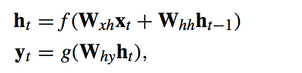
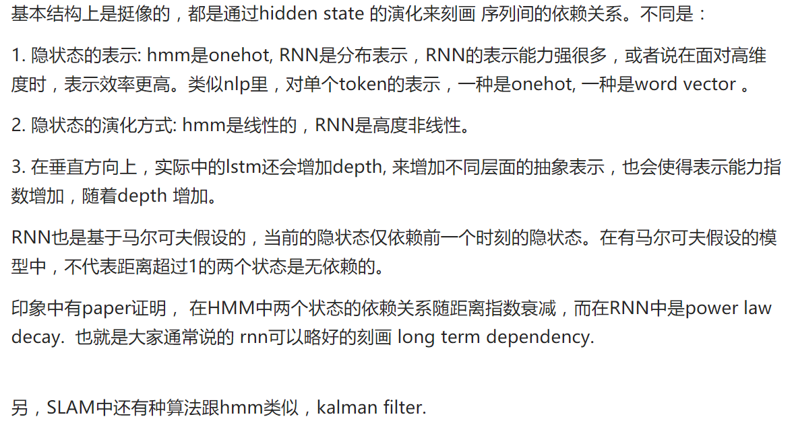
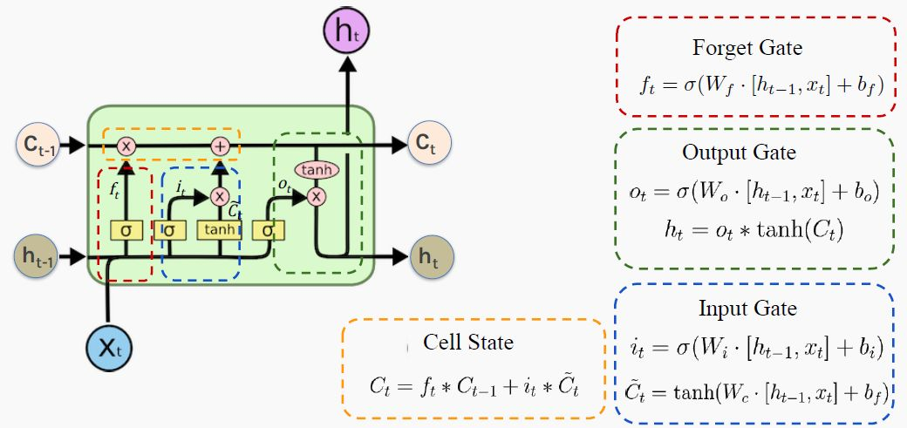
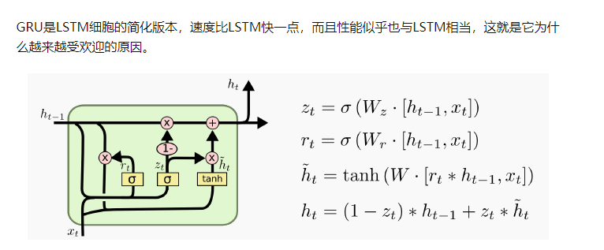

# 递归神经网络

用于处理任意长度时序数据，每一个时间点都共享参数，每个时间步的计算

文本摘要，语音识别，阅读理解

缺点是对于Long term的序列，远处的信息很容易丢失(主要因为网络太深，信息丢失，以及梯度消失和爆炸)

# LSTM

注意这里，所得gate关键部分就是sigmod,训练良好的sigmoid函数值要么是0，要么是1，所以

传统上分析LSTM的好处的各种文章通常是两点：解决梯度消失和抓长距离依赖.
LSTM处理长序列的优点
1. 可以选择性的记忆某些时刻的信息，过滤不需要的信息
2. 可以避免梯度消失/爆炸

“忘记门”（ Forget Gate）控制着过去存储的内存量, 它觉得新的ct中是否还要保存ct-1的信息。gate尤其是forget gate的作用与residual类似，给较早时刻的单词加了一条通路，可以更好的把较早时刻的单词信息传到当前时刻，也有利于梯度的传播～

input gate

接下来，你需要决定：最近发生的事情（隐藏状态h）和今天发生的事情（输入x）中的哪些信息需要记录到你对所处情况的长远判断中(状态状态C)。LSTM通过使用“输入门”（ Input Gate）来决定要记住什么。

sigmod和tanh起到了squashing的作用。

forget gate里面大多数位置都是0，少数为1，这部分1就是它要在网络中持续保留的信息

LSTM中的三个门是用的sigmoid作为激活函数，生成候选记忆时候用的才是tanh，门j的激活函数如果用relu的话会有个问题，就是relu是没有饱和区域的，那么就没法起到门的作用。候选记忆用tanh是因为tanh的输出在-1~1，是0中心的，并且在0附近的梯度大，模型收敛快

为什么使用sigmod
   
LSTM应该需要饱和的门来记住或忘记信息，不饱和的门会使得过去和现在的记忆一直在叠加，造成记忆错乱

另一方面，LSTM在非常长的数据上（比如超过1000个step）是很难训练的，这个问题一般可能不太会遇到，但是语音里也不算罕见。无论是波形还是频谱图，在句子长了以后是很容易上千甚至上几千的，这时候LSTM的训练就会有些问题。一般我会加个gradient clipping来处理特别长的输入，并且发现这样比不加要好非常多。

DNN性能一般是因为DNN建模的过程本质还是一个词袋模型，无法对词序做区分，也就是一个句子里面词换序之后经过fasttext 第一层之后是不变的，但是很多句子里，词序其实对句意影响很大，甚至有决定影响。

CNN同理，convtext，只是提取了局部的ngram信息，对于句子的词序尤其是远距离词的词序是区分不了的。 类比传统的文本分类方法，DNN相当于词袋模型，只是特征变成了词向量，卷积相当于特征变成了词向量组成的ngram。

LSTM的优点是建模时隐含着建立了一个语言模型，这对词序是很强的区分。双向lstm就更强，反向也建了个语言模型，不仅有正向词序还有反向词序的区分，这样对于LSTM每一个步的词，相当于有了完整的上下文建模。

长序列

其实LSTM抓长距离依赖的能力并没有那么强，比如机器翻译任务里，长句的翻译性能下降还是比较明显的。此时需要梯度剪切等方式来避免。
self attention加上位置编码的模型组成的transformer是一种很强的捕获长距离依赖的手段，对于全局信息的建模是很强的，这些模型都没用任何RNN，只是把词序信息用一种三角函数硬编码到了词向量里。这些任务的特点是：信息量大、文本的全局特征在任务里更重要，所以self attention的好处被充分发挥。

Encode-Decode 框架中固定长度的向量表示也是有限的，输入序列较长时模型性能就会变差，毕竟丢失了很多细节信息嘛。这就给 Attention 替换 RNN 的说法形成支撑。LSTM、GRU 及其变体能学习大量的长期信息，但它们最多只能记住约 100s 的长期信息，而不是 1000s，10000s 甚至更长时间的信息。

事实上最近NLP圈甚至有一种争论是要不要放弃LSTM，毕竟训练速度比attention和卷积慢，更是无法并行，现在很多性能上也比不了attention了。当然这并不会发生,LSTM依旧由很多优点.

# attention
LSTM+attention似乎一般都能比只用LSTM要稍好一点，但是这个也跟目标任务相关。NLP中的Seq2Seq类模型、CV中的video captioning模型应当是提升最大的，因为输入和输出中的对应可能有很长的时间（单词、帧）跨度，这种时候attention经常能帮大忙；

语音识别中attention也有帮助，但帮助的主要是language model而不是auditory model，因为auditory model本身还是局部化的（说了啥就是啥，音素上是不会变的），而language model是全局的（从上文来看，这里这些音素组成的是个什么词？），但是提升上没有NLP里那么明显，不过这又是另一个问题了——我觉得LSTM在语音里的坑比NLP里要多。

作者：Yi Luo
链接：https://www.zhihu.com/question/278825804/answer/403308938
来源：知乎
著作权归作者所有。商业转载请联系作者获得授权，非商业转载请注明出处。

# GRU

GRU主要优化在于
1. 合并forget gate和input gate, 直接用1-input_gate代表forget gate
2. 合并LSTM中的ct和ht, 统一用ht表示