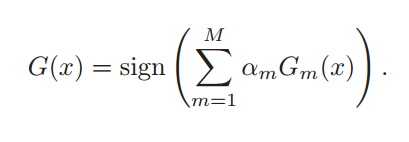
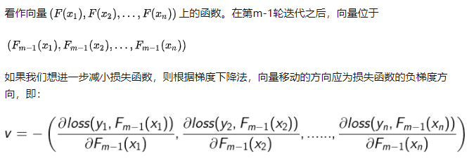
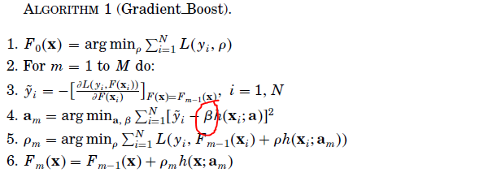
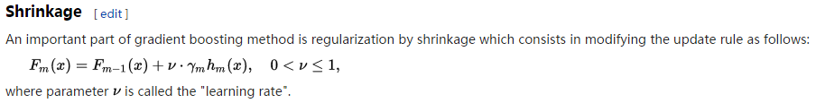
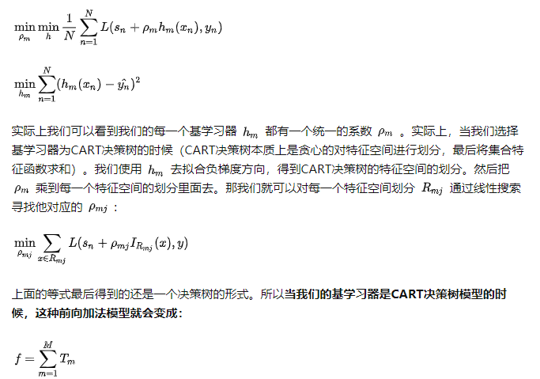

# boosting
思想通过堆叠多个分类器，将每个分类器的输出进行加权平均（投票）得到结果。

怎么找出最优的权重，以及最优的子分类器是个问题。

Gradient Boosted Decision Tree（GBDT）, 思想是将每个子分类器看作一个函数向量。
每一次迭代，我们通过决策树来拟合负梯度，从而使得F(x)每一轮迭代都朝着最优化方向前进，之后我们再通过最小化残差求出子分类器的残差。此外我们还需要定义超参数学习率，避免梯度的过拟合。

上面的公式指的是整个集成模型F(x)的优化过程，我们把F(x)在函数空间中按照梯度方向进行更新。

因此我们需要做两件事
1. 我们通过一个CART，拟合负梯度, 这其实是一个回归问题（第三行），注意上面的公式h(x)前面还有个系数，这个方法称为shrinkage，这里的shrinkage代表的就是学习率，因为我们不可能每次都能完美拟合，甚至可能过拟合，因此这里需要一个正则参数，约束F(x)每一步的更新，其实也就是学习率(learning rate)

上面的学习算法实际上更下面的一样，只不过下面是将learning rate放在和h(x)前面，而上面的算法是放在了h(x)的损失函数中.

实际上的可以证明的是，在前面乘一个放缩系数,就等价于把前面的回归问题的MSE转换为下面的MSE：

2. 通过最小化y和按梯度方向更新的后F(x)的损失函数，求解出权重。
这里最常见的损失函数是平方损失函数，square loss的优点是便于理解和实现，它的负梯度就是残差，所以当损失函数是平方损失的时候，又叫残差提升树Boosting
而其他损失函数的负梯度只能看作残差的近似值，它的缺点在于对于异常值它的鲁棒性较差，因此会常用absolute loss或Huber loss来代替。

GDBT和xgboost的一点思考 - 雨伞的文章 - 知乎
https://zhuanlan.zhihu.com/p/37611297

最后我们的学习算法每一步更新可以表示为

这里的学习的步长属于模型的一个超参数， 

为什么前向分步时不直接拟合残差？简单来讲就一句话，为了可以扩展到更复杂的损失函数中。这时候你可能就有疑问了，难道不是所有的损失函数都在  时最小吗？那可能你忘了正则项这一回事，如果只是经验风险最小化的话非常容易过拟合，所以一个合理的办法就是在每个基模型中加入正则项，所以在有正则项的情况下就不再是  时损失函数最小了，所以我们需要计算损失函数的梯度，而不能直接使用分模型来拟合残差。

## 树模型

基学习器是树模型的情况，或者更准确的说是CART决策树的情况。
1. 树模型的特殊性使得我们可以对上面的情况进行一定的优化，此时我们不用引入基学习器的权重参数
2. 我们可以看作树模型只是帮我们找到一个基于负梯度拟合后的最优特征空间划分

