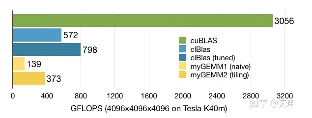

1. CUDA: 好用也挺成熟了，毕竟那么多年了。但是只支持 NV 的 GPU 这个有点麻烦。
2. OpenCL: 一般，也比较成熟了。OpenCL是一个开放的、免费的标准框架，用于异构系统中的跨平台并行编程。, 这个支持的就多多了，不光是 NV GPU/Xeon Phi可以用，Intel的核芯显卡甚至Altera的FPGA都能用。也有不少开源项目在用了。
3. OpenMP: 没啥好比较的。OpenMP是给你处理线程并行的，不能处理 offload.OpenACC: Cray, Nvidia 和 PGI 想来挑战 Intel 和 IBM 的？后来又加上了个 AMD，然并卵。Intel Cilk Plus 都比它好用多了而且 Intel Compiler 还有原生支持。

经过完全优化的opencl数学库clBlas差cuBlas近一个数量级，不是一个朝代的！！！有了N卡，谁有病再去用opencl呢？如果没有N卡呢？比如我的笔记本上有一张Intel G630，比较下来，opencl的矩阵运算甚至不如纯CPU的numpy！！！

