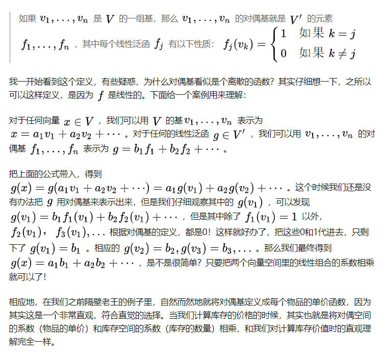
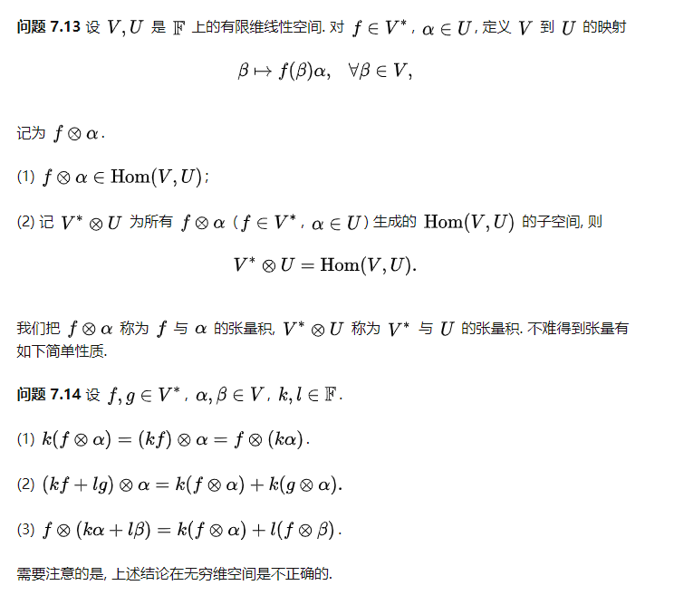

张量 

# 书籍

《微分几何入门与广义相对论》

一套极为珍贵的教材。我最欣赏的中文微分几何教材。（其次是梅加强的《流形与几何初步》）

 An Introduction to Tensors and Group Theory for Physicists

学张量分析的数学基础是搞清楚高代里有关于对偶空间，度量空间的部分（到这里和学完完整的高代差不太多了），剩下的就比较简单了，和基本的分析运算一结合，多熟练熟练就行了。

# 基础概念

张量和微分几何都是为了选择一种基于基矢表示的范畴上找到不依赖基矢选择的不变关系。
张量设计的目的就是为了定义与坐标系无关的物理量。
张量所描述的物理量是不随观察者或者说参考系而变化的，当参考系变化时（其实就是基向量变化），其分量也会相应变化，最后结果就是基向量与分量的组合（也就是张量）保持不变。
考虑到张量有如此强大的表示能力，又不随观察者不同而变化，能够有效的表示宇宙间的万物，Lillian R. Lieber给了张量一个形象的称呼the fact of the universe.

如果一个物理量，在物体的某个位置上只是一个单值，那么就是普通的标量，比如密度。如果它在同一个位置、从不同的方向上看，有不同的值，而且这个数恰好可以用矩阵乘观察方向来算出来，就是张量，比如物体的内应力、转动惯量。

同一物理量的值，在不同坐标系下的坐标往往是不同的，如果去除坐标系变换的影响，应该是同一个量，于是就把这些符合某种坐标变换法则的物理量称为张量；另一方面，黎曼流形研究的对象恰好就是曲面上的各种对象在不同坐标系下的不同表示之间的联系，在流形上的众多对象中，把流形切丛上的多重线性映射称为张量(场)。当然，这两方面说的是一个概念。

张量的关键性质，就是我们如果想要求出它在另一个坐标系下的表示，只需要乘以一个变换矩阵即可。

# 对偶空间
对偶空间里的元素是“线性泛函”（linear functional），这是一种特殊的线性映射。它构成了一个线性空间，也就是任意一个线性泛函，我们都可以用一组基底来表示。
dual space V*与原空间 V维度相同（同构的）。

线性函数是什么？

这里所说的一个函数，就是一个吃掉一个向量，产生一个数的机器。并且，如果这个机器的吃法是“线性的”，那这个机器就会被叫做线性函数。稍微数学一点的说法就是，线性函数是一个映射，将一个向量线性地映射到一个数。

这就是线性函数。很快我们就会意识到，虽然这是一个函数，但是它的地位事实上和自变量，也就是某个向量，是平等的。在这个意义上，我们回头考虑开头“一阶张量是一个向量”的论断。这个论断在一定程度上不假，因为在线性代数中，我们定义过一个概念，叫做内积。它的作用就是将两个向量搞在一起，产生一个数。如果我们认为向量和在对偶空间中的线性函数是平等的，那么求函数值的过程就如同求内积的过程一样：向量+对偶的向量=一个数。

更严格地说，逻辑上，这种平权性会引入对偶的概念，随之自然地产生内积。这种发生在向量和同它对偶的线性函数之间的内积运算的方式以及结果，和将这个函数直接作用在向量上没有什么区别，

# 张量

张量用来表示多重线性函数，比如两重线性函数可以表示为T(x,y) = ax + by, 这里x, y可以是在不同。
输入r个向量，输出一个实数, r成为张量的阶.
我们通常用tensor来表示一个张量，也就是一个多维数组。
tensor中的元素，代表的是这个线性函数作用于r个基底后得到的值。比如一个三维张量可以表示为下面的公式。

$$ T(x, y, z) = ax + by + cz $$
$$T_{ijk} = T(e_i, e_j, e_k) = ae_i + be_j + ce_k$$

因此我们可以通过一个tensor来表示一个线性函数，相应的有

张量T矩阵表示是依赖于所选的基矢的，而张量T作为多重线性函数是个抽象的实体，本身不依赖于基矢。

不同的数值可以表示同一个物理量。高维的情形就没那么平凡了。但是说穿了也很简单，不同的向量可以表示同一个物理量。一维的情形，不同的数值之间只差一个倍数，所以很平凡。高维的情形，不同的向量之间差的就是（切空间上的）线性变换

有些物理量，并不简单地生活在切空间中，而是切空间上的线性变换，或者二次型（比如转动惯量，比如动能），或者落在切空间的对偶空间中，

张量跟向量一样，也是某个特定线性空间的元素.
区别的地方在于，这个特定线性空间是用若干线性空间通过张量积操作生成的.

F=ma，力的单位因此是 kg*m*s^-2

看似普普通通，只是把两个数乘起来，其实，它做的是张量积. 这是为了使得计算过程不受单位的约束。

度规(长度、角度的度量)就是一个2阶张量

张量所描述的物理量是不随观察者或者说参照系而变化的
，当参照系变化时（其实就是基向量变化），其分量也会相应变化，最后结果就是基向量与分量的组合（也就是张量）保持不变。
这样的好处是，可以求出一个物理量在任意一个方向的值（基向量变换）。我们讨论某个方向的力的时候，不仅仅有沿着法向的正力，还有垂直于法向的剪力。什么东西点乘一个向量，还是一个向量呢？那就是二阶张量。

矢量作用的单位可以看成是一个点，而张量作用的单位是一个占据空间体积的微元体。应力张量的存在就是因为物质有体积。
张量包含了某个点上 / 任意一个过这个点的面 / 的受力情况。所以，我们用这个面的法向量 点乘 张量，就可以得到该面的受力信息了。
在某个受力点，我们可以从N个方向对该点同时进行作用力，因此，单个向量已经无法描述该点的受力情况，必须引入张量。

有限维线性空间的对偶空间也是有限维的，且维数和原来的空间相同，称对偶空间上的元素是一个协变，对偶空间上的线性函数是一个反变[2]。根据自然的同构，也可以认为反变就是原来的空间上的向量。

# 张量积

同一个双线性函数在不同的基下的度量矩阵之间是合同的，标准型的本质是找到这样一组正交基，这个基下的度量矩阵为对角矩阵。

对称双线性形式对应对称矩阵。对称双线性形式定义二次型函数；反过来二次型函数可以表示对称双线性形。
对称矩阵都合同于一个对角矩阵，证明思路类似Gram-Schmidt正交化（见7.2节）。它保证了二次型的标准形的存在性。

对向量做内积的运算就是关于欧式空间的一个二重线性函数,只不过它相当简单，其中的多重坐标分量可以用一个矩阵表示，并且它恰好是一个单位矩阵。

V*中的每一个对象可以看作度量V中向量“长度”的一种度量方法。那你可以想象，V*V*是度量V中两个向量张成的区域的“面积”的度量方法。注意，以上讨论对不同两个空间的张量VW同样成立，也就是说张量事实上可以给出不同空间的向量“张成的区域”的“面积”。

叉积本质上是楔积。两个向量的楔积得到的是一个二阶反对称张量。在三维情况，这个3×3的反对称张量只有三个自由度，恰好和一个三维向量一一对应。而这个三维向量就是所谓叉积的结果。而楔积的引入，最开始就是为了计算面积啊，体积啊。所以说，从这个角度，叉积也是有高维推广的。但这个推广，并不那么直接。

张量积可以应用于不同的上下文中如向量、矩阵、张量、向量空间、代数、拓扑向量空间和模。在各种情况下这个符号的意义是同样的: 最一般的双线性运算。在某些上下文中也叫做外积。

我们所熟悉的积: 数乘，标量积，内积，叉积，矩阵乘积，面积，体积，等等，都可以表示为张量积的线性映射。而张量积也是广义积，单从积这个二元运算来说，其蕴含了一个双线性映射。

从定义上来说，张量积就是一个双线性映射，其结果还是一个张量。张量本身也是bilinear map。
研究张量积的主要手段是如何把这个bilinear map对应到一个linear map上。张量积的泛性质（universal property for tensor product）就是这样一个定理。基于该性质，我们讨论张量和张量积上升为讨论bilinear map与linear map。

泛性质是建立在上空间基础上定义的。商空间，即仿射子空间，或者称为线性流形。是由线性映射诱导的一个等价关系，等同于对原空间（说成集合更贴切）的一个划分。比如给出一个直线方程（该直线是原空间的一个子空间），其上所有的点都划分到这条直线上（等价类），而这条直线本身是商空间的零元素。因此，商空间是线性降维的一种手段。

# 反变/逆变 

所谓 反变/逆变 就是指张量的系数在基变化下是通过作用转化矩阵的逆矩阵得到，而所谓 协变/共变 就是指系数在基变化下是通过作用转化矩阵得到。

# 度规张量

度规，从字面意思理解，度量规则，定义某一个坐标系下，两个点的距离，度量函数是个线性函数，因此可以用张量表示，称为度规张量。

度规张量遵守张量的性质，具有协变/反变的性质，因此通过坐标变换我们就可以求得不同坐标系下的度规张量（度规计算函数）。

# 叉积

两个向量张成空间的零向量

叉积表示的也是一种线性变换。

法向量与该平面内的所以向量的内积为0，实际上就是求Ax=0,A就是给的两个向量组成的矩阵.
求解出来的x在三维空间只有一个姐

叉积的本质就是张量积。
两个矢量的叉积是二阶反对称张量，可以用矩阵表示。然而三维是特殊的维度，因为该维度下存在着张量空间到矢量空间的某种同态(Hodge对偶)，所以两个三维矢量的叉积结果形式上可以表示为一个三维矢量。

叉积的直观含义是有向面元，也就是既有大小信息又有方向信息的一个面元。一般的在n维里它的方向信息应该是要2个或者(n-2)个不同向向量才能决定的。你可以想象三维里一个面的方向既可以由面里的两条不平行的线的方向决定，也可以由面的法线方向决定。所以二维的有向面元可以作为标量也就是2-2＝0阶张量，而三维的有向面元可以作为矢量也就是3-2＝1阶张量。同理四维中的有向面元就只能用2阶张量表示了，也就是四维中不存在作为二元运算叉积。但是你可以在四维里定义一种三元运算的叉积，它的意义是有向三维体元（面元是有向二维体元），它可以表示为4-3＝1阶张量也就是矢量，这种运算可以输入三个矢量输出一个矢量，它的方向是那个三维体元的“法向”。

Clifford代数里面将叉乘定义为两个矢量的二矢的对偶。

比如三维中，二矢表示一个平面，对偶当然就是法矢量了。

在几何代数中，内积是降阶操作，外积是升阶操作。两个矢量的内积是标量，两个矢量的外积是二阶矢量，三维中可通过Hodge算子对应一阶的矢量，相当于叉乘，所以叉乘只在三维有定义，而外积可推广。利用降阶和升阶的现象，可将内积外积定义推广到多矢。内积 inner product, 又时候又称scalar product 外积 wedge produxt, exterior product, outer product，中文词穷，都翻译成了外积，不过意思也确实差不多 应该最先有矢量间内积的概念，用来求长度，后来内积的概念推广到矢量空间。然后有了外代数中的wedge product，为与inner对称，将其称为outer product.

作者：玟清
链接：https://www.zhihu.com/question/26661955/answer/35803670
来源：知乎
著作权归作者所有。商业转载请联系作者获得授权，非商业转载请注明出处。

N维向量的叉积是如何被定义的？ - AmFCG的回答 - 知乎
https://www.zhihu.com/question/31549458/answer/52547431

# 应用

计算机视觉不少传统的非深度学习处理的手段就很几何，处理二维三维图形的几何知识都可能用到，比如空间解析几何，射影几何，曲线曲面论的内容都有一些应用。微分流形在很多机器学习的文献里也会提到一点，不过我个人看来噱头成分大于实际用处。

