曲线的散度和通量---->曲面的散度和通量---->曲线的旋度和环量---->曲面的旋度和环量

通量在国内的书上一般称为 第二类面积分（我特别想吐槽这个称呼）.

# 一阶微分

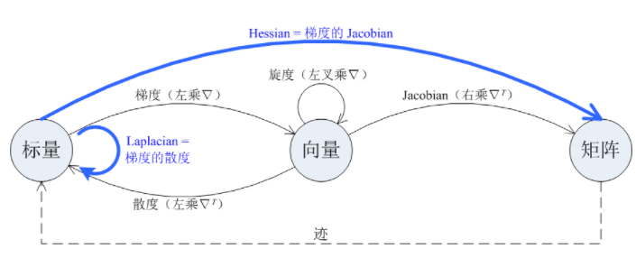

四种一阶微分运算，包括梯度、散度、旋度和 Jacobian。
这四种一阶微分运算可以统一用算符nable表示。Nabla 算符是一个形式向量它可以如下地作用于标量 或向量

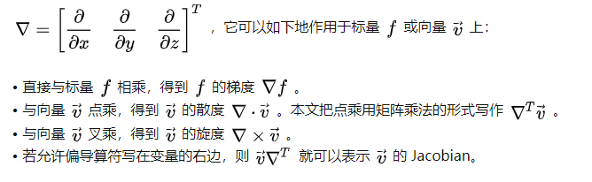

这几个都是用来描述向量场中向量得变化趋势。向量场比较直观的例子就是二维流动的液体，我们需要表示出液体中每一个单独粒子的速度和方向。~~~~

## 向量场
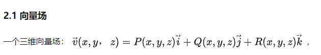

## 散度

对于那么对于一条曲线而言，有的向量朝着外面通过，有的朝着里面通过，就会相互抵消。
那么每一小段上向量F在法向量上的分量（F·n）乘以这一小段的距离ds（因为相切得部分不会流过），然后加起来就是这一小段曲线的通量。

设在(x,y,z)液体流量面密度为A(向量), 曲面该处的法向量为n ，微元面积为dS。
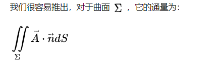

同理我们也可以定义极小邻域的通量, 通过极限运算就可以求解出每一个点上的通量。
散度。我们取一个极小的曲面，并求解这个曲面的通量，并除以体积，并计算极限，就可以得到散度。因此散度也成为通量密度。

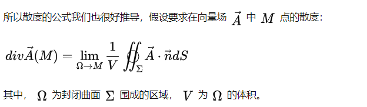

求解极限可以得到，散度为各个方向的梯度模长之和。
当一点处向量分量沿各自方向的偏导数的和为正时，说明这一点处的向量，非常讨厌这一点，想要迫切的离开这一点，正数越大离开的想法越强烈；当为负时，说明这一点的向量很喜欢这一点，他虽然不愿意离开。
所以散度，在脑海中可以形成的直觉就是，这一点的向量离开这一点的愿望的强烈程度。

高斯公式，又称为散度定理，解释通量和散度的关系。简单来说就是封闭曲面（区域）的矢量积分等于表面的矢量积分，因为内部的都被上下抵消掉了.
散度定理通常运用在三维空间中。然而，它可以推广到任意维数。在一维，它等价于微积分基本定理；在二维，它等价于格林公式。
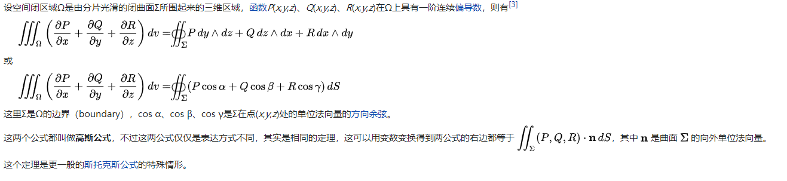

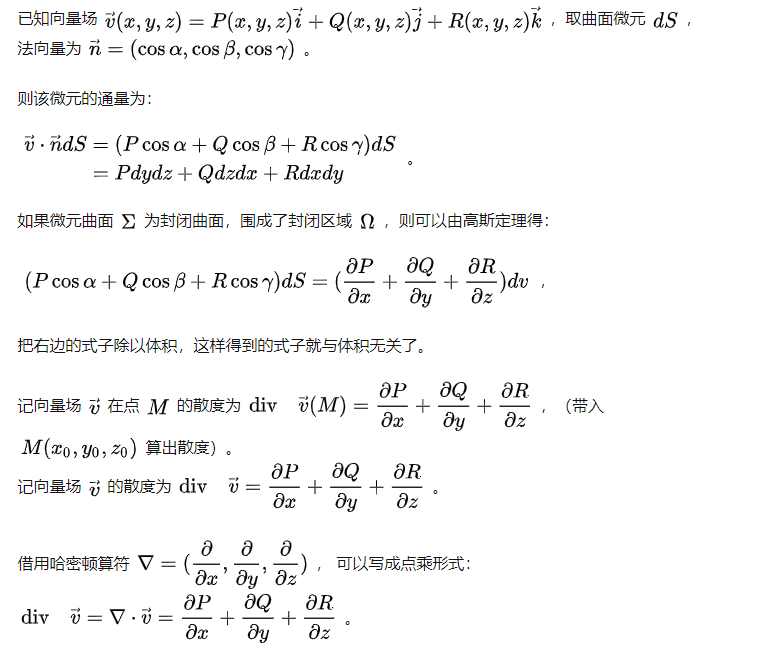

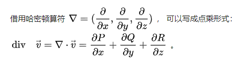

散度，旋度是向量场的某种性质，就像是密度是物质的性质一样。

散度的体积分就是通量（就是大家讲的：要知道球面光进出了多少，看看球体内有多少源和汇就知道了），即高斯定理（面积分等于体积分）。

## 环量与旋度

格林公式解释的是二维平面上旋度和环量的关系

环量的典型代表就是，在一个力场中，我们需要求解一个单位质量的质点在其中沿某条曲线 L 运动，如何求该力场中的力做的总功呢

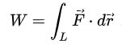

显然按照不同积分方向，有正负区别
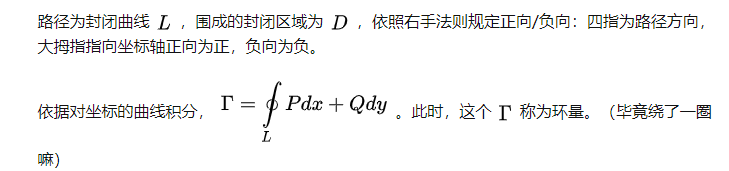

我们可以看到，环量是沿切线方向的积分，而通量是沿发现方向的积分

https://zhuanlan.zhihu.com/p/71503766

旋度就是环量密度

https://zhuanlan.zhihu.com/p/149639778

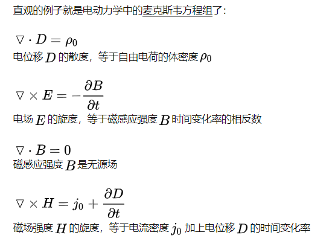

高等数学中，通量、散度、环流量、旋度，有哪些形象易懂的例子？ - Michael Jiang的回答 - 知乎
https://www.zhihu.com/question/25047547/answer/114295767

旋度，就是环量密度。 旋度表能量变化，旋度是这一点附近流的机械能的变化率。旋度代表流量在这个点附近的绕行的流量的差异，也就是类似于“绕过左边的比绕过右边的少”这件事。这说明流量在这个点附近打圈。由于“绕过”是有方向性的，所以旋度是个矢量，垂直于“绕过”的所在平面。它其实暗示着能量流动在这个点附近是不均匀的，这种物质在这个点附近获得了或者损失了能量（体现在获得或损失速度上）。

作者：灵剑
链接：https://www.zhihu.com/question/46380810/answer/111328873
来源：知乎
著作权归作者所有。商业转载请联系作者获得授权，非商业转载请注明出处。

https://www.zhihu.com/question/21912411

龚昇的《简明微积分》。

散度表示当x,y,z有微小增加时， P,Q,R增加量的总和。散度在各个方向是一样的，不随坐标系旋转而改变。散度对旋转不变。
散度描绘的是速度矢量的增加量，旋度描绘的就是速度矢量方向的变化情况，所以它是矢量，有三个分量。

散度定理说明，矢量场穿过曲面的通量，等于散度在曲面围起来的体积上的积分。

旋度定理说明，矢量场在曲线上的旋量，等于旋度在曲线围起来的曲面上的积分。

# 二阶微分

图中的粗实线箭头表示了两种二阶微分运算，它们可以由两个一阶微分运算组合而成，即：

* 梯度的散度就是 Laplacian；
* 梯度的 Jacobian 就是 Hessian。

图中的虚线箭头表示了一种不涉及微分的运算（迹）。在微分运算之后接上「迹」运算，可能得到另一种微分运算，如：

* Jacobian 的迹就是散度；
* Hessian 的迹就是 Laplacian

https://zhuanlan.zhihu.com/p/35323714

## 拉普拉斯

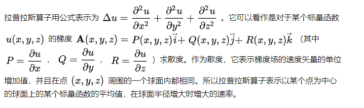

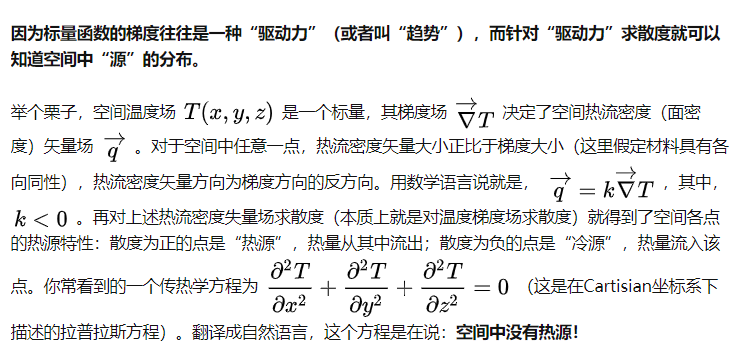

拉普拉斯算子描述了一个标量函数在某一点附近的平均值与该点处函数值的差。
因为我们可以用二阶差分拟合二阶导数

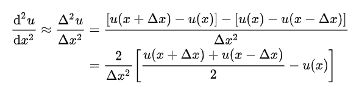

放在温度上来看，拉普拉斯可以用于描述热传导过程，因此热传导方程无非就是说，如果空间某一点的温度低于(高于)周围的平均温度，那么该点的温度就会以正比于该差值的速率上升(下降)。

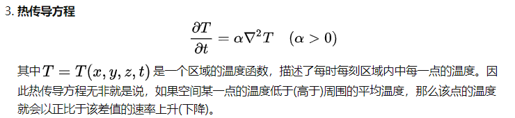

图像处理中，拉普拉斯可以用来捕获边缘。首先边缘是两块明显不同的区域之间的分割线，而各个区域内的灰度应该是大致稳定的。
因此我们用拉普拉斯算子计算二阶微分（二阶差分），来找到突然变化的点，突然变化的点可以看作是散度比较大的点，因为跟周围的点的差值比较大。

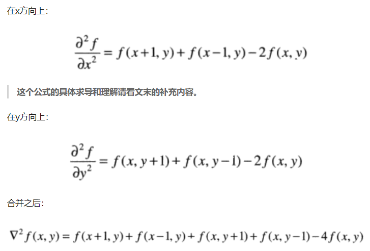

我们也可以通过下面的图片来展示这个过程，假设我们只观察[y1,y2,y3]三个点

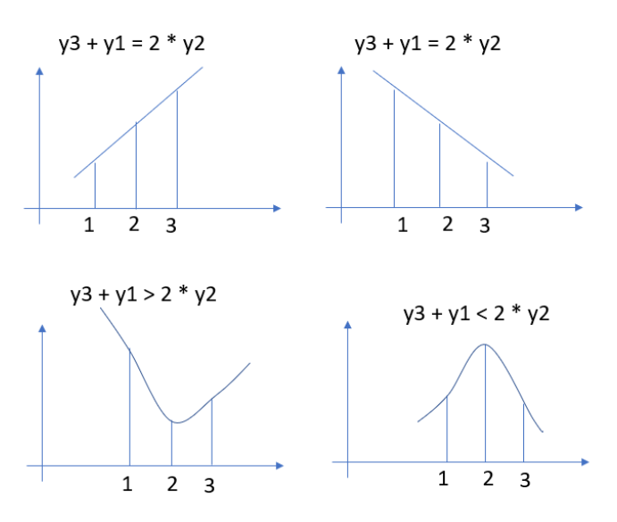

如果二阶差分为0，说明在一条直线上，否则肯定是个凸出/凹进的曲线。

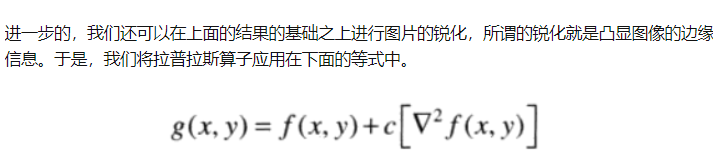

为什么 空间二阶导（拉普拉斯算子）这么重要？ - 薛定谔的老狗的回答 - 知乎
https://www.zhihu.com/question/26822364/answer/1831093667

因此叫做平均值算子似乎更合适一些。

## 图像中的拉普拉斯

在图像计算中，常常使用卷积来计算

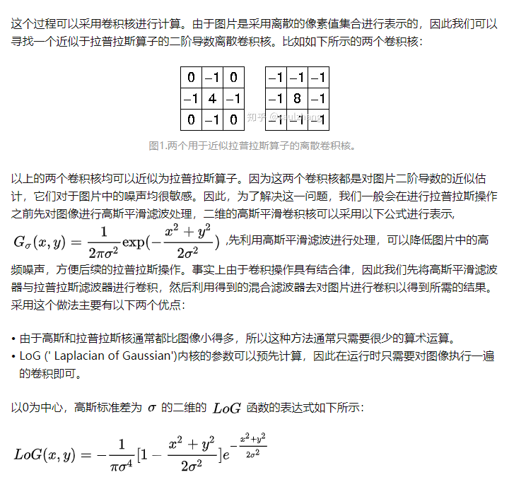

https://zhuanlan.zhihu.com/p/92143464

随着高斯函数变得越来越窄，LoG卷积核将会近似于图1中所示的简单Laplacian内核，主要原因是因为采用十分窄的高斯函数，其在于离散的网格上面
是不起作用的。

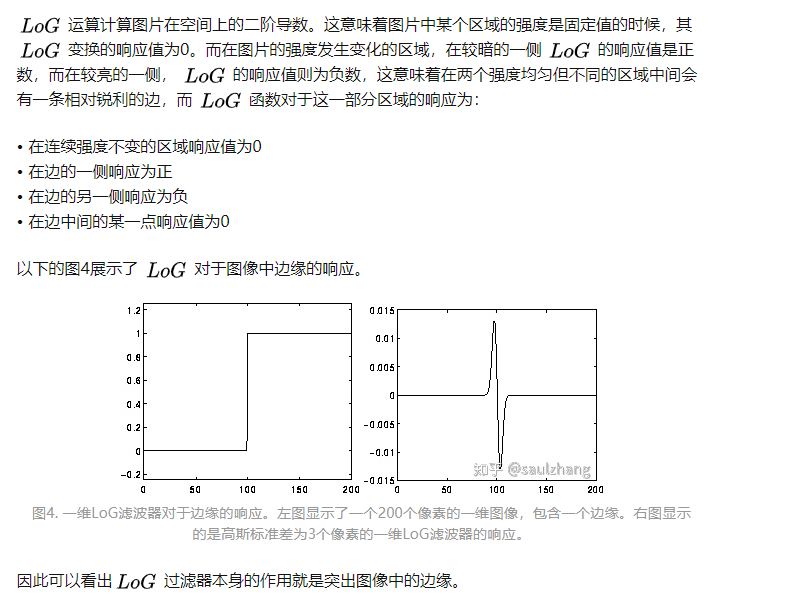

[公式] 是一个各向同性的过滤器，所以不可能直接从 [公式] 输出中提取边缘的方向信息，这与其他边缘检测器(如Roberts Cross和Sobel算子)的方法类似。

https://zhuanlan.zhihu.com/p/92143464

## 拉普拉斯矩阵
https://zhuanlan.zhihu.com/p/81502804
https://zhuanlan.zhihu.com/p/85287578
## Jacobian和Hessian

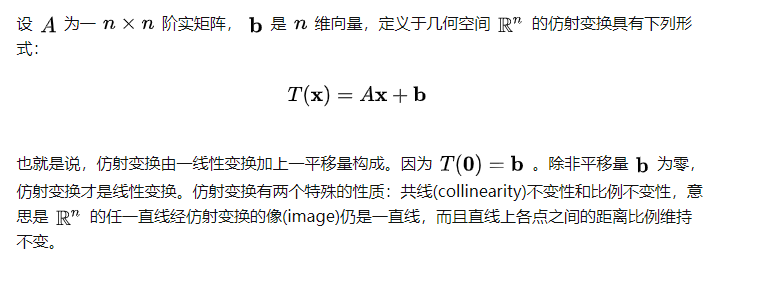

Jacobian矩阵可以帮助我们通过ax + b来近似f(x)

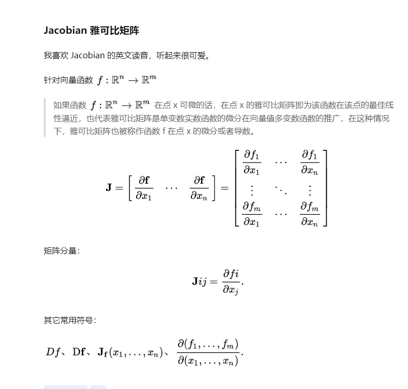

如果 m = n，那么 Jacobian 可以形成方阵，这个矩阵可以计算出它的行列式，也叫做 Jacobian (determinant)，它的意义是比如这个微小形状改变的比值。

雅克比Jacobian 矩阵, 可用于判断梯度下降的步骤是否会像预期的那样改善，什么样的学习率能够保证结果更好。

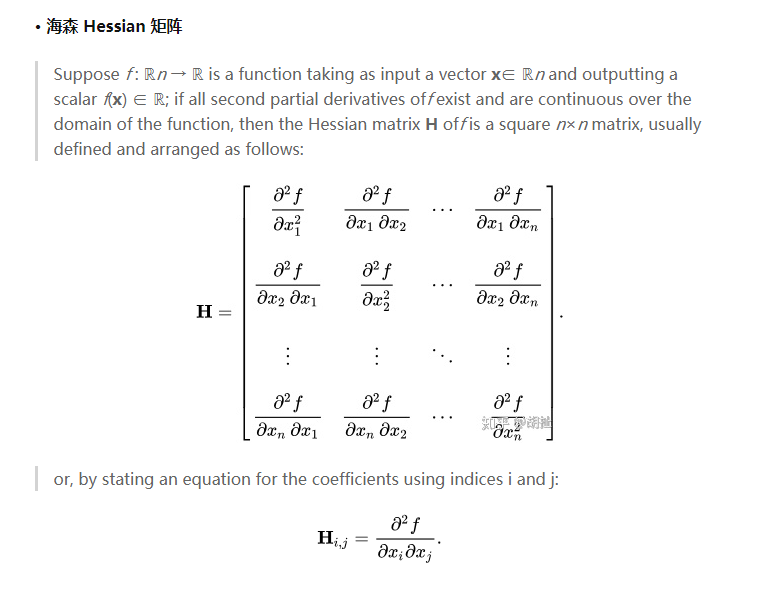

Hessian矩阵是函数梯度的Jacobian矩阵,

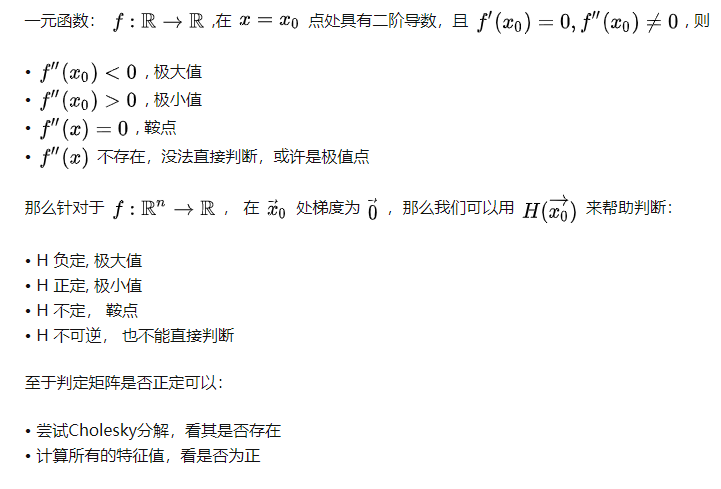

https://zhuanlan.zhihu.com/p/117657125