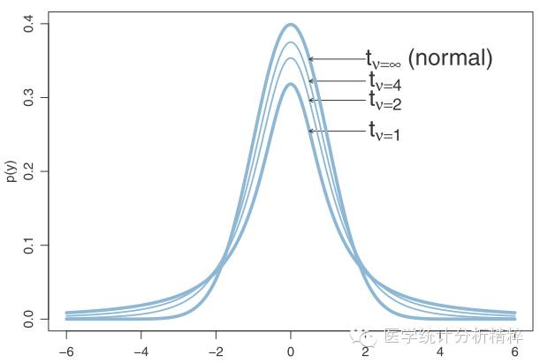
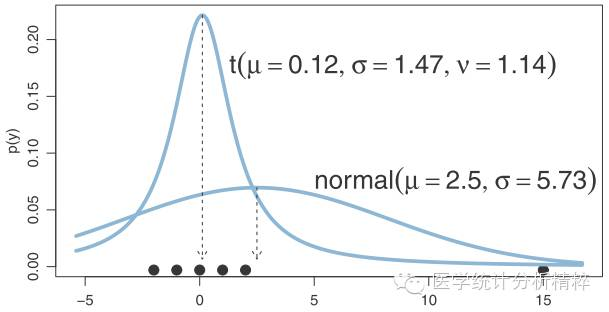

t分布用于检验均值是否不同。F分布用于检验方差是否不同。卡方分布主要用于检验样本是否偏离了期望，例如偏离了期望的分布(拟合优度检验)，期望的比例(列联表)等。t检验和F检验只能使用连续数据(定量数据)。卡方检验既可以使用连续数据，也可以使用离散数据(频数)，也可以用于对数似然值。但计算公式不同。三者都可以用于回归方程系数的检验。t统计量的平方就等价于F统计量。大样本时，t检验就等价于Z检验，其平方等效于卡方统计量(以上针对线性回归和方差分析等线性模型而言。非线性模型中系数的t检验/z检验与卡方检验/F检验不完全等价。)

两个卡方统计量除以各自自由度后再相除，就等于F统计量。

1、有关平均值参数u的假设检验

根据是否已知方差,分为两类检验：U检验（Z检验）和T检验。
如果已知方差，则使用U检验（Z检验），如果方差未知则采取T检验。

2、有关参数方差σ2的假设检验

F检验是对两个正态分布的方差齐性检验，简单来说，就是检验两个分布的方差是否相等

3、检验两个或多个变量之间是否关联

卡方检验属于非参数检验，主要是比较两个及两个以上样本率（构成比）以及两个分类变量的关联性分析。根本思想在于比较理论频数和实际频数的吻合程度或者拟合优度问题。

原文链接：https://blog.csdn.net/qq_22592457/article/details/92982170

# 三大抽样分布
所谓的抽样分布，指的不是一个总体内所有变量的概率分布。而是你针对一个总体N，用固定的样本容量进行多次抽样，得到的一个有关样本方差、均值的组合。

三大抽样分布是从正态分布抽出的样本的分布，只有了解这三大分布，后续的假设检验和统计推断才能进行.

t分布就是正态随机变量的均值在未知方差时的分布。

S也就是population variance的MLE unbiased version。
使用s代替对Z ratio中的标准差有什么影响呢?

许多早期的统计学家都认为这种替代并不会对新ratio的pdf产生影响。在某些情况下，他们是对的，即当sample size n比较大的时候.
但是当sample size n比较小的时候这个结论就是错误的了，用s代替是会产生影响的,
当n较小时虽然这个新的ratio的pdf也和normal distribution一样时bell-shaped的，但是它的tails要thicker，也就是说它去的极端值的概率要比normal distribution大。

因此有人提出了t分布(student分布), 使用了t这个符号来表示ratio Z的分布。最后这就成了统计学中众所周知的Student t distribution。
我们平常说的t分布，都是指小样本的分布。但其实正态分布，可以算作t分布的特例。也就是说，t分布，在大小样本中都是通用的。

相对于正态分布，t分布额外多了一个参数，自由度。
大家都说重要的事要重复三遍，我们再重复一下，样本量越小（自由度越小），t分布的尾部越高(相比正态分布)。
尾部的高度，有十分重要的统计学意义, 尾部代表了出现极端值的概率, 在假设验证中的作用很大.

https://www.cnblogs.com/think-and-do/p/6509239.html

T分布盛行的原因，即T分布被广泛应用于小样本假设检验的原因。虽然是很小的样本，但是，却强大到可以轻松的排除异常值的干扰，准确把握住数据的特征（集中趋势和离散趋势）！

正态分布不能够容忍它长长的尾部出现大概率的事件（图中横轴值为15处一圆点出现概率为六分之一），所以正态分布就很无奈地，将这一点纳入它的胸膛而非留在尾部。于是乎，恶果就出现了：图中正态分布的均数，远远偏离了大多数点所在的位置，标准差也极大。总之，与我们所期待的很不一致。

Chi-square distribution和F distribution其实是为了derive Student t distribution的pdf而引入的。Chi-square distribution其实就是Gamma distribution，而F distribution又是2个Chi-square random variables的商。

通俗的定义：无偏估计是指“估计量的期望等于估计参数的真值”。
“样本均值”其实也是一个随机变量，那么就可以理解为这个随机变量的期望等于原始随机变量的期望，所以无偏（这是无偏的定义）；而它又是一个随机变量，只是估计而不精确地等于，所以是无偏估计量。