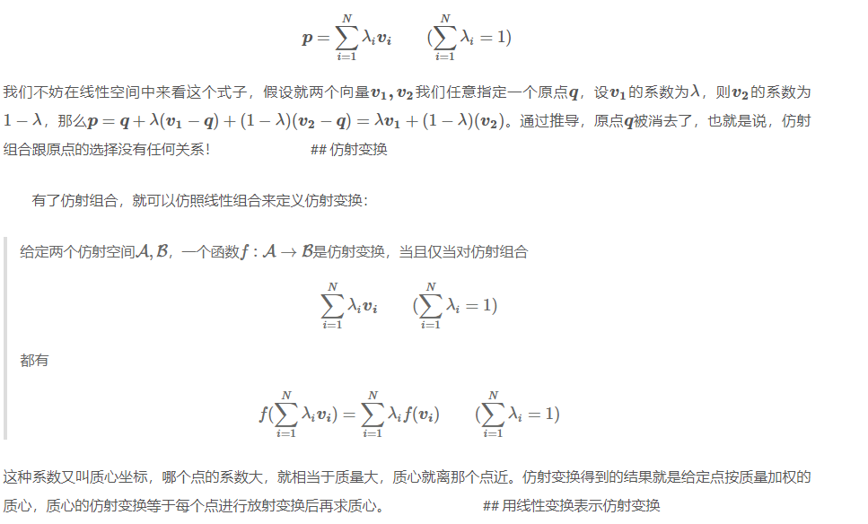
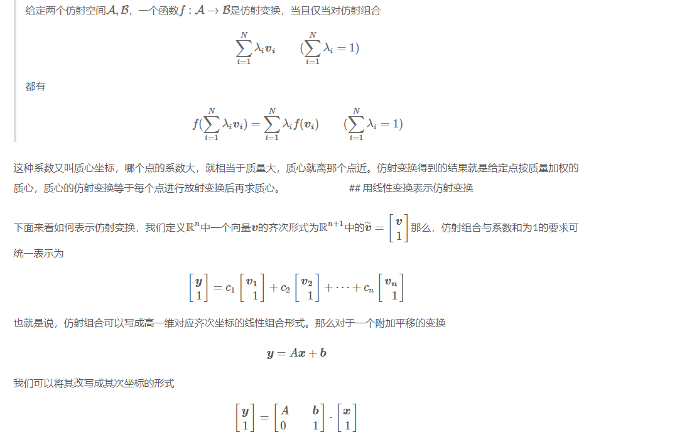
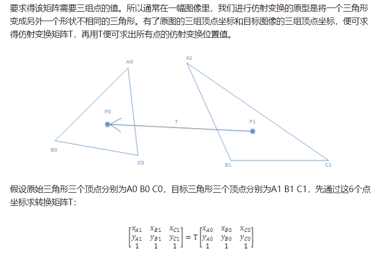

# 放射变换

我们用矩阵乘向量的方法，可以表示各式各样的线性变换，完成诸多的功能，但是有一种极其常用的变换却不能用线性变换的方式表示，那就是平移，一个图形的平移是非线性的！

我们都学过欧几里德空间，同时在线形代数课上老师让你们证明了任何通过原点的直线或者平面是这个欧几里德线形空间的子线形空间。那么，那些没有通过原点的直线或者平面可以理解为仿射空间的一个例子。它们在一定程度上具有线性。大家通俗的把仿射空间看成一个没有原点的线形空间。

仿射空间不属于线性空间。
仿射空间 （英文: Affine space)，又称线性流形，是数学中的几何结构，这种结构是欧式空间的仿射特性的推广。在仿射空间中，点与点之间做差可以得到向量，点与向量做加法将得到另一个点，但是点与点之间不可以做加法。

仿射空间就是没有原点的线性空间。在线性空间中，两个点相加，可以定义为原点到两个点的向量线性相加，而在仿射空间中，由于没有原点，因此不能定义相加，没有线性组合。但我们可以定义一个仿射组合来用若干基表出某个点。我们定义仿射组合：

我们再来看看质心坐标（Barycentric Coordinates），采用质心坐标的好处在于它能够表示每一点受周围点的影响，质心坐标的系数越大，影响越大，因此在线性插值时，可以直接用质心坐标来乘以每一点的值，得出的就是插值后的结果，在计算机图形学中进行渲染时，颜色差值就用这种算法。 　

针对三角形A1 B1 C1所在的全图，只需遍历图中每一点，对每一点进行仿射变换，便可求出针对整幅图像的仿射变换。

Affine transformation 仿射变换 - 任毅的文章 - 知乎
https://zhuanlan.zhihu.com/p/23199679

# 翻译的很烂

1. General Physics， General Chemistry，分别被翻译为普通物理，普通化学。2. Symplectic Geometry， Symplectic Manifold， 分别被翻译为辛几何，辛流形。3. Unitary Linear Space 被翻译为酉空间。4. Affine Transformation， Affine Space，分别被翻译为仿射变换，仿射函数。（这个最莫名其妙！）
2. 
仿射空间中没有特定的原点，因此不能将空间中的每一点和特定的向量对应起来。仿射空间中只有从一个点到另一个点的位移向量，或称平移向量。如果X是仿射空间，

# 投影变换

# 课程

https://www.cs.umd.edu/class/fall2018/cmsc425/