# 总结
相比RNN，attention架构的优点在于
RNN 固有的顺序属性阻碍了训练样本间的并行化，RNN is aligning the positions to steps in computation time, 对于长序列，内存限制将阻碍对训练样本的批量处理(因为RNN不能再time上并行，只能再批次上提高并行，但是内存限制，批次不能很大）。
Transformer，是一种避免循环(recurrent)的模型结构，完全依赖于注意力机制对输入输出的全局依赖关系进行建模。

attention用于时序数据的下面三个个阻碍

1. self-attention对位置不敏感，因为算score的时候是根据所有位置的信息计算，最后的加权求和也对位置不敏感，意味着交换某些输入的位置，输出不变。
2. self-attention中不包括非线性变换，No nonlinearities for deep learning! It’s all just weighted averages.
3. 需要保证decoder的attention不读取future的信息，可以把key,value set中去除future，但是

因此attention处理时序的时候需要三个要素, position embeding, 添加非线性，future mask
   

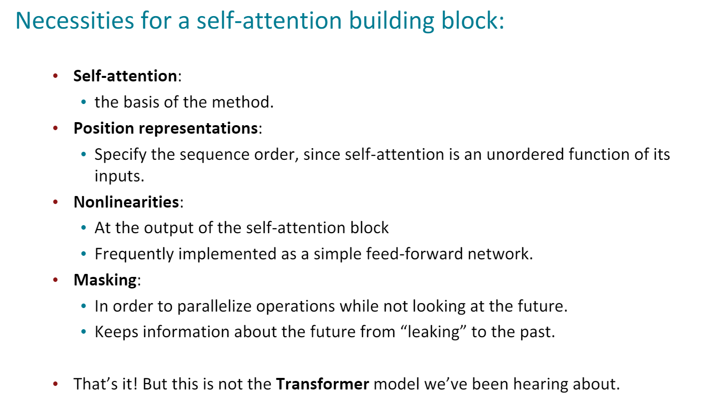

上面对attention的优化还不够, Transformer还做了下面的一些改动
1. KQV形式的self-attention，之前用的attention还是太简单了
2. Multi-headed attention: Attend to multiple places in a single layer!
3. training trick
   * Residual connections2
   * Layer normalization3
   * Scaling the dot product

KQV selfattention可以表示为下面形式

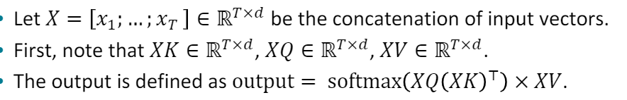

类比CNN中同时使用多个滤波器的作用，直观上讲，多头的注意力有助于网络捕捉到更丰富的特征/信息。

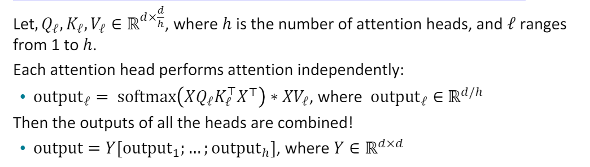

为了提高模型表达能力，需要足够的模型容量，也就需要hidden size足够大。但是如果不拆分成多头，那么模型就过于复杂了。所以多头的大hidden size实际上就是复杂度和容量的平衡。头数的好处就是为平衡模型提供了一个多余的调参空间。这也解释了头数不是越多越好，也不是越少越好，而是需要平衡。
所以这里的multi-head attention作用是 1.并行化 并不是和 head=1去比较的，而是和单纯的stacking more layer 去比较 2. 才是 和head=1去比较，multi-head 可以增加网络的capacity

Residual connections本质是打破了层级结构的显示，使得下层信息更容易传递到上层。
Residual connections are thought to makethe loss landscape considerably smoother(thuseasier training!)

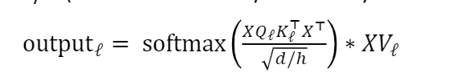

When dimensionality 𝑑 becomes large, dot products between vectors tend to become large.
inputs to the softmax function can be large, 这很可能使得softmax到达饱和区，是的梯度变得很小。
除以sqrt(d/h)，相当于对过大的d加入了约束。

完整结构如下

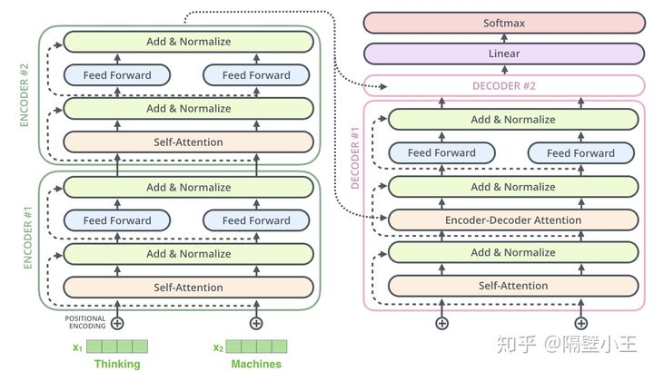

encoder由 6 层相同的层组成，每一层分别由两部分组成：

第一部分是 multi-head self-attention
第二部分是 position-wise feed-forward network，是一个全连接层（relu)
两个部分，都有一个残差连接(residual connection)，然后接着一个 Layer Normalization。

Decoder
和 encoder 类似，decoder 也是由6个相同的层组成，每一个层包括以下3个部分:

第一个部分是 multi-head self-attention mechanism
第二部分是 multi-head context-attention mechanism
第三部分是一个 position-wise feed-forward network

ontext-attention 是 encoder 和 decoder 之间的 attention，是两个不同序列之间的attention，与来源于自身的 self-attention 相区别。

Batch Norm方法经过规范化和缩放平移，可以使输入数据，重新回到非饱和区，还可以更进一步：控制激活的饱和程度，或是非饱和函数抑制与激活的范围。这个性质，也解释了第一个问题：Batch Norm为什么往往放在激活函数之前。

因为每个样本的原始句子的长度是不一样的，需要Padding到相同长度，补全的位置上的embedding数值自然就是0了。

对于那些补零的数据来说，我们的attention机制不应该把注意力放在这些位置上，所以我们需要进行一些处理。具体的做法是，把这些位置的值加上一个非常大的负数(负无穷)，这样经过softmax后，这些位置的权重就会接近0。Transformer的padding mask实际上是一个张量，每个值都是一个Boolean，值为false的地方就是要进行处理的地方。
在batch预处理后, tokenizer会返回一个mask张量，我们需要把它传递给transformer函数。

# 3.3 transformer问题
transformer没有解决计算复杂度的问题，self attention计算复杂度是O(L^2), L是序列长度

为什么使用不一样的Wq, Wk？
一种解释是为了避免attention矩阵对称，但是实际上经过softmax以后并不会对称, 虽然simaliar(i,j) == simaliar(j,i)，但是归一化以后就不相等了（因为softmax是row-wise的，也就是按行归一化），所以这种说法不正确。
虽然是这样的，但是simaliar矩阵的对称性，也是相当于给相似度加了一个正则化的约束，降低了模型的泛化能力。相似度矩阵也就是内积矩阵。

softmax值得是soft版本的max, 因此softmax实际上是一个加权求和，当然最后的结果中，最大的值占据最主要部分。hardmax不可导，所以softmax才被采用，
softmax直白来说就是将原来输出是3,1,-3通过softmax函数一作用，就映射成为(0,1)的值，而这些值的累和为1（满足概率的性质），那么我们就可以将它理解成概率。

# tokenizer

tokenize就是对文本进行分词+词语数值化.
SentencePiece以及WordPiece是两种tokeinzation方法.
SentencePiece一般基于BPE或者ULM，其中BPE是基于2-grams频次构建词表，ULM是基于unigram language model（一元语言模型）构建词表。WordPiece也是基于语言模型构建词表的。

BPE（Byte Pair Encoding）就是用来构建词表的。怎么构建，当然就是新词发现了，而且还用的最简单的一种方法，频次。思想就是打破词语单元，想要引入更细节的信息,因此从字符层次开始提取。

1. 对每个句子进行切分。
2. 将分词后的每个单词进行进一步切分，划分为字符序列。。同时，在每个单词结尾添加结束符，以保留单词边界信息（因为下一步统计2-grams频次时，不允许跨词边界构成2-grams）
3. 统计每个单词中2-grams串出现的频次，选择top-2的2-grams串，将其作为新词添加到词汇表中。
4. 不断重复上一步，直到词表大小达到预设的大小，或者新词的频次等于1。

构建完词后就进行数值化。
在这里中文怎么做是一个很大的挑战。

https://zhuanlan.zhihu.com/p/267144841

# RNN问题
Problem:RNNs take O(sequence length)steps for distant word pairs to interact.
Linear interaction distance.

1. Hard to learn long-distance dependencies (because gradient problems!)
2. linear order isn’t the right way to think about sentences...6Thewaschefwho  ...Info of chefhas gone through O(sequence length) many layers!
3. Lack of parallelizability.Inhibits training on very large datasets!

此时需要一种新的模型，比如
Word window models aggregate local contexts(1d conv),
Stacking word window layers allows interaction between farther words.

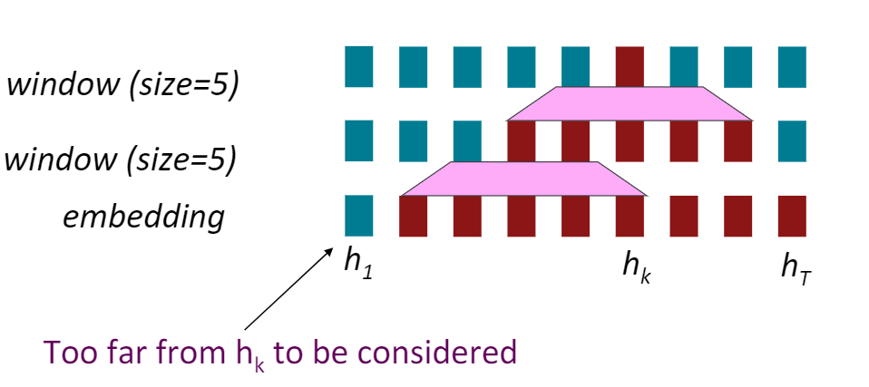

1d cnn, Maximum Interaction distance = sequence length / window size， 这里的最大交互距离指，最远的两个词，在模型中发生交互，需要的计算长度，最远的词就在最远的两个时间窗口，距离也就是时间窗口的数量了

# attention for time-series

attention也是一个选项。
Attention treats each word’s representation as a queryto access and incorporate information from a set of values。
Maximum interaction distance: O(1), since all words interact at every layer!

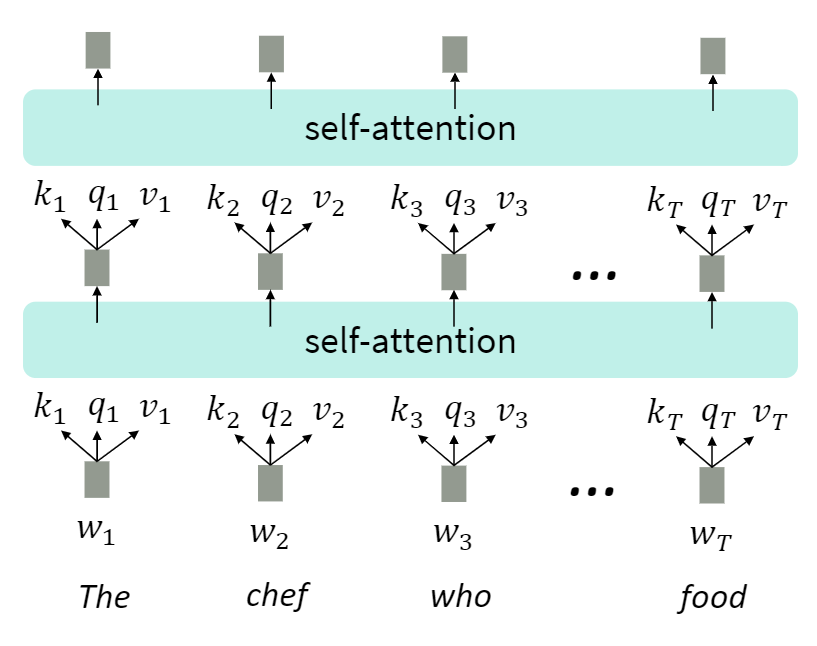

但是attention的问题也很明显，self-attention本身是没有位置信息的。
因此需要Postion embedding.
最简单的位置编码就是计数，但是这个方案问题很大，很长的(比如含有500个字的)文本，最后一个字的位置编码非常大。它比一般的字嵌入的数值要大，难免会抢了字嵌入的「风头」，对模型可能有一定的干扰。

位置编码最好具有一定的值域范围，我们关注的位置信息，最核心的就是相对次序关系。如果我们对位置归一化的话，长短文本的相邻单词位置编码信息差异巨大

位置编码的需求：1. 需要体现同一个单词在不同位置的区别；2. 需要体现一定的先后次序关系，并且在一定范围内的编码差异不应该依赖于文本长度，具有一定不变性。我们放弃对绝对位置的追求，转而要求位置编码仅仅关注一定范围内的相对次序关系，那么使用一个sin/cos函数就是很好的选择.

一种思路是使用有界的周期性函数。
如何理解Transformer论文中的positional encoding，和三角函数有什么关系？ - TniL的回答 - 知乎
https://www.zhihu.com/question/347678607/answer/864217252

需要将位置信息嵌入到输入中，但是嵌入的位置信息不能喧宾夺主，不能影响原始输入。
位置编码的需求：1. 需要体现同一个单词在不同位置的区别；2. 需要体现一定的先后次序关系，并且在一定范围内的编码差异不应该依赖于文本长度，具有一定不变性。3. 值域要有限制，最好在[0,1]

前有三种主流的技术可以解决：

用正弦位置编码（Sinusoidal Position Encoding）
学习位置向量（类似词向量）
相对位置表达（Relative Position Representations）

transformer采用了Sinusoidal position representations， 这个公式是比较玄学的，效果跟别的差别也不大，不用太在意。
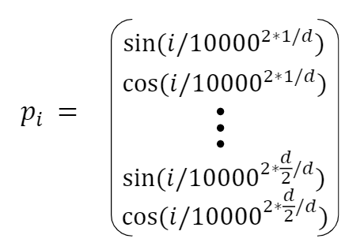

attention用于时序数据需要考虑下面三个问题
1. position learned from scratch

思想类似词向量

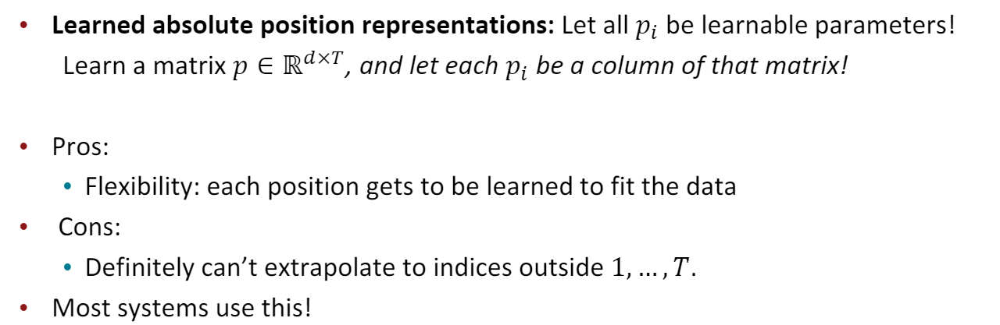

   * Sometimes people try more flexible representations of position:•Relative linear position attention [Shaw et al., 2018】
   * Dependency syntax-based position [Wang et al., 2019]Position representation vectors learned from scratch16

2. Adding nonlinearities in self-attention

   * stacking more self-attention layers just re-averages valuevectors.
  * Easy fix: add a feed-forward network to post-process each output vector

3. Need to ensure we don’t “look at the future” when predicting a sequence
   * machine translation and language modeling
   * Masking the future in self-attention of decoder
   * At every timestep, we could change the set of keys and queriesto include only past words. (Inefficient!)
   * To enable parallelization, we mask out attention to future words by setting attention scores to 无穷大

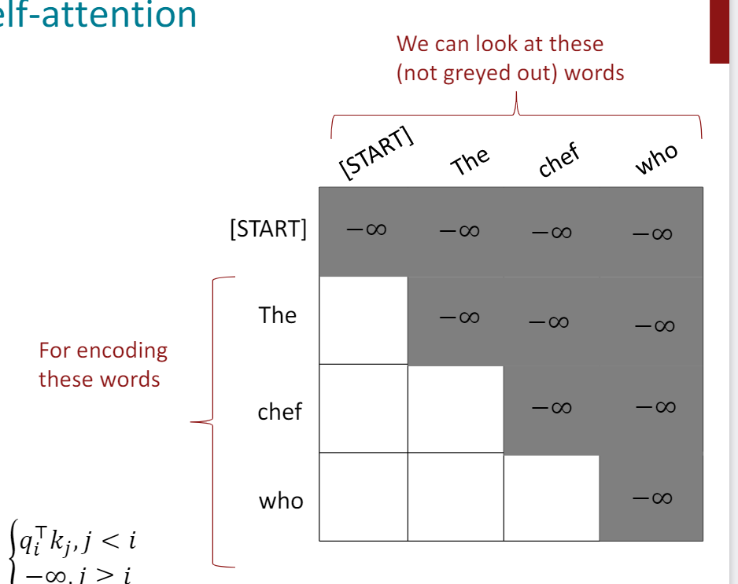

# 3. transformer

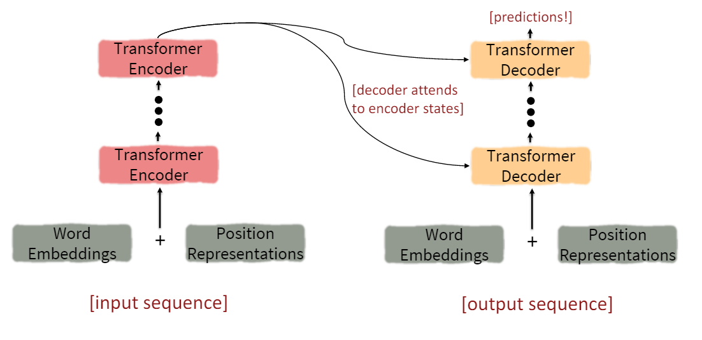

上面对attention的优化还不够, Transformer还做了下面的一些改动
1. KQV形式的self-attention，之前用的attention还是太简单了
2. Multi-headed attention: Attend to multiple places in a single layer!
3. training trick
   * Residual connections2
   * Layer normalization3
   * Scaling the dot product

## 3.1 attention
KVQ, attention用来三个矩阵，对原始输入进行变换，最后计算attention。
These matrices allow different aspectsof the 𝑥vectors to be used/emphasized in each of the three roles.

上面的KQV指的都是变换矩阵。

类比CNN中同时使用多个滤波器的作用，直观上讲，多头的注意力有助于网络捕捉到更丰富的特征/信息。

For word 𝑖，maybe we want to focus on different j for different reasons? We’ll define multiple attention “heads” through multiple Q,K,V matrices.

multi-head attention其实相当于将Q,K,V再进一步拆分成h个独立的矩阵，每个矩阵对原始输入变换到不同的空间中，最后将其拼接。
Each head gets to “look” at different things, and construct value vectors differently.
使用多头注意力，也就是综合利用各方面的信息/特征。
比如当你浏览网页的时候，你可能在颜色方面更加关注深色的文字，而在字体方面会去注意大的、粗体的文字。
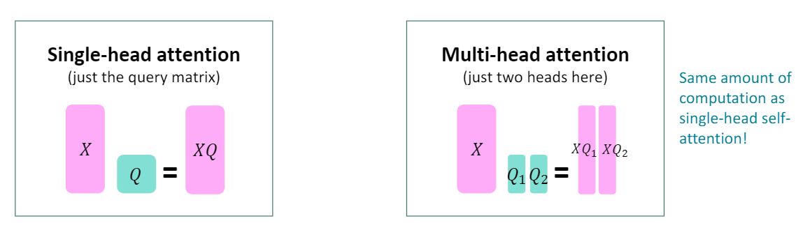

多头注意力的机理还不是很清楚。事实上，注意力机制本身如何工作，这个可解释性工作也还没有完成，目前的一些解释都还只是intuition。

multi-head对encoder-decoder attention提升不小，但对self-attention目前看提高很有限。NMT任务上heads大于4就没什么提高了。
个人感觉这可能类似于 CNN 模型中多 channel 的一种作用。

为了提高模型表达能力，需要足够的模型容量，也就需要hidden size足够大。但是如果不拆分成多头，那么模型就过于复杂了。所以多头的大hidden size实际上就是复杂度和容量的平衡。头数的好处就是为平衡模型提供了一个多余的调参空间。这也解释了头数不是越多越好，也不是越少越好，而是需要平衡。

Residual connections are a trick to help models train better.
Residual本质是打破了层级结构的显示，使得下层信息更容易传递到上层。
Residual connections are thought to makethe loss landscape considerably smoother(thuseasier training!)

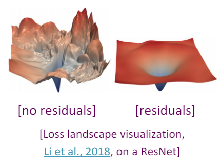

## 3.2 SScaled Dot Product

* When dimensionality 𝑑 becomes large, dot products between vectors tend to become large.
* Because of this, inputs to the softmaxfunction can be large, making the gradients small
* We divide the attention scores by sqrt(d/h), to stop the scores from becoming large just 

完整结构如下

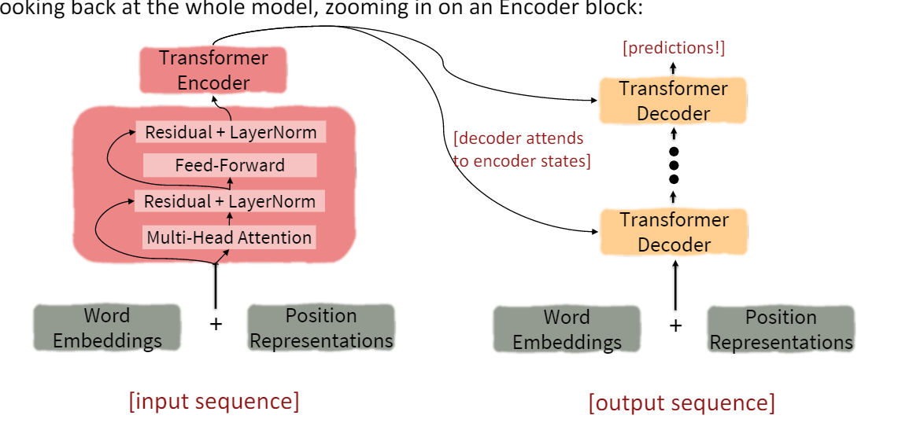
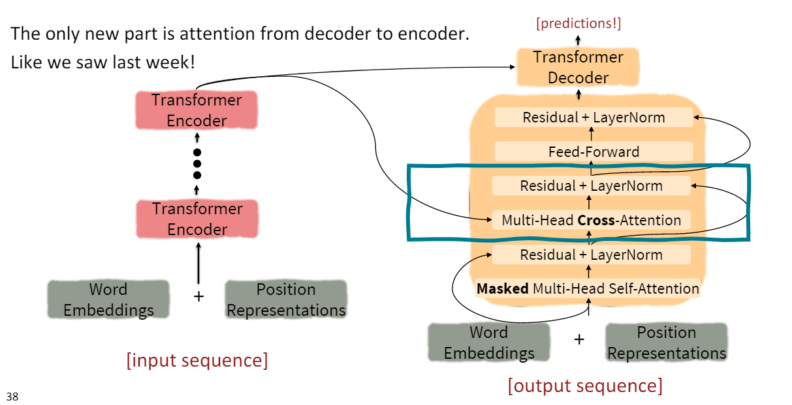

cross attention的详细公式可以用下面表示

Transformers’ parallelizability allows for efficient pretraining, andhave made them the de-facto standard

## transformer改进空间
1. Quadratic compute in self-attention
    * self attention算法复杂度O(T^2d), computation grows quadraticallywith the sequence length!
    * Linformer, map the sequence length dimension to a lower-dimensional space for values, keys
    * replace all-pairs interactions with a family of other interactions, like local windows, looking at everything, and random interactions.

2. Position representations
    * Dependency syntax-based position
    * Relative linear position attention(Self-Attention with Structural Position Representations, Tencent AI Lab)

KQV