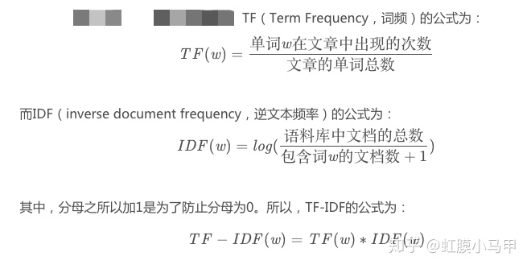

bag of words，BOW,该模型忽略掉文本的语法和语序等要素，将其仅仅看作是若干个词汇的集合.
只考虑词表（vocabulary）中单词在这个句子中的出现次数。向量中每个位置的值为该编码对应的词在这段话中出现的次数。

大部分的文本都只会使用词汇表中的很少一部分的词，因此我们的词向量中会有大量的0。也就是说词向量是稀疏的。在实际应用中一般使用稀疏矩阵来存储。
向量的维度根据词典中不重复词的个数确定
。向量中每个元素顺序与原来文本中单词出现的顺序没有关系,与词典中的顺序一一对应

# TF-IDF
BOW模型有很多缺点，首先它没有考虑单词之间的顺序，其次它不能很好的反应关键词（因为频率最高的一般是一些通用介词）。

TF-IDF引进了文档频率来弱化像“的”、“我”、“你”这样的词的权重。文档频率就是一个词在文档中出现的次数。DF指代文档频率，I的英文是Inverse,表示逆文档频率。也就是说，文档频率越高，这个词的权重越低。TF指代词袋模型中词在文本中出现的次数。

在实际应用中，我们并不是直接使用 TF*IDF 这个理论模型，因为它计算出来的权重偏向于短文本，因此需要某种平滑.

# word2vec

可以使用文档所有词的平均词嵌入。
如果直接求平均效果不好的话，或者过于简单的话，可以对词求TFIDF，然后乘以相应的权重

https://renxingkai.github.io/2019/04/05/word-tfidf/#TF-IDF%E5%8A%A0%E6%9D%83%E5%B9%B3%E5%9D%87%E8%AF%8D%E5%90%91%E9%87%8F