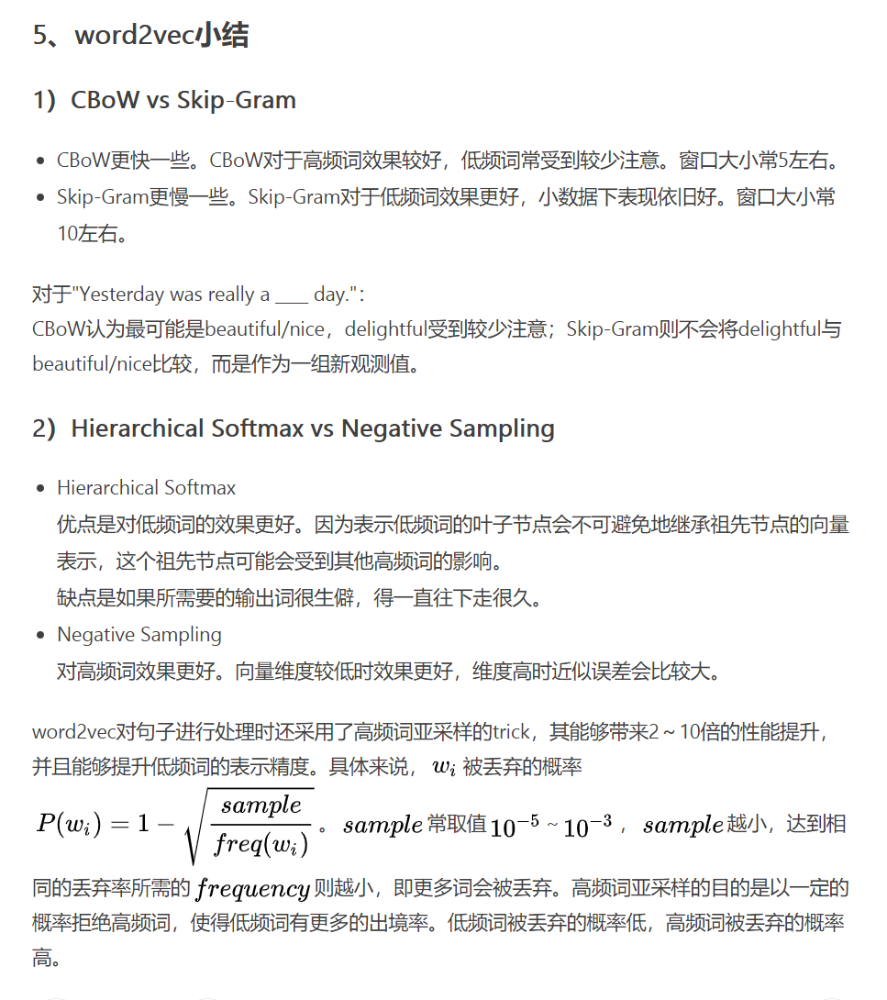
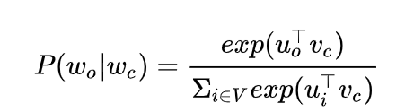
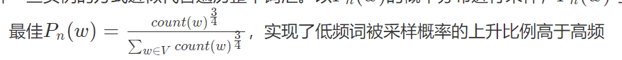

每个词有一片相对独立的小空间，通过在这个小空间中产生一个小的偏移来达到表示一词多义的效果，

可以表示为下面这个公式：                                                                     Ei = αEi + βEj你会发现，transformer每一层都做了这件事，也就是在不断调整每个词在空间中的位置。具体的Ei看成当前词，Ej可以看成所有环境词的加权和。 这个过程会有一个潜在风险：Ej是不可控的，环境词向量和环境词的数量对Ej都有影响，这就可能造成偏移量会很大，相加后的“尺度”也有可能发生较大变化，尤其是transformer的维度较高，每个维度一个很小的变化也可能引起很大的“尺度”变化。然后，再考虑下layer normalization，你会发现，当Ej较小时候，layer normalizaiton基本不起作用，但是当Ej较大时，layer normalization 可以将相加后得到的向量拉回到原来向量的附近

nlp最关键的一些任务包括
Word meaning, dependency parsing, machine translation, question answering

词嵌入的目的是，找到一个能表示单词含义的嵌入方式。

最简单的方法就是采用One-hot Representation，当然这种表示方法也存在一个重要的问题就是“词汇鸿沟”现象：任意两个词之间都是孤立的。每个单词都是独立的、正交的，无法知道不同单词之间的相似程度。光从这两个向量中看不出两个词是否有关系。此外，这种表示方法还容易发生维数灾难

我们希望这种嵌入方式有下面的特征
1. 能轻易分辨出同义词，表征空间中同义词在相近的空间
2. 可以实时更新（新词出现）

Distributed representation词向量就是为这个目的诞生的。
它将 word映射到一个新的空间中，并以多维的连续实数向量进行表示叫做“Word Represention” 或 “Word Embedding”。自从21世纪以来，人们逐渐从原始的词向量稀疏表示法过渡到现在的低维空间中的密集表示。
Distributed representation 最大的贡献就是让相关或者相似的词，在距离上更接近了（看到这里大家有没有想到普通hash以及simhash的区别）。

著名的假设:Distributional semantics: A word’s meaning is givenby the words that frequently appear close-by.
单词的语义由它周围的词决定。

计算distributed representation的方法有很多，比如
1. SVD，基于cooccurrence matrix， i,j代表第i, j个词是否出现在同一个窗口。我们需要对这个矩阵做一个SVD分解，按照奇异值大小从分解出来的矩阵中取几个，作为词嵌入矩阵.
2. LSA矩阵分解模型，LDA等方法。
3. 迭代训练.相较于基于SVD的方法直接捕获所有共现值的做法，基于迭代的方法一次只捕获一个窗口内的词间共现值。
word2vec, glove, fasttext.
3. 简单预训练。
   

word2vec是2012的工作，取得了很好的结果，思想是we need to learn to encode similarity in the vectors themselvesSec. 9.2.216

最早期的方法采用wordNet, 其实就是个字典，会保存同义词，词性相同的分类.
缺点是同义词很多时候只在少量场景下相同含义。
无法精确计算相似度。

word2vec Parameter Learning Explained

# word2vec
## 总结
word2vec的核心思想是
1. Go through each position tin the text, which has a center word cand context (“outside”) words o
2. Use the similarity of the word vectors for c and oto calculate the probabilityof o given c (or vice versa)
3. Keep adjusting the word vectors to maximize this probability

word2vec是一种迭代式算法，基于迭代的方法一次只捕获一个窗口内的词间共现值。本质上word2vec定义了模型预训练的辅助任务，通过辅助任务引导模型学到好的词嵌入。

有两个训练方式(两种辅助任务)
1. Skip-grams (SG)Predict context (“outside”) words (position independent) given center   word (基于上下文预测)
2. Continuous Bag of Words (CBOW). Predict center word from (bag of) context word.
   
其实就相当于两种不同的辅助任务定义方式.CBOW的思想和bert类似.

本质来说word2vec也类似自监督预训练的思想.

word2vec存在性能问题
主要因为每一轮训练需要计算与每个词向量的相似度， 如果语料库由几万个单词，每轮训练太慢。

1. negative sampling
   * 负采样每遍历到一个目标词，为了使得目标词的概率最大，优化目标是让分母中其他非目标词的分数尽可能小，普通softmax的计算量太大就是因为它把词典中所有其他非目标词都当做负例了
   * 负采样的思想特别简单，就是每次按照一定概率随机采样一些词当做负例，同时将多分类任务转换成对正负样本的二分类问题。因此N 多分类任务变换为了K个二分类任务。采样分布一般跟词频相关，同时会取词频的3/4次方，这能保证低频词采样概率能提高更多。
   * 之前是，给定一个词，判断它的某个上下文单词是哪个词，现在转换给，给定一个中心词和另一词，判断他们是否出现在同一个窗口中。
   * 采样分布设计的好，就可以保证我们每次迭代尽可能找到更有用的样本，或者说靠近决策边界的样本来进行更新，思想跟SVM支持向量很像。
2. Hierarchical softmax. 思想同样是将多分类改为多个二分类任务，将单词类别放到一颗二叉树上，每个叶子节点保存一个权重向量，用一个逻辑回归判断属于左右哪个类别组。一般采用霍夫曼算法，这样高频词能更快走到叶子节点，性能更好。

   
https://my.oschina.net/u/4271149/blog/3552542

在得到输入词向量和输出词向量后如何得到最终词向量？常取输入词向量(word2vec)、拼接、相加(GloVe)等。

## 1. 简化版的CBOW
Word2vec maximizes objective function by putting similar words nearby in space.

CBOW的训练目标是，根据context word预测center word.
我们首先定义两个矩阵V, U, V代表每个词在输入层的特征向量，U代表每个词输出层特征向量，注意每个词对应两个vector.
此外我们用X表示ont-hot.

0. 给定一个单词， 我们找到它左右两边m个相邻单词，设他们的onhot为X
1. 模型参数input matrix表示为V, input时的词向量, VX得到context中每个单词的词向量. 之后计算一个平均得到context vector c.
2. 根据上一步生成的c, 计算z = Uc, 这个过程可以看作计算c和U中每一个向量的相似度，最后得到一个相似度向量，通过softmax函数就可以的到分类结果.

我们可以使用交叉熵（cross entropy）作为模型的损失函数.

最终训练完模型，我们可以采用u, v的平均值作为词向量.

如上图所示，滑动窗口会不断移动，就可以计算出所有后验概率. 而word2vec最大的假设就是可以通过词向量内积可以计算得到邻近词的后验概率.

其实就是个softmax函数，这个公式用于计算一个时间窗口V内的概率。
我们计算一个词和周围所有词的内积（内积衡量两个向量的相似度），归一化后就可看作后验概率p(wi+j | wi)

## 2. skip-gram model

 Skip-Gram 则是通过中心词预测上下文
 0. 遍历每一个中心单词x, 我们将他的onehot表示为x, 相应的context word表示为c.
 1. 我们定义一个input vector矩阵V, 我们计算x嵌入后的向量v = Vx.
 2. 对于每个我们计算v和所有输出词向量矩阵U中每一个向量的相似度, 也就是Uv, 得到的向量表示center word和所有单词的相似度，我们计算个softmax, 就可以得到概率向量。 这个过程我们需要重复2m次.
 3. 如果时负采样我们需要采集K个虚假的x, 之后预测给定一个x和一个context vector, 判断是否真实。

训练目标就是训练集和模型输出的p(c|x)的交叉熵最小化。

 we invoke a NaiveBayes assumption to break out the probabilities.

 

## 3. Negative Sampling
https://www.jianshu.com/p/5a896955abf0

由于softmax运算考虑了背景词可能是词典 中的任⼀词，以上损失包含了词典⼤小数⽬的项的累加。对于含⼏⼗万或上百万词的较⼤词典，每次的梯度计算开销可能过⼤。

负采样的思想，也是受了C&W模型中构造负样本方法启发，同时参考了Noise Contrastive Estimation (NCE)的思想，
负采样每遍历到一个目标词，为了使得目标词的概率最大，优化目标是让分母中其他非目标词的分数尽可能小，普通softmax的计算量太大就是因为它把词典中所有其他非目标词都当做负例了，而负采样的思想特别简单，就是每次按照一定概率随机采样一些词当做负例，同时将这些负单词和正确的单词，转换成相应的二分类问题。

那负样本的选择肯定是选信息量大的那些，比如一些模型的决策边界，如果有充足的样本就能学的比较好，如果负样本离分离边界太远，那其实提供不了太多有用信息，甚至会误导模型使其有偏。思想和SVM的支持向量有相通之处。
采样的分布是按照单词频率得到的概率分布进行一定调整。

此时我们需要修改目标函数，梯度公式.因为我们的学习任务转换成了二分类问题。

之前学习目标是预测center/context vector。
nagative samling现在通过采样引入了噪声词，新的模型需要判断噪声词跟center vector(skip gram)或者context vector()是否同时出现在语料库中的同一语句中。

Consider a pair(w,c)of word and context. 我们用下面的公式表示(w,c)在语料库中存在的概率

此时我们将目标函数修改成最大化每个词向量和相应的噪声词,真实词共现的likehood(交叉熵).

上面D代表真实的语料库，另一个是虚假的，
Unnatural sentences that shouldget a low probability of ever occurring. 

我们对于每个上下文向量v或者center vector，都生成K个噪音单词，此时对于每个训练样本(center/context vector)，损失函数可以表示为下面形式

上面的公式中uk是从Pn(w)中采样出来的， 一般来说Pn(w)采用
Unigram Model raised to the power of 3/4. 因为3/4次方能够提升频率很低的词的采样概率。

现在，训练中每⼀步的梯度计算开销不再与词典⼤小相关，而与 K线性相关。当K取较小的常数 时，负采样在每⼀步的梯度计算开销较小。

## Hierarchical Softmax
Hierarchical Softmax是当类别数量太多的时候，替代softmax的一个方式.

hierarchicalsoftmax tends to be better for infrequent words, while negative sam-pling works better for frequent words and lower dimensional vectors.

层次softmax基本思想是将各个类别进行分类，组成一颗二叉树，在二叉树每个节点，我们只需要判断属于左右哪个类别群，每个叶子节点都代表一个具体的词，此时我们将多分类问题，变成了多个二分类问题。这样就将原始大小为V的字典D转换成一棵深度为logV的二叉树。

从根节点出发到任意的一个叶子结点都只有一条唯一的路径——这条路径也编码了这个叶子节点所属类别。

当然这种方式也不是没有缺点的，增加了词与词之间的耦合性。比如一个word出现的条件概率的变化会影响到其路径上所有非叶子节点的概率变化。间接地对其他word出现的条件概率带来影响。

每个非叶子节点，我们都存储一个权重向量w, 代表一个逻辑回归，用于判别属于左右哪个类别。

这里引入一个Logistic Regression，判断在哈夫曼树中走左子树还是右子树，其输出的值就是走某一条的概率。

此时训练的性能由二叉树高度组成.
那么怎么建立这个二叉树就很关键了，比如我们可以使用霍夫曼编码树。which assigns frequentwords shorter paths in the tree.

这里我们用n(w, j), 表示对w进行分类时, 到叶子节点路径的第j个节点，ch函数返回左子树, 
then term[n(w,j+1) =ch(n(w,j))]returns1when the path goes left, and -1 if right. 这个term也起到了Normalazation的作用，因为每个节点左右子树概率和为1.

损失函数依旧选择likehood, 这个模型中每次训练，我们不需要更新每个output vector，我们只需要更新softmax tree路径上的节点权重

# glove

GloVe方法比较简单，全称是Global vectors of word representation。它计算目标target有多少次出现在上下文context中。对于每一个句子，其中的词a出现时词b出现与b出现时a也出现的次数是一致的，因此二者具有对称性。

用开源的gensism库进行词向量训练：

# 实践

首先有了文本语料库，你需要对语料库进行预处理，这个处理流程与你的语料库种类以及个人目的有关，比如，如果是英文语料库你可能需要大小写转换检查拼写错误等操作，如果是中文日语语料库你需要增加分词处理。这个过程其他的答案已经梳理过了不再赘述。得到你想要的processed corpus之后，将他们的one-hot向量作为word2vec的输入，通过word2vec训练低维词向量（word embedding）就ok了

