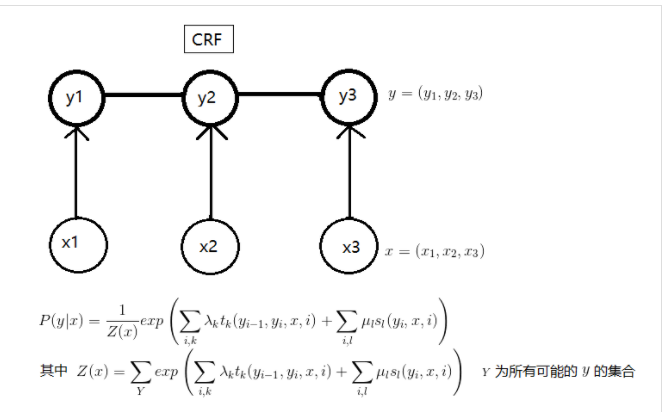
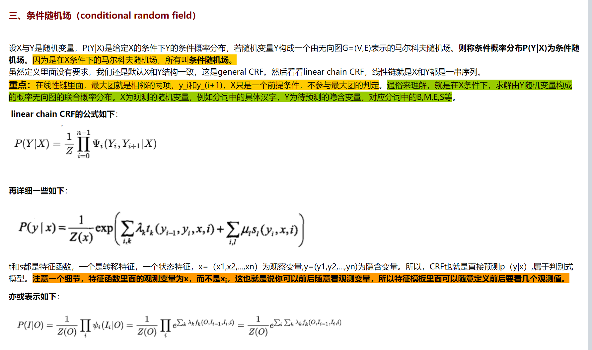
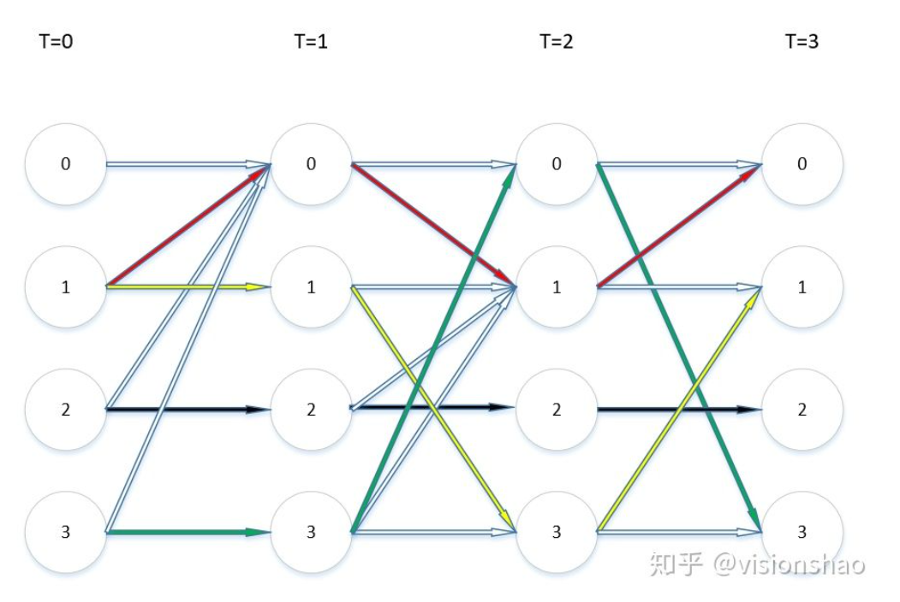
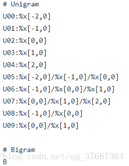

我们知道HMM中的两大规则1、齐次一阶的马尔科夫假设 2、观测独立假设。我们来分析一下这两个规则合不合理哈：

观测独立性假设：主要是指观测值之间假设是独立的，也就是说给定一组观测值x xx,其中x 1 x_1x 
1
​	
 与其他x xx之间假设是独立的，这个假设显然在nlp中有一些不合理，比如给定的观测值是一句话，你能说这句话中单词与单词之间是没有联系的吗？当然不是，所以HMM中这种假设是有一定的局限性

齐次一阶的马尔科夫假设：也有一些局限性，意思是每种状态只依赖与前面一种状态，也就是说在很多实际的场景下状态不仅仅只是依赖于前一种。

注意特征函数与每一个xi都有可能发生关系, 这相比HMM就有更大的灵活性.
其次CRF是判别模型，不对x的依赖关系做任何的假设.

https://dorianzi.github.io/2019/04/10/CRF/
https://zhuanlan.zhihu.com/p/30606513
https://hit-computer.github.io/2017/06/10/CRF/

两种

训练主要是获得最优的特征函数权重.

# 特征函数
一般我们会生成 label种类数 * 依据的词/字属性的种类数 个特征函数

# lstm+crf

HMM是生成模型(精度不如判别模型)，且假设不同时刻的输入相互独立。
CRF是判别模型且可增加不同时刻隐状态之间的约束，但需要人工设计特征函数。
LSTM模型输出的隐状态在不同时刻相互独立，它可以适当加深横向(序列长度)纵向(某时刻layer层数)层次提升模型效果。

https://zhuanlan.zhihu.com/p/97676647

LSTM无法对标签转移关系进行建模。而标签转移关系对序列标注任务来说是很重要的，所以就在LSTM的基础上引入一个标签转移矩阵对标签转移关系进行建模。这就和CRF很像了。我们知道，CRF有两类特征函数，一类是针对观测序列与状态的对应关系（如“我”一般是“名词”），一类是针对状态间关系（如“动词”后一般跟“名词”）。在LSTM+CRF模型中，前一类特征函数的输出由LSTM的输出替代，后一类特征函数就变成了标签转移矩阵。

模型运行步骤如下

1. 对于一个输入序列X，经过Embedding后得到输入到LSTM.
2. LSTM输出每个词在各个标签上的得分, LSTM输出结果成为发射矩阵E. 这个矩阵只包含了节点的分数，还需要边的分数.
3. CRF可以获得一个转移矩阵T，通过转移矩阵可以计算p(yi|yi-1)
4. 接下来通过维比特算法进行解码. 详细来说我们需要保持每个时刻下每个单词的最高路径信息（上一个节点）.每个时刻T其实就是根据E和T做矩阵运行

训练步骤
1. 整个结构都是通过梯度下降来求解, 整个模型采用负对数似然函数作为损失函数.
2. 

# crf++

特征模板分为unigram和bigram
1. unigram代表crf中的一个点的特征函数, %x[#,#]生成一个CRFs中的点(state)函数: f(s, o), 其中s为t时刻的的标签(output)，o为t时刻的上下文. 对应发射特征函数.
2. bigram, 第一个字符是B，每一行%x[#,#]生成一个CRFs中的边(Edge)函数:f(s', s, o), 其中s'为t – 1时刻的标签. 对应转移特征函数.

# 参考
Neural Architectures for Named Entity Recognition

https://zhuanlan.zhihu.com/p/140479197

