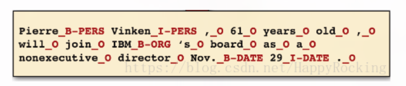

序列标注（Sequence Tagging）可用于解决一系列对字符进行分类的问题，如分词、词性标注、命名实体识别、关系抽取等等。

序列标注一般可以分为两类：

1、原始标注（Raw labeling）：每个元素都需要被标注为一个标签。

2、联合标注（Joint segmentation and labeling）：所有的分段被标注为同样的标签。

# 标注方式
标注方式有
序列标注方法BIO、BIOSE、IOB、BILOU、BMEWO、BMEWO.

https://zhuanlan.zhihu.com/p/147537898

最常见的BIO方式，对于每个实体采用下面的特殊标记

* B stands for 'beginning' (signifies beginning of an Named Entity, i.e. NE)
* I stands for 'inside' (signifies that the word is inside an NE)
* O stands for 'outside' (signifies that the word is just a regular word outside of an NE)

BIO直接用于原始标记，每个单词都会被打上标记，B/I/O + 实体类型，例子如下

BIOSE则是增加了两个特殊标记
* E stands for 'end' (signifies that the word is the end of an NE)
* S stands for 'singleton'(signifies that the single word is an NE)

