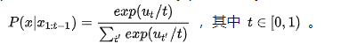

主要流程就是构建语言模型, fine-tunning, 通过生成算法生成语句。
# 生成过程

## Greedy Decoding
贪心解码，也成为argmax, 最简单的方法就是根据语言模型建立的后验概率，每次选择概率最大的词

beam search尝试在广度优先基础上进行进行搜索空间的优化, beam search每次保留一定数量的候选，剩余步骤跟维比特很想

## Stochastic Decoding
Argmax Decoding常常会导致模型生成重复的句子，如"I don't know. I don't know. I don't know...."。

一个可行的解决方案就是在decoding过程中引入randomness，但是The Curious Case of Neural Text Degeneration这篇论文指出，sampling from full vocabulary distribution生成的句子会非常的杂乱无章，因为当vocabulary size非常大时，每个词的probability都会变得很小，这时模型会有非常高的可能性sample到一个tail distribution中的词，一旦sample到了tail distribution中一个和前文非常不相关的词，很有可能接下来的词都受其影响，使得句子脱离原本的意思。

因此，我们需要sampling from truncated vocabulary distribution，比较常见的算法主要有以下几种：

Temperature Sampling 

在softmax中引入一个temperature t来改变vocabulary probability distribution，使其更偏向high probability words

当t->0时，就变成了greedy decoding；当t->无穷时，就变成了uniform sampling。这样通过调整t的大小，就可以避免sampling from tail distribution

top-k采样
这个方法就是在采样前将输出的概率分布截断，取出概率最大的k个词构成一个集合，然后将这个子集词的概率再归一化，最后从新的概率分布中采样词汇。这个办法据说可以获得比Beam Search好很多的效果，但也有一个问题，就是这个k不太好选。

为啥呢？因为这个概率分布变化比较大，有时候可能很均匀(flat)，有的时候比较集中(peaked)。对于集中的情况还好说，当分布均匀时，一个较小的k容易丢掉很多优质候选词。但如果k定的太大，这个方法又会退化回普通采样。

) Top-p Sampling

惩罚重复
为了解决重复问题，还可以通过惩罚因子将出现过词的概率变小或者强制不使用重复词来解决。