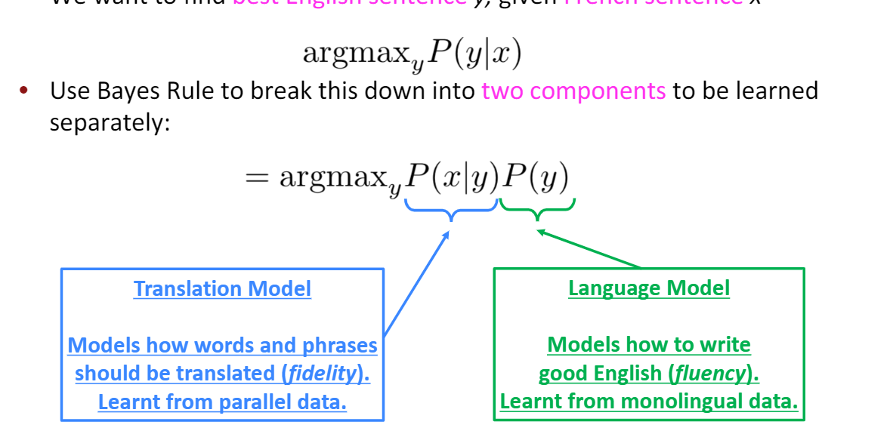
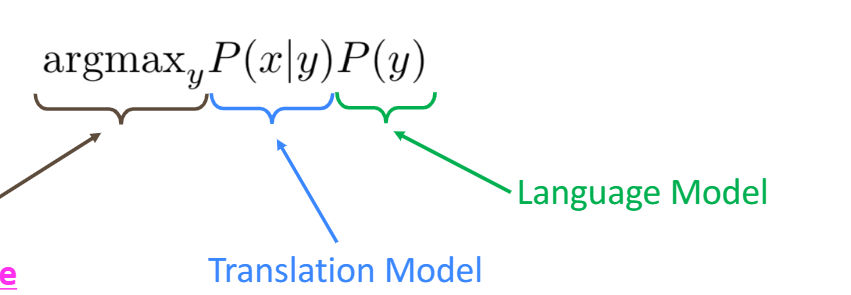
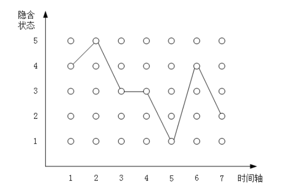
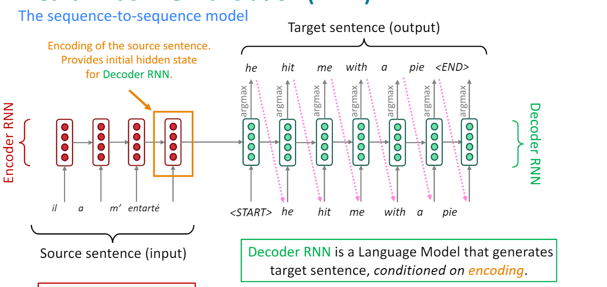
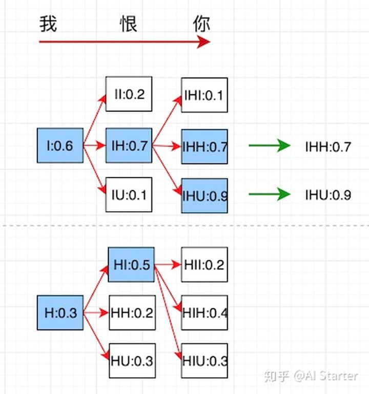
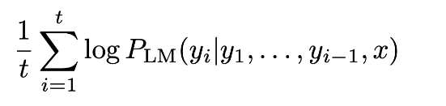
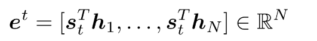
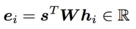
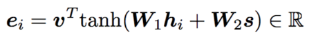

# 总结

翻译的核心目标是学习 y = argmax p(y|x), 按照贝叶斯定理，可以转换为 y = argmax p(x|y)p(y).
注意求解上面的argmax y， 在所有模型中都需要不同方案，因为y的搜索空间太大了。

早期模型大多采用HMM, CRF, 这些模型的假设都很强，缺乏泛用性，需要添加大量的人工干预.
对于HMM,解决搜索空间过大的问题一般是，维比特算法。

深度学习翻译模型一般采用seq2seq, encoder将原始序列编码成一个中间状态, 解码器相当于一个conditional language model, decoder需要同时考虑中间状态，和已经翻译完成的信息。

对于seqtoseq模型的decoder在翻译的时候也要解决搜索空间过大的问题，理论上说我们应该保存所有生成的可能序列，解决方案有。
1. greedy search,每次只保留概率最大的一个词，其他所有可能忽略。
2. beam search，超参数beam size，基于上个步长的输出序列，挑选出所有组合中条件概率最大的 k 个，作为该时间步长下的候选输出序列

# 早期模型

对于翻译任务就是，给定原始语句x，输出还原的语句y, 可表示为下面的结构

语言具有不同的拓扑结构（Typological differences），因此翻译实际上设计complicated alignments， 也会出现多词少词的状况。
Alignment can be many-to-one。因此需要alignment建模。

P(x,a|y).

Alignments aare latent variables: They aren’t explicitly specified in the data!(需要EM算法求解)

遍历所有y成本太高，因为是指数级。
Impose strong independence assumptions in model（这个假设就是dp[i] = max(dp[i-1]*y[i]), use dynamic programming for globally optimal solutions (e.g. Viterbi algorithm)， 这个问题也就转换成了最大路径问题。这个过程其实就称为解码。

上面这些其实可以看做是HMM模型。需要很多的人工干预。

# deep learning

HMM，CRF，RNN这些模型最本质的联系和区别。联系上，这些都可以看成图。区别上：HMM属于有向图，且有两个非常强的假设。CRF属于无向图，是一个有条件的马尔可夫随机场。RNN算是有向图，深度学习讲究的是最小化先验表征和计算假设，避免明确的手工设计结构。

好的图结构假设，可以避免使用海量的训练数据。但是需要很多精力去寻找，RNN通用性抢了很多。

很难在一个全连接结构里完成图像识别，全连接的假设非常弱，只有层级关系的假设，但是我们加入了一点点空间假设，CNN就能把图像识别这个任务做到极致。
“卷积结构”可以看作是一个特定的图结构假设，在这个假设中，我们强加了一些重要的关系归纳偏差：局部性和平移不变性。“循环”结构中则存在时间不变性的关系归纳偏差。

堆叠神经网络的过程中，我们得到了“分层处理”这个关系归纳偏差，其中计算分阶段执行，通常导致输入阶段中的信息之间的长距离交互。然后我们发现“分层处理”的关系归纳偏差有时候并不太理想，于是我们加入了跳层连接这个关系归纳偏差，跳层连接不但可以让梯度更容易回流来训练更深的网络，还可以把底层的特征跟高层特征结合起来。

deep learning翻译模型基本都是seqtoseq, 强调将原始序列进行压缩，后面使用一个decoder进行解码。

Decoder RNN is a Language Model that generates target sentence, conditioned on encoding. Decoder is Conditional Language Mode, Conditional because its predictions are alsoconditioned on the source sentence x

Decoder与HMM不同，它的每一步的输出都会考虑x所有的信息（经过了编码），

Many NLP tasks can be phrased as sequence-to-sequence:

1. Summarization(long text → short text)
2. Dialogue(previous utterances → next utterance)
3. Parsing(input text → output parse as sequence)
4. Code generation (natural language → Python code)22

Multi-layer RNNs are also called stacked RNNs.25, make them “deep” in another dimension by applying multiple RNNs.

Transformer-based networks (e.g., BERT) are usually deeper, like 12 or 24 layers.
Usually, skip-connections/dense-connectionsare needed to train deeper RNNs(e.g., 8 layers).

这里的Decoder是greedy decoding，Greedy decoding has no way to undo decisions! 
Beam search decoding， We search for high-scoring hypotheses, tracking top kon each step。
每一步基于上个步长的输出序列，挑选出上一步输出序列所有组合中条件概率最大的 k 个，作为该时间步长下的候选输出序列

但序列可以遇到 <END> token就停止，但是对于beam需要考虑什么时候停止，比如
1. 到达某个时间步T
2. 有n个序列都完结了
对于beam search还有一个问题，就是如果有序列提前就到了<end>，后面的长序列的分数都比较低，此时需要对score使用长度进行normalize

模型评估

BLEU (Bilingual Evaluation Understudy)。

人类翻译和机器翻译，进行下面的比较。
computes a similarity score based on:•n-gram precision (usually for 1, 2, 3 and 4-grams)•Plusa penalty for too-short system translations

# attention
Encoder needs to capture all informationabout the source sentence

Core idea: on each step of the decoder, use direct connection to the encoderto focus on a particular part of the source sequence

此时我们将上一时间步decoder隐层状态作为query, encoder所有隐层状态作为K,V, 应用到attention中

这里st代表decoder的隐层状态.

attention和CNN最大的不同在于，他的权重不是定死的，而是动态计算出来的，但是attention对位置信息不敏感，改变输出顺序，attention输出不变。

The weighted sum is a selective summaryof the information contained in the values, where the query determines which values to focus on.

Attention is a way to obtain a fixed-size representation of an arbitrary set of representations (the values), dependent on some other representation (the query).

attention计算分数的方式很多

