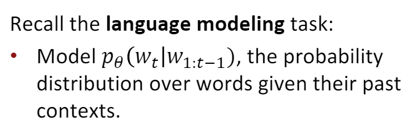
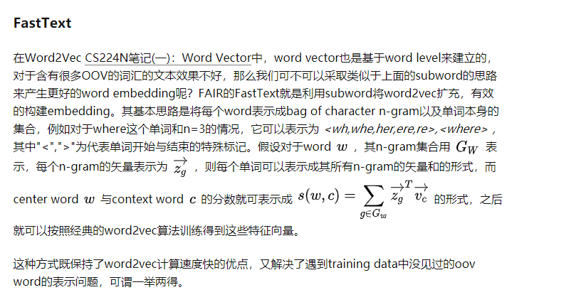
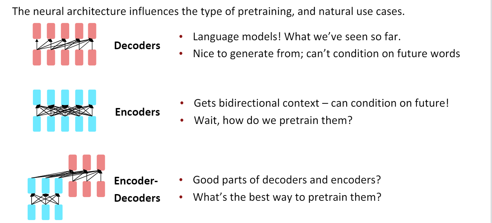
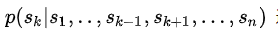
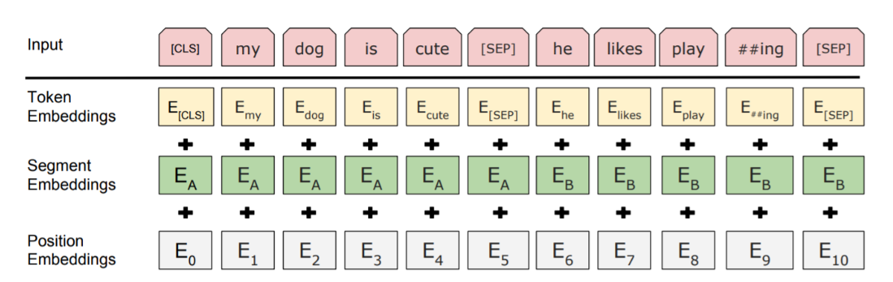
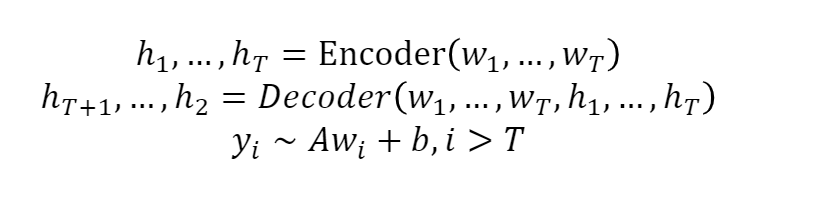
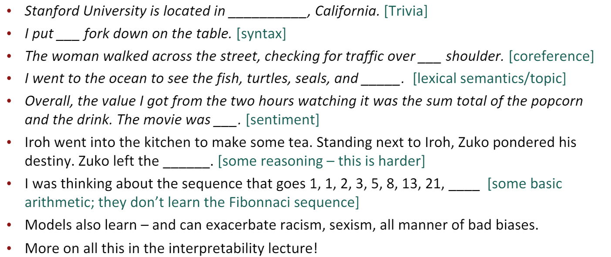
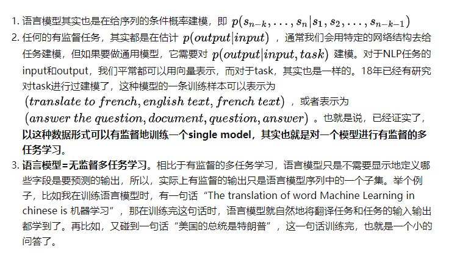
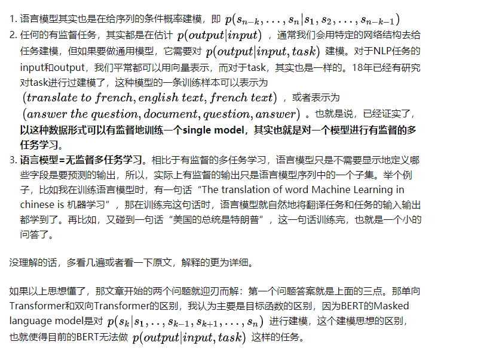

bert训练成本非常大。

如果要驗證BERT，那肯定不能直接在精調階段替換LN，必須要經過預訓練才能驗證。如果要預訓練，那首先需要復現BERT，和谷歌官方結果對齊，這可能就需要幾個月的時間=。= 等真正搞了預訓練之後，就會發現這些結構上的細節並不重要，語料及預處理、預訓練任務都對效果有更大的影響。

所以目前結構創新都不會用BERT去驗證，機器翻譯和LM任務確實是常規benchmark。是否真正有用，可能需要慢慢被大家用起來才知道。

# 词嵌入

“You shall know a word by the company it keeps”, 我们认识一个词的时候，也应该考虑它可能的搭配。

This quote is a summary of distributional semantics, and motivated word2vec. 
 meaning of a word is always contextual.

目前的主流方案都是,pretrained word embeddings.
缺点就是预训练想要达到比较好的效果，就必须包含所有下游任务需要的信息。
并且预训练只能提供一小部分参数(embeding)的先验知识，其它参数还是随机初始化

未来的发展趋势是，pretraining whole models（其实也就是很火的自监督）
* All(oralmost all) parameters in NLP networks are initialized via pretraining
* Pretraining methods hide parts of the input from the model, andtrain the model to reconstruct those parts

pretraining whole models带来的好处是,能够构建下面三种强健的信息
* representations of language
* parameter initializations for strong NLP models
* Probability distributions over language that we can sample from

# subword与模型预训练
之前的Neural Machine Translation基本上都是基于word单词作为基本单位的，但是其缺点是不能很好的解决out-of-vocabulary即单词不在词汇库里的情况，且对于单词的一些词法上的修饰(morphology)处理的也不是很好.

一个自然的想法就是能够利用比word更基本的组成来建立模型，以更好的解决这些问题。一种思路是将字符作为基本单元，建立Character-level model，但是由于基本单元换为字符后，相较于单词，其输入的序列更长了，使得数据更稀疏且长程的依赖关系更难学习，训练速度也会降低。

基本单元介于字符与单词之间的模型称作Subword Model。
它的思想是
1. learn a vocabulary of parts of words (subwordtokens)
2. At training and testing time, each word is split into a sequence of known subwords.
3. 那么subwords如何定义呢（subword类似于词根的东西），Byte Pair Encoding,简称BPE。 BPE最早是一种压缩算法，基本思路是把经常出现的byte pair用一个新的byte来代替。重复压缩最常见的pair,直至语料库达到要求的大小
4. Originally used in NLP for machine translation; now a similar method (WordPiece) is used in pretrained models（谷歌的NMT模型）
5. Common words end up being a part of the subwordvocabulary, while rarer words are split into (sometimes intuitive, sometimes not) components.

FastText

Hybrid Model
还有一种思路是在大多数情况下我们还是采用word level模型，而只在遇到OOV的情况才采用character level模型。

# 预训练分类
Semi-supervised learning， The earliest approaches usedunlabeled data to compute word-level or phrase-level statistics, which were then used as features in asupervised model。

Unsupervised pre-training is a special case of semi-supervised learningwhere the goal is to find a good initialization point instead of modifying the supervised learningobjective.  

Auxiliary training objectivesAdding auxiliary unsupervised training objectives is an alternativeform of semi-supervised learning

# 预训练与微调

Pretraining can improve NLP applications by serving as parameter initialization.
* Step 1: Pretrain (on language modeling)Lotsoftext; learn general things!
* Step 2: Finetune (on your task)Not many labels; adapt to the task!

一般预训练以后，得到的模型参数可以作为finetune时候的参数初始值。

The neural architecture influences the type of pretraining, and natural use cases

之前的Word Representation方法CS224N(一）：Word Vector如Word2Vec, GloVe, fastText等对每个单词仅有一种表示，而通常单词的含义依赖于其上下文会有所不同，而且每个单词不仅有一方面特征，而应有各方面特征如语义特征，语法特征等，这一讲集中讨论contextual word representation，主要比较了ELMO，GPT与BERT模型

有三种预训练结构

第一个代表作GPT，第二个代表作bert.

## Pretraining decoders
When using language model pretrained decoders,  we can ignore that they were trained to model 𝑝(𝑤𝑡 | 𝑤1:𝑡−1).
We can finetune them by training a classifier on the last word’s hidden state

This is helpful in tasks where the output is a sequence with a vocabulary like that atpretraining time!
* Dialogue (context=dialogue history)
* Summarization (context=document)
在这种场景下，分类器也参与预训练

 including language modeling as an auxiliary objective to the fine-tuninghelped  learning  by  (a)  improving  generalization  of  the  supervised  model,  and  (b)  acceleratingconvergenc

 GPT就是其中的一个例子，使用decoder

## Encoder pretrain
Gets bidirectional context –can condition on future!
此时预训练模型不再是语言模型了，因为它建模的概率是下面的

这个建模思想的区别，也就使得目前的BERT无法做p(output | input,task)这样的任务。

此时预训练的目标可以改成
Idea: replace some fraction of words in the input with a special [MASK]  token; predict these words.

BERT: Bidirectional Encoder Representations from Tranformers。

Proposed the “Masked LM” objective and released the weights of a pretrained Transformer, a model they labeled BERT.

Predictarandom15%of(sub)word tokens
* Replace input word with [MASK] 80% of the time
* Replace input word with a random token 
* 10% of the time Leave input word unchanged(10%,still predict)

The pretraining input to BERT was two separate contiguous chunks of text

BERT was trained to predict whether one chunk follows the other or is randomly sampled.
Laterworkhasargued this “next sentence prediction” is not necessary

## Encoder-Decoders

we could do something like language modeling, but where a prefix of every input is provided to the encoder and is not predicted.

Replace different-length spans from the input with unique placeholders; decode out the spans that were removed!

There’s increasing evidence that pretrained models learn a wide variety of things about the statistical properties of language. 

# bert

bert对语句进行随机mask(替换成随机token或者[Mask]或者不变)

bert不擅长生成任务。BERT and other pretrained encoders don’t naturally lead to nice autoregressive (1-word-at-a-time) generation methods.

RoBERTa: mainly just train BERT for longer and remove next sentence prediction!

SpanBERT:masking contiguous spans of words makes a harder, more useful pretraining task

A takeaway from the RoBERTapaper: more compute, more datacanimprovepretrainingevenwhen not changing the underlyingTransformerencoder

# GPT
Generative Pretrained Transformer (GPT) 是其中的一个典型代表.
* 使用了Byte-pairencoding
* 那么如何对一个生成模型进行fine-tuning呢。同样也是在隐层上训练一个线性分类器。
* Natural Language Inference是一个fine-tuning task的例子， Label pairs of sentences as entailing/contradictory/neutralr

GPT2的核心思想就是认为可以用无监督的预训练模型去做有监督任务。GPT2模型的结构还是和GPT一样

从Word2Vec->ELMo->GPT->BERT->MT-DNN->GPT2，可以看出NLP技术越来越倾向于用更少的有监督数据+更多的无监督数据去训练模型，而GPT2也在一定程度上解释了为什么用language model预训练出的模型有更好的效果和泛化性能。

两个问题展开解析：

论文题目《Language Models are Unsupervised Multitask Learners》到底是什么意思？
GPT2（单向Transformer）和BERT（双向Transformer）到底有什么区别？

GPT2的创新点在于验证了无监督的语言建模能够学习到有监督任务所需的特征。
如果无视该价值的话，GPT-2是没有特别突出的贡献。

# 实战

keras-bert封装库操作的bert,非常简单。下面说下Pytorch版本的

# 谷歌NTM

谷歌的NMT模型用了BPE的变种，称作wordpiece model，BPE中利用了n-gram count来更新词汇库，而wordpiece model中则用了一种贪心算法来最大化语言模型概率，即选取新的n-gram时都是选择使得perplexity减少最多的ngram。进一步的，sentencepiece model将词间的空白也当成一种标记，可以直接处理sentence，而不需要将其pre-tokenize成单词。

