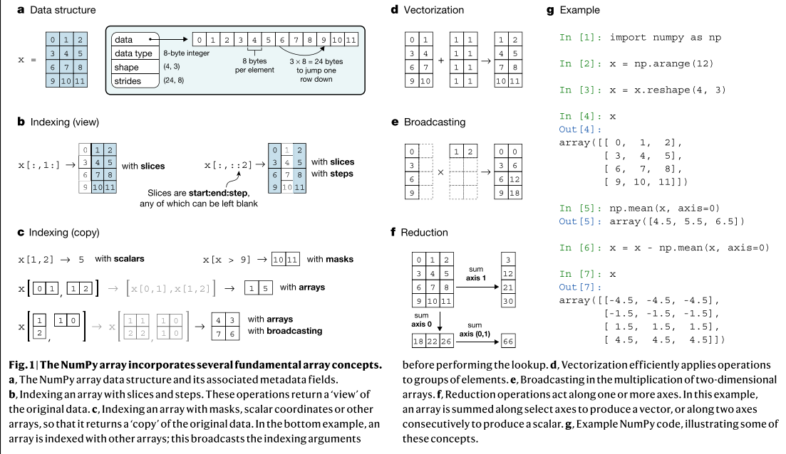
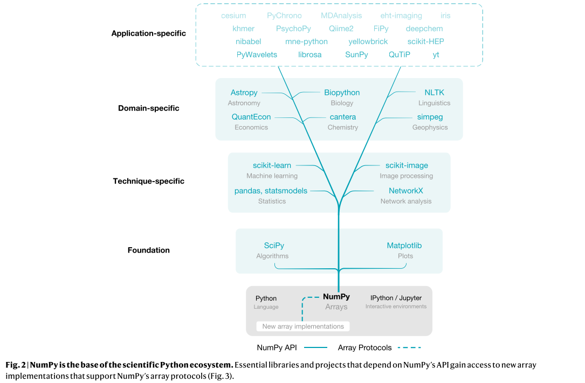

# api总结

# 原理

## ndarray
1. data（数据）：是一个指向内存的指针，所有数据保存在内存中
2. dtype（数据类型）：float/str/object
    * （不同精度的）实数/复数
    * 字符串
    * 时间戳
    * 指向Python对象的指针
3. shape（形状）：例如彩色视频数据的shape是(T, W, H, 3)
4. strides（步长）：描述各个轴的数据byte数量间隔，例如一个4×3的矩阵，每个元素是8 bytes，那么步长就是(24, 8)

## 操作数组的方式
indexing：Python的index和切片

operators：+ - * / @等操作符

array-aware functions （functions able to manipulate array）, 包括：create/reshape/sort/append/线性代数计算…

## 加速

NumPy之所以能够实现加速计算，是因为它采用了以下几种优化技术：

1. 底层实现采用C语言：NumPy是用C语言实现的，因此在计算速度上比纯Python实现的程序要快得多。同时，NumPy采用了一些底层优化技术，如内存预分配、缓存友好等，进一步提高了计算效率。
2. 并行计算：NumPy可以通过多线程实现并行计算，进一步提高计算速度。这种并行计算方式可以让多个CPU核心同时处理不同的数据，从而加速计算过程。
3. 向量化计算：NumPy支持向量化计算，可以一次性处理多个数据，而不是单独处理每个数据。这种向量化计算方式可以利用CPU的SIMD指令集，进一步提高计算效率。

BLAS和LAPACK库的支持：NumPy底层采用BLAS和LAPACK库来进行矩阵和向量计算，这些库都是高度优化过的数学函数库，可以实现快速的线性代数计算。

