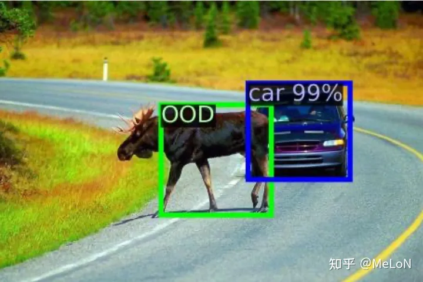

# openset detection
检测没有出现过的类别

开放词汇物体检测（Open-Vocabulary Object Detection），开放集物体检测（Open-Set Object Detection），开放世界物体检测（Open-World Object Detection）

开放集检测算法重点关注如何区分未知物（Unknown）与已知物（Known）。但是，这类算法并不关注非物体（Non-Object）的包围盒，在训练阶段，会同时将未标注的未知物（Unknown）和非物体（Non-object）抑制掉。因此，在测试阶段，这类算法会把许多未知物当做非物体，这在许多需要对未知物应检尽检的任务中是不可容忍的，比如自动驾驶场景。

不同于开放集检测算法，开放世界物体检测不但需要区分未知物与已知物，还需要将增量学习加入到学习策略中。现有的算法，比如ORE和OW-DETR，均采用了伪未知物（Pseudo Unknown Sample）作为训练样本，以此将未知物体从图像中尽可能地发掘出来。然而，我们发现这些伪样本都是RPN输出的结果中的高分包围盒，而RPN的输出结果可信度是很低的，因此这些伪样本表达未知物的能力很弱。这导致伪样本事实上限制了将已知物知识迁移到未知物的能力。算法因而无法有效区分非物体和未知物。

# 方法调研
* maxlog [1] 方法学习confidence score, 用于分割unexpected object. online
* Entropy Maximization [2], online.
* VOS, offline, 通过学习一个class-conditioned multivariate Gaussian distribution，来生成OOD, free energy as an uncertainty measurement

[1] A simple yet effective approach for identifying unexpected road obstacles in urban-scene segmentation.
[2] Entropy maximization and meta classification for out-
of-distribution detection in semantic segmentation
## Unknown Sniffer 

https://zhuanlan.zhihu.com/p/624972623

我们认为一个出色的目标检测模型应该是具有清晰划分 已知物、未知物、非物体 三者的能力的。

Towards Open World Object Detection

# 其他

https://www.semanticscholar.org/paper/A-Survey-of-3D-Point-Cloud-and-Deep-Learning-Based-Wang-Huang/172ac2538a8ba1f83a98ed70209ebed026d21e1b

