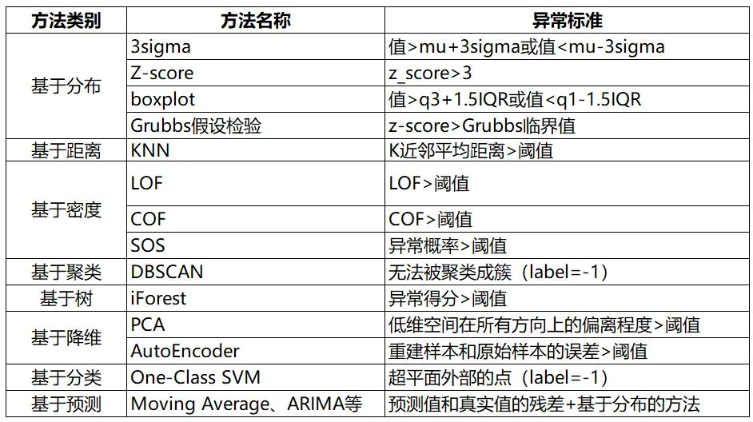

# 异常检测方法

## 时序

moving average

ARIMA

## confidence score

Anomalies due to positional
uncertainty are defined by the standard deviation of scaled
bounding boxes exceeding a predefined threshold. In addi-
tion, instances are considered anomalous due to class uncer-
tainty whenever the standard deviation of any class is above
the predefined threshold. But Bayesian segmentation net-
works are slow in inference due to their multiple forward
passes through the network with Monte Carlo dropout for
each frame.

VOS(learned)
Standardized Max Logits(learned, 也包含unknown objectg)
MC Dropout(bay)
Entropy Maximization(learned)
EMDEV(post)
LDN-BIN(learned)
Dirichlet Prior Networks(bay)
RTA(bay)
Bayesian SegNet(bay)

## 标定

Platt scaling [24] is a simple post-hoc calibration method for binary
models, which transforms the logit using scalar parameters. 

Temperature scaling is the simplest
multi-class extension of Platt scaling and matrix and vector scaling are another two extensions of
platt scaling.

[40] proposes Mix-n-Match calibration strategies which mix parameter methods with
non-parameter methods. 

[25] explores the non-linear space for post-hoc calibration function using a
neural network. 

Histogram binning 

Isotonic regression 保序回归

https://github.com/markus93/NN_calibration/tree/master/scripts/calibration