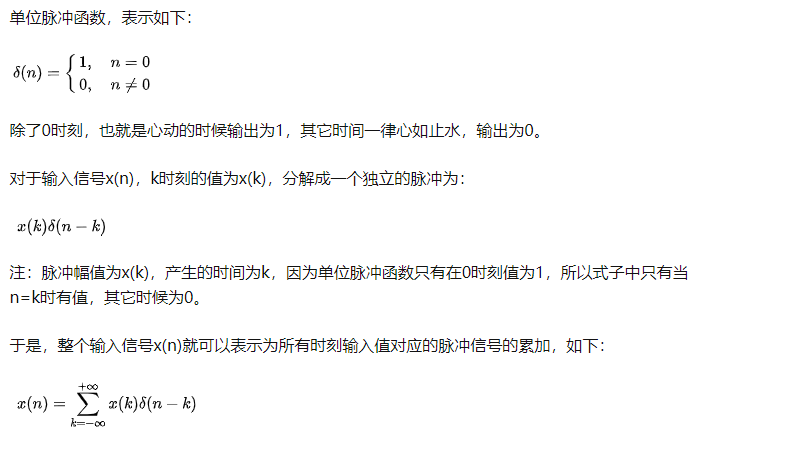
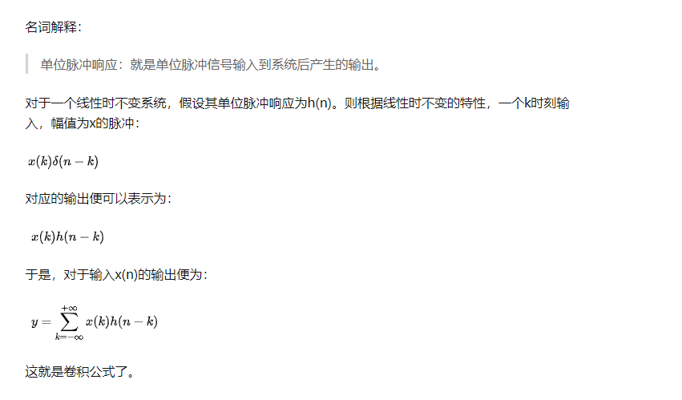
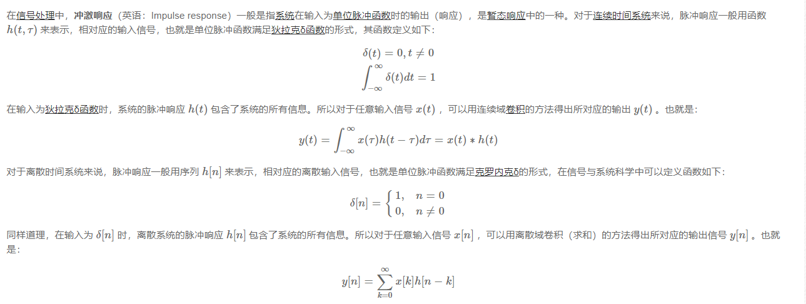
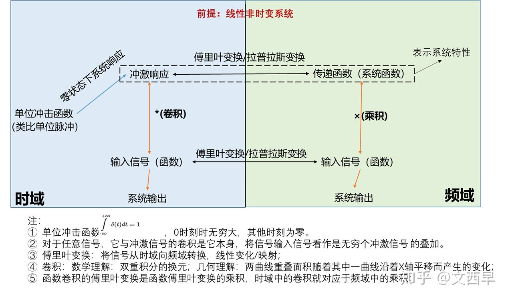

所有的输入信号都可以表示成一系列不同延时的单位冲激函数的线性叠加

所谓线性时不变系统,首先要线性,然后要时不变:所谓线性,指的是如果任意输入x输入系统得到y, 那么x*k输入系统,应该得到y*k,比如,"乘100"就是个线性系统,因为例如以5为输入得到输出500,而5*6为输入得到3000 == 5*100*6. 而"平方"则不是线性系统,因为以5为输入得到25,而5*6得到的结果是30*30 != 5*5*6.线性时不变系统的另一个特性就是叠加性, 即假如x进入系统得到结果f(x), 那么若x=a+b,必有f(x) = f(a) + f(b).

还有就是时不变,时不变指的是若一个输入x得到信号y,那么一个经过了延迟的x得到的也只是一个被延迟过的y.而不能是其他值. 举个不太恰当的例子,假设有一个火车站, 今天你去买票买到了今天的票, 明天你去买到了明天的票,那么这个火车站就是个时不变系统,假如今天你去买票买到了今天的票,明天你去买到了大后天的票,那么这个火车站就不是时不变系统.

利用线性系统的线性性，我们可以将输入信号拆分成各个脉冲信号，求出脉冲信号的输出并求和就可以得到信号输出。
因为信号f(t)可以看作是无穷个冲激信号的叠加，所以在线性时不变系统中，其系统响应也可以 表示为无穷个冲激响应的叠加。

卷积

可以发现，只要我们求解出了响应函数h(t) (h(t) 是对脉冲函数的响应)， 即可求解出结果。
单位冲激响应h(t)可以完整描述一个线性时不变系统，有了它，任意给定输入信号x(t), 通过该系统后的输出y(t)为x(t)和h(t)的卷积。

https://www.cnblogs.com/WangHongxi/p/12732521.html

怎么理解卷积，代表了瞬时行为的持续性后果，每时刻拍打岸边的浪都是之前所有状态输入水滴引起波纹的叠加。

连续卷积，就是 f(t) * g(t) = f(x)g(t-x) 基于x做积分，结果是一个一维函数

信号处理领域的理论知识着重是线性系统分析（傅立叶分析，拉氏变换，Z 域分析），推荐奥本海姆的《信号与系统》；离散信号处理中涉及了题主提到的滤波器问题，以及最重要的fft算法，推荐奥本海姆的《离散时间信号处理》

信号与系统这门课可拓展性极强，上接复变函数，电路理论，下启通信原理，数字信号处理，傅立叶光学等等。就其本身在通信，信息，图像处理领域就有非常广泛的应用，因此完全可以拓展很多东西。奥本海默的这部著作就是旨在传递思想同时引申了大量工程应用，因此这门课应该花两个学期或者至少80个以上的学时去真正深入的学习，通过工程和科研上的例子领悟其思想

信号与系统我最喜欢的教材之top2，另一本是拉扎维的模集。这本书的暗线，实际是按照信号与系统这个学科的发展历史来给你讲的，可以说是一部学科的史诗。为什么有傅里叶级数，为什么有傅里叶变换，这个东西提出来的时候遇到了什么挫折，为什么有拉普拉斯变换，为什么又有Z变换，它们的限制是什么，条件是什么，都给你娓娓道来。

《信号与系统》可以学一生，其中最重要的是深入理解卷积！！！！！！！！

以上都是线性分析，非线性的处理往往会线性化，目前没有推荐！

工程师推荐

The Scientist & Engineer's Guide to Digital Signal Processing

Digital Signal Processing - A Practical Guide for Engineers and Scientists

我认为数字信号处理，写的最通俗易懂有趣的就是下面这本了，Richard G. Lyons: "Understanding digital signal processing"下面这本也很不错，特别是有很多实际工程的例子，Steven W. Smith: "The Scientist & Engineer's Guide to Digital Signal Processing, 1999"

1, Understanding Digital Signal Processing (3rd Edition), Richard G. Lyons大致翻过一边，并未细读，因为和使用的教材比较重叠。本书概念思路十分清晰，有助于理解DSP众多基本概念以及一些高阶的东西，而且该书数学推导并不是很多，只出现在需要的部分。是本十分适合初始阶段使用的教材。2, Digital Signal Processing (4th Edition), John G. ProakisDSP圣经之一，但很遗憾没读过，因为时间都花在下面要说的那本上了。简单总结下Amazon上得评论：相较于Lyons的书，该书同样基本概念条理清楚，更涵盖了诸多深度的内容（线性预测，自适应滤波，功率谱估计等），因此内容相当丰富（应该是包括了现阶段国内本科研究生阶段DSP课程的全部内容），可作为进阶教材使用。当然该书并不容易读进去，如果可以做到，相信会使得你的DSP理论功底非一般的扎实，下面这本书亦是如此。3, Discrete-Time Signal Processing, Alan V. OppenheimDSP另一圣经，读了不下三遍。该书内容同样十分全面，从基础到高阶，很直观，同时也包含了大量的数学证明，但思路清晰推理严谨。个人最喜欢书中DTFT/DFT，及FFT部分，推导过程十分透彻，顺着作者思路推一遍，会让人大呼过瘾。此外，该书每章节后的习题也是其一大特色，简单->中等->困难，层层推进，一般完成前两个难度就差不多了，曾试图独立完成苦难程度的习题，后因难度太大而放弃。2，3两本书集信号处理几十年发展之精华，是从事DSP相关专业/行业的必备参考书，常看常新。

