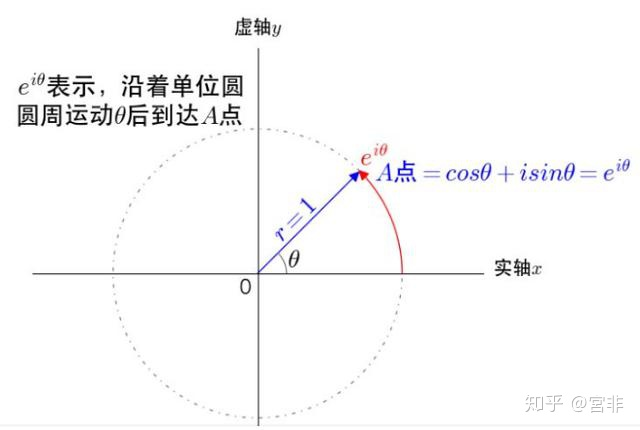
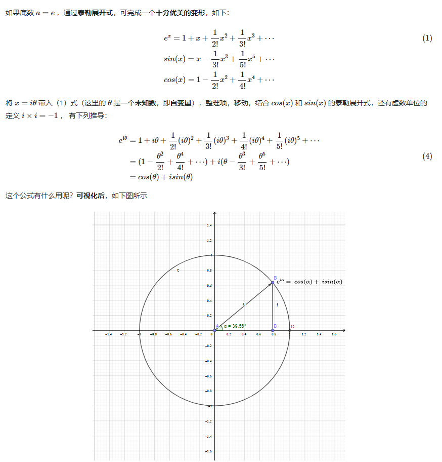
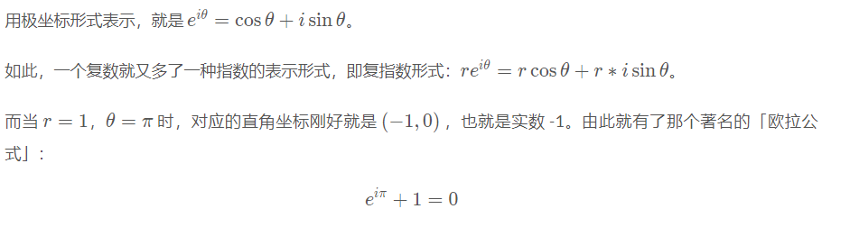
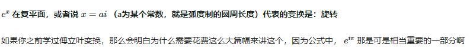
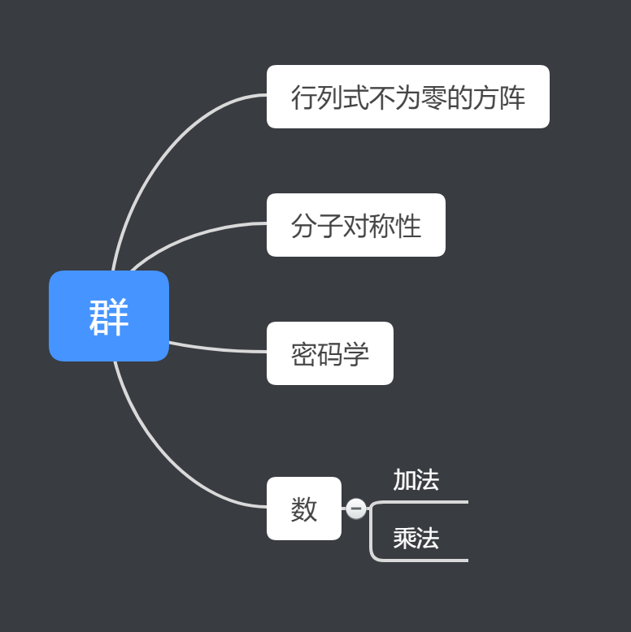
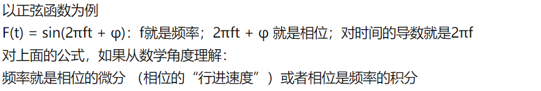
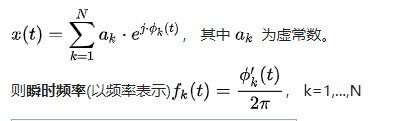
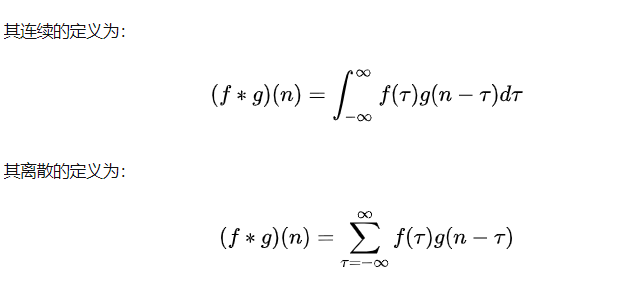
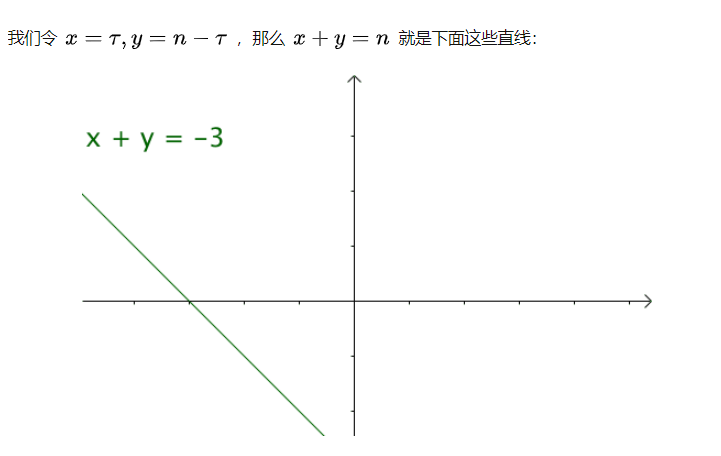

# 复数
复数的意义是是的整数域的运算完备了。
增加复数，可以使得减法任意进行。对数运算也可以操作负数了。
通过更高维度的复平面，解决了低维度的实数问题。

单位时间内增长率是100%， 那么对于连续增长的事物，单位时间后将变为e倍。

欧拉函数解明了与三角函数的关系，实际上高中学的所有三角恒等式都可以用欧拉公式推导。
欧拉公式（Euler’s formula）的美不只是在连结了实数到虚数，或是将三角函数与复指数函数关联起来。
i 是单位虚数，它的意义是平方后的结果为 -1，而在這里 i 代表 “旋轉”了 θ。

是否有更高维度的数？答案是有的，比如四元数，在电脑动画中、量子物理中找到了四元数更多的应用，只是这些应用对普通人距离太远了。
复数也就可以看做是复平面上的一个矢量。

两个复数相乘的结果就是：让它们的模长相乘得到最终的模长，让它们的幅角相加得到最终的幅角。

每个函数的作用无非是在有些地方把数轴往中间压了压，在有些地方又把数轴往两边扯了扯.
是挤压还是拉伸，就看函数在那一点的导数的绝对值是小于1还是大于1。因此导数大小的意义就是局部小区间在变换下的伸缩倍数。导数正负符号的意义是小区间是否反向。
复数的运算可以看作是平移变换，乘法是旋转和伸缩

换个角度，最早的文明理解负数是个障碍，数数能数出负数吗？不能。那为毛有负数？比拟一下，复数也就好理解了。

复信号包含了信号的幅值与相位信息,求解瞬时频率比较方便,使用方便。
即得出复信号的求法,也就是我们常见的复变函数形式的傅里叶变换了.
复信号的模就是幅值。相位也很好求。

https://www.zhihu.com/question/23234701

# 欧拉公式与旋转

环、域、向量空间、代数结构、线性代数群、李群。

对称性 symmetry， 你能对正方形做些什么，并且在这个操作后，保持正方形的形态和操作前相同. 我们把具有上述性质的操作都列出来，放在一起，如下面动图所示（左右旋转90°，旋转180°，四个轴对称，不变，这八个操作），就构成了一个有限群【对称群】。
【旋转群】，表示的是所有旋转操作。因为角度可以无限细分，这个操作是无限的，比如：顺时针旋转θ，所以【旋转群】也是一个【无限群】

很多不同的概念都能从对称性和对称性的符合构建得到。数字本身有两种表达方式（操作），加法和乘法， 对于【数】这个集合来说，加法对应数轴的平移变换（一个操作），乘法对应着数轴的伸缩变换（一个操作）. 但是我们可以注意到数轴没有旋转这种操作。

引入虚数系统以后，我们用i表示逆时针旋转90°, 但是我们需要任意角度的旋转，那么该怎么办呢，这个时候我们可以想到。
旋转，是沿着一个圆弧（有圆心，转过的角度）运动的过程，如果你对泰勒公式非常熟悉（不熟悉没关系，点开连接看看呗？），就可通过一系列公式推导（下面就是）得到一个完美桥梁：【指数函数】, 其实也就是欧拉函数

在复平面内，以指数函数为桥梁，实轴横向平移对应伸缩，虚轴纵向平移对应旋转(逆时针旋转是正). 每走一个单位的纵向位移，在圆周上旋转的圆弧长度就是1，恰好代表逆时针旋转180°。同时通过指数函数的性质，我们可以将复数乘法表示为指数加法。

总结来说，通过引入虚数，我们可以定义二维空间中的旋转，我们可以将复数表示为a + bi形式。复数有三种表示形式直角坐标、极坐标，以及复指数表示形式，极坐标形式由相位（phase）和强度（magnitude）表示。
借助欧拉公式，我们可以将常规形式变换为指数形式。
复平面中的旋转可以使用乘法来表示（也可转换成指数加法）, 伸缩可以通过加法完成，构成一个旋转群。能表示旋转的方法有很多，比如二维向量空间。虚数是表示旋转比较方便的一种方法。
通过欧拉公式，我们可以很容易的把一个复数在直角坐标系或者极坐标系转换，而这两种坐标系根据问题的不同都非常有用，因此借助欧拉公式，我们就可以在我们认为更便利的坐标体系下工作了.

群有下面的应用场景

# 总结

总结来说，通过引入虚数，我们可以定义二维空间中的旋转，我们可以将复数表示为a + bi形式， 并且借助欧拉公式，我们可以将其变换为指数形式（极坐标）这个二维空间中的旋转可以使用乘法来表示（虚数乘法转换成指数加法）, 伸缩可以通过加法完成，构成一个旋转群。能表示旋转的方法有很多，比如二维向量空间。虚数是表示旋转比较方便的一种方法。
通过欧拉公式，我们可以很容易的把一个复数在直角坐标系或者极坐标系转换，而这两种坐标系根据问题的不同都非常有用，因此借助欧拉公式，我们就可以在我们认为更便利的坐标体系下工作了.

# 傅里叶变换与欧拉公式

# 频谱图和功率谱

将一个信号从时域通过FFT变换到频域，得到的直接结果就是所谓的频谱，频谱是复数形式，有幅值和相位。由于频谱是复数形式，包含相位信息，当信号中包含不相关的噪声成分时，由于噪声成分的相位是杂乱无序的，那么多次线性平均之后，可以将不相关的噪声平均掉。

但是傅里叶变换只能用于平稳信号。

随机信号不满足傅立叶变换的条件，不能进行傅立叶变换，即不能直接在频域中进行。而它的功率谱满足傅立叶变换条件，可以看功率频谱。
随机信号的频谱是随机的，而功率谱密度是这个随机信号的一个特征量，是确定的。

对于一个随机信号，我们可以使用短时傅里叶变换得到一个频谱图

功率谱密度PSD表征的是单位频率上的能量分布。它等于自功率谱除以频率分辨率，因此，它的单位为（信号单位^2/Hz）。由于自谱是实数，因此，功率谱也是实数，可进行线性平均。它只有RMS格式。不同的试验人员试验时可能会采用不同的频率分辨率，因此，谱函数的幅值可能会有差异，不方便进行对比。而PSD剔除了频率分辨率的影响，因而，可比性更强。在各类国标中，通常用的都是PSD来描述信号的频域结果。

功率谱密度本质上是频域上的二阶矩。一个随机变量的一阶二阶三阶四阶矩都是有名字的，但是在信号这，二阶矩最重要，因为二阶矩决定了一段信号能传递的信息量的上限。一个最经典的场景就是带限信号在有色噪声信道下最大化信息的传输，就是在频域去分配功率。

有的信号，它的幅度在时间趋向正负无穷时是衰减的，其总能量有限，这样的信号可以去算它的频谱。有的信号，它在整个时间轴上都有不可忽略的幅度，总能量是无限的。这样的信号，如果你去算它的频谱，就会发现不收敛。如果这样的信号是周期的，那么可以取一个周期来求频谱，但如果是非周期的就不行了。上面说的第二种信号，如果在 [-T, T] 区间上的总能量的增长大致跟 T 成正比，那么可以说它的功率是有限的，于是可以算功率谱。
说到随机信号，常常指的是平稳的随机信号。这样的信号总能量是无限的，但功率是有限的，所以不能算频谱，只能算功率谱。

https://www.zhihu.com/question/68698069

# 时频分析
平稳信号在不同时间得到的采样值的统计特性(比如期望、方差等)是相同的， 平稳信号通常频率是不变的。

傅里叶变换只适合处理平稳信号（瞬时频率为常数），对于非平稳信号，由于频率特性会随时间变化，为了捕获这一时变特性，我们需要对信号进行时频分析，就包括短时傅里叶变换、小波变换、希尔伯特变换、希尔伯特黄变换这几种变换。

想像下一个点绕着单位圆匀角速度逆时钟转圈，你的初始位置对应的角度就是初始相位，在任何某一时刻，你的相位就是初始相位加上你转过的角度。
时间相位对时间微分是时间角频率，除以2pi是时间频率。
空间相位对距离/位置微分是空间角频率，也称作角波数，除以2pi是空间频率，也作波数。

直观上，瞬时频率为相位的微分。相位反应了是信号在时域上的变化，变化的快慢就是频率, 频率也可以理解为相位的变化率，频率越大，相位变化越快.
相位对时间的求导应该是瞬时角频率，瞬时频率应该除以2 pai.

频率估计是信号处理中的一个主要问题。
拿最简单的线性调频信号来说。
估计频率既可得信号的多普勒信息，在雷达中就可以算出来目标速度了，在通信中就可以加载响应的补偿器了。

# 希尔伯特变换
一般来说要计算局部频率的值至少需要一个完整周期的正弦波形。但是现实中信号可能变换的很快，我们需要能够求出一个瞬时频率。

直观上，瞬时频率为相位的微分。Gabor提出解析讯号法(Analytic Signal Method)，将实数讯号表示为对应的复数讯号，即可定义复数讯号的大小与相位，将实数讯号的瞬时频率求出。
复数表示(a, bj), 可以同时计算出相位和幅值，求微分也就不在话下了。

实信号->希尔伯特变换->复信号. 

稳定信号是指平均值为零的局部对称信号。
对于非稳定信号，求他的瞬时频率时竟然出现了负频率，非平稳信号，不过是平稳信号叠罗汉的恶作剧罢了。
只要使用EMD就可以把他们分离开。
不如把被分离开的这几个家伙叫做IMF（内涵模态分量 Intrinsic Mode Functions）吧

为了纪念故事中两位老先生（Hilbert和Huang）的突出贡献，人们决定把“经过EMD分解出的IMF分量再经过Hilbert变换，最终得到信号瞬时频率和瞬时幅值”的方法叫做希尔伯特黄变换（HHT，Hilbert-Huang Transform）。

https://zh.wikipedia.org/wiki/%E7%9E%AC%E6%99%82%E9%A0%BB%E7%8E%87

实信号，例如正弦波信号，是正负频率的共轭对称。例如cos(wt)=cos[(-w)t]，对cos(wt)进行傅里叶变换就会得到正负频率点上的信息，回忆一下cos(wt)的傅里叶变换，实部相等、虚部相反。
正负频率点都含有信息，信息就会有冗余，如果只保留正频率点的信息依然能恢复实信号，以达到简化的目的。可以考虑通过滤波器将负频率点给滤掉。这个滤波器就是希尔伯特变换。
希尔伯特变换。欧拉公式实际上是最特殊的希尔伯特变换。

话说回来，获得一个信号的HHT结果究竟有什么用呢？括号先森的理解是这样的：

HHT的结果反映的是信号的时频特征，即信号的频域特征随时间变化的规律。相对于傅里叶变化得到的是信号的频率组成，HHT还可以获取频率成分随时间的“变化”。比如我们要分析的信号代表的是一个性能迅速退化的发动机（假设信号表征是某些IMF分量的频率逐渐升高），使用HHT就可以对该现象进行很好的捕捉。
HHT可以对局部特征进行反映，这点主要得益于EMD的作用。EMD可以自适应地进行时频局部化分析，有效提取原信号的特征信息。
“分解”往往可以对应着“重构”，从HHT结果中选择出满足要求的特征分量并重组信号，有利于将关注的特征从复杂的混合信号中分离出来。
由于这些优点，HHT方法与短时傅里叶变换（STFT）和小波变换（wavelet）等方法共同成为了时频域分析界的重要手段。

求解瞬时频率也可以用短时傅里叶变换，Gabor，Cohen，WVD，小波，相位差分，STFRFT，STFTx

# 卷积
卷积其实和傅里叶一样，是一种函数转换工具，只是将函数转换成了不一样的形式，傅里叶将原始函数转换成了一系列不同频率的正弦波，卷积将函数转换成一系列冲激

如果遍历这些直线，就好比，把毛巾沿着角卷起来。
假设卷积平面是一个正方形地毯，上面保存着f和g在区间[a,b]的张量积，即U(x,y)=f(x)g(y)。
卷起来以后变成了一个一维的函数，而且每点的函数值等于卷起来后重合的点函数值之和.
卷积的轴正好就是x+y为定值的一条直线，所以卷起来后那点的函数值正好为这条直线上函数值的积分。

时域卷积为频域乘积。
时域信号可以分解成一串不同频率正弦信号的叠加。根据卷积的分配率，两个时域信号的卷积最终可以展开成两两正弦信号的卷积的和。由于不同频率的正弦信号的卷积为0，所以最终只剩下相同频率的正弦信号的卷积。而卷积的结果就是频率不变，幅度相乘。在频域里边就表现为直接相乘。

fourier变换是一种线性积分变换。

卷积的作用就在于：
令(f(a)和f(b)卷积)的积分 等于(f(a)的积分)乘上(f(b)的积分)。

而fourier变换本身就是一种积分
所以(f(a)和f(b)卷积)的fourier变换，自然等于(f(a)的变换)乘上(f(b)的变换)。
