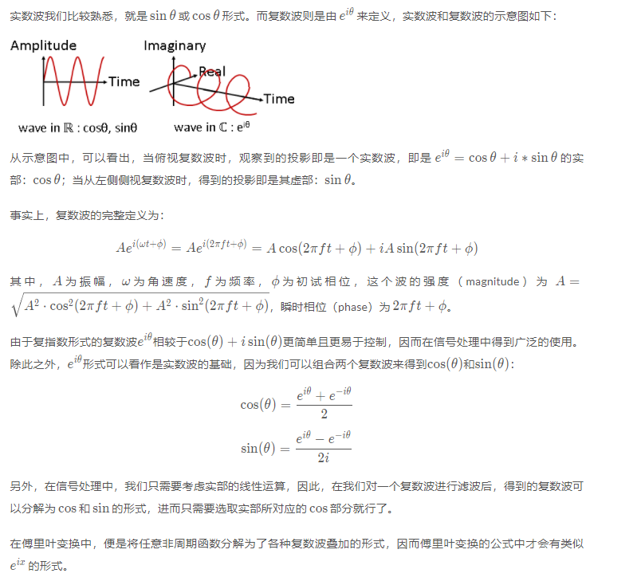
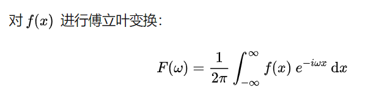
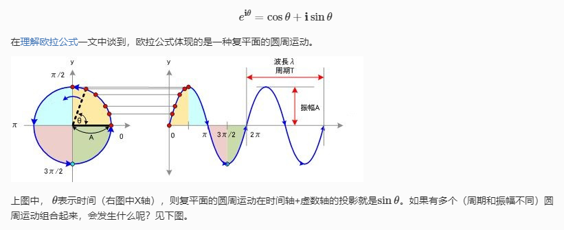
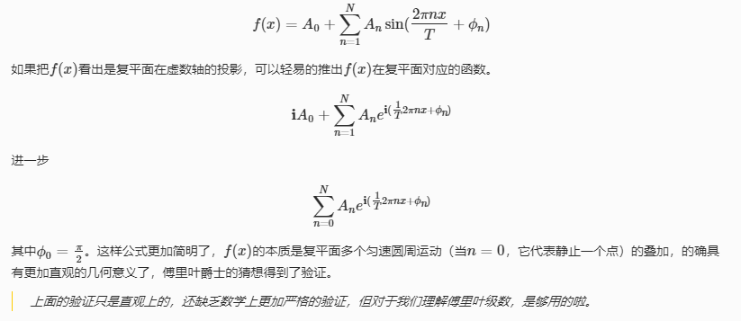

# 复数波和实数波

傅立叶级数是把满足狄利克雷条件的周期函数表示为一系列具有不同频率的正弦与余弦函数的和。这些频率不同的三角函数是正交的，所以傅立叶级数就如同欧几里德空间里对向量进行正交分解一样，把L^2空间里的平方可积函数分解到一组正交基上。每个基也是一个函数。

为什么要将一个完整的函数拆分成一个正弦波呢，答案是为了简化计算，因为正弦函数求导和积分之后都仍是正弦函数，并且很多在时域不好处理的事情在频域很简单，比如滤噪.

傅立叶级数可以表示成三角函数的和，也能表示成复指数函数的和，原因就是有欧拉公式在二者之间作为桥梁。两种表示方法都是可行的，只是人们发现复指数函数的表达方式在计算上更为便捷。

傅里叶变换将一个周期信号，从时域表示转换为频域表示。所谓频率也就是1/转圈的速度, 因此我们需要一种方式来表示旋转，那自然也就是通过复平面和欧拉公式来表示。
我们需要找到一种方法，将时域的信号映射到复平面上，复平面中模对应幅值，y对应相位. 同时使用欧拉公式描述信号曲线。

在傅立叶变换中，我们规定旋转是顺时针的

傅里叶指出任何一个周期函数都可以用三角级数表示，然而太过宽泛，狄里赫利进一步给出了精确的条件。只有满足狄里赫利条件时，一个函数才可以展开为傅里叶级数。
又根据由无穷级数推导而成的最美公式欧拉公式，三角函数信号可以与复指数信号相互转换，故仅以推导复指数信号为例。
三角函数的一个特殊之处在于其加减乘除或是微积分运算，频率都不变对应于复指数信号而言，复指数函数是LTI系统的特征函数。这实际上是维纳在控制论里提及的“平移下不变式”。

# 推导

转换的过程中，我们将t%2pai变为复平面的theta, y也对应复平面的y.

复杂的周期函数其本质是复平面上多个匀速圆周运动的组合。傅里叶级数假设

这里的投影是指复平面在虚数轴的投影。

上面的公式其实就是傅里叶级数，这里强调一下，傅里叶级数中对不同频率的波有一个要求就是给定一个初始的频率w0,之后的角频率必须是w0的整数倍， 这就是DTF（离散傅里叶变化）中的角频率取值的原则。

可以观察到里面有很多的常数，为了简化我们想把他们合并到一起

