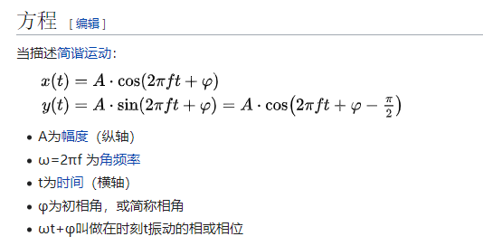

信号系统中微分方程和全响应和卷积存在大量理解困难，关于傅立叶拉普拉斯Z域存在大量机械记忆性质和结论背题的情况。离散数学对群环格理解困难，图论只能靠大量数据结构相关习题训练。机器学习理论因为设计大量微积分和概率统计，难以理解，因为某些知识缺陷无法推导SVM，图像处理滤波器原理因为某些只是缺陷无法理解很多算符的意义，存在大量调用API的情况。

信号与系统该书循序渐进，从宏观先介绍系统及信号以及它们的特点，再从微观深入系统及各种信号的特点、性质等，接着从两个域----时间域和频率域解析如何分析系统，对应于卷积及傅立叶变换。再次，从连续时间和离散时间并列出发，发现傅立叶变换有些不适用的场景于是提出拉普拉斯变换及Z变换。（至此三大变换、时频变换等核心知识都包含了）

一个信号有三个组成部分：幅值、相位和频率成分。

# 复数信号

一个音频型号是一个物理量随时间变化的时间序列。比如，这个物理量可以是电压。
当我们获得一段，比如一分钟的音频信号以后。直接对其进行傅立叶变换。得到的频域变换是无限的，非周期的。

在某个时刻，信号有意义的部分也不仅是这个时刻信号的值，还有信号的变化率。复数瞬时值就是把变化率包含进来了，实部是信号本身的值，虚部是负变化率与角频率之比。
a+bi的表达方式确实不够友好，rθ更好，考虑最直观的状况，r就是某个物理信号的幅度，θ则是它的相位。
相位（英文：phase）又称位相、相、相角，是描述信号波形变化的度量，或物体周期运动的阶段[1]，通常以度（角度）为单位

其实这个问题的本质在于我们可以用什么方法来表示正交这个概念。
正弦信号不也是余弦信号吗，只不过差了九十度的相位。那还有什么是差九十度的相位的呢？1向量和i向量嘛，那我们不就可以很方便的用一个复数来表示两个正交的量了吗？
所以其实我们就是把正弦和余弦这一组正交基换成了1和i这一组正交基了而已。

实信号->希尔伯特变换->复信号.
首先，实际现实的信号是实信号的，但是在数学建模过程中通常处理的是复数形式的信号。

实信号，例如正弦波信号，是正负频率的共轭对称。例如cos(wt)=cos[(-w)t]，对cos(wt)进行傅里叶变换就会得到正负频率点上的信息，回忆一下cos(wt)的傅里叶变换，实部相等、虚部相反。

正负频率点都含有信息，信息就会有冗余，如果只保留正频率点的信息依然能恢复实信号，以达到简化的目的。可以考虑通过滤波器将负频率点给滤掉。这个滤波器就是希尔伯特变换。