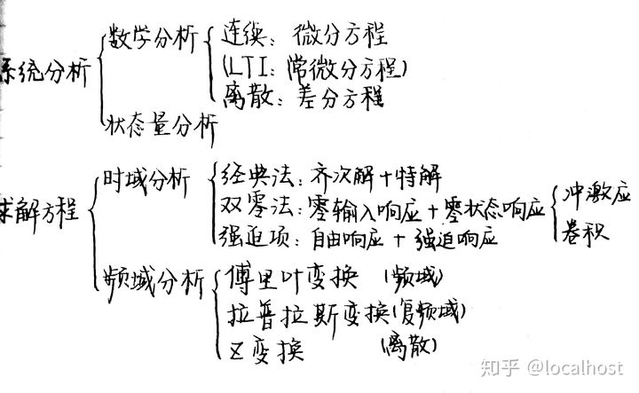

如果没有修过信号处理的话，学数字图像处理可能会在基础知识的部分有些不容易搞懂。数字图像处理首先第一个比较大的知识点就是傅里叶变换，然后进阶到图像处理中所用到的二维傅里叶变换，此时教授会默认你已经会了一维傅里叶变换。之后的快速傅里叶和二维滤波器，基本上冈萨雷斯那本书的前四章，都是将信号处理中一维的部分，扩展到了二维。但之后的部分和信号处理的关系就没有那么密切了。色彩和各种检测的内容核心就是相关的概念和算法。

《信号与系统》最重要的思想就是线性组合：找到一组基本信号，它可以构成其他信号，我们知道了LTI系统对基本信号的响应后，经过线性组合，就可以得出LTI系统对其他信号的响应。

所以基本信号的特点是：

由这些基本信号能够构成相当广泛的一类有用的信号。
线性时不变系统对每一个基本信号的响应应该十分简单，以使系统对任意输入信号的响应应有一个简单的表达式。

信号与系统知识框架
信号与系统概述
线性时不变系统（LTI)
傅里叶级数与傅里叶变换
信号与系统应用（时频特性、采样、通信系统）
拉普拉斯变换
Z变换

尤其是很多基本信号的变换公式，强行记忆绝对是效率低下。记住三大变换基本公式，其他的基本变换在用的时候，即使忘记了，临时过一遍脑子就能推导或者回想起来。

如何学好信号与系统？ - 怡宝纯净水的回答 - 知乎
https://www.zhihu.com/question/21064916/answer/522411188

