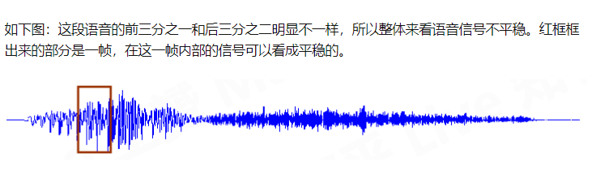

贯穿于语音分析全过程的是 “短时分析技术”。因为，语音信号从整体来看其特性及表征其本质特征的参数均是随时间而变化的，所以它是一个非平稳态过程，不能用处理平稳信号的数字信号处理技术对其进行分析处理。但是，由于不同的语音是由人的口腔肌肉运动构成声道某种形状而产生的响应，而这种口腔肌肉运动相对于语音频率来说是非常缓慢的，所以从另一方面看，虽然语音信号具有时变特性，但是在一个短时间范围内（一般认为在10~30ms），其特性基本保持不变即相对稳定，因而可以将其看作是一个准稳态过程，即语音信号具有短时平稳性。所以任何语音信号的分析和处理必须建立在“短时”的基础上，即进行“短时分析”，将语音信号分为一段一段来分析其特征参数，其中每一段称为一“帧”，帧长一般即取为10~30Ms。这样，对于整体的语音信号来讲，分析出的是由每一帧特征参数组成的特征参数时间序列。分帧一般采用交叠分段的方法，这是为了使帧与帧之前平滑过渡，保持其连续性。前一针和后一帧的交叠部分称为帧移。帧移与帧长的比值一般取为0~1/2。

作者：正霖
链接：https://www.zhihu.com/question/52093104/answer/301234347
来源：知乎
著作权归作者所有。商业转载请联系作者获得授权，非商业转载请注明出处。

# 分帧

语音信号处理常常要达到的一个目标，就是弄清楚语音中各个频率成分的分布。做这件事情的数学工具是傅里叶变换。傅里叶变换要求输入信号是平稳的. 但是语音信号整体很不平稳。

在比较短的时间内，嘴巴动得是没有那么快的，语音信号就可以看成平稳的，就可以截取出来做傅里叶变换了。这就是为什么语音信号要分帧处理，截取出来的一小段信号就叫一「帧」.

那么一帧有多长呢？
1. 从宏观上看，它必须足够短来保证帧内信号是平稳的。口型的变化是导致信号不平稳的原因，所以在一帧的期间内口型不能有明显变化，即一帧的长度应当小于一个音素的长度。正常语速下，音素的持续时间大约是 50~200 毫秒，所以帧长一般取为小于 50 毫秒。
2. 因为傅里叶变换是要分析频率的，只有重复足够多次才能分析频率。语音的基频，男声在 100 赫兹左右，女声在 200 赫兹左右，换算成周期就是 10 毫秒和 5 毫秒。既然一帧要包含多个周期，所以一般取至少 20 毫秒。

# 加窗
https://zhuanlan.zhihu.com/p/252783855

取出来的一帧信号，在做傅里叶变换之前，要先进行「加窗」的操作，即与一个「窗函数」相乘，如下图所示：

加窗的目的是让一帧信号的幅度在两端渐变到 0。渐变对傅里叶变换有好处，可以让频谱上的各个峰更细，不容易糊在一起（术语叫做减轻频谱泄漏），具体的数学就不讲了。加窗的代价是一帧信号两端的部分被削弱了，没有像中央的部分那样得到重视。弥补的办法是，帧不要背靠背地截取，而是相互重叠一部分。相邻两帧的起始位置的时间差叫做帧移，常见的取法是取为帧长的一半，或者固定取为 10 毫秒。

贯穿于语音分析全过程的是“短时分析技术”。语音信号具有时变特性，但是在一个短时间范围内(一般认为在10~30ms的短时间内)，其特性基本保持不变即相对稳定，因而可以将其看作是一个准稳态过程，即语音信号具有短时平稳性。

# 频谱变换

对一帧信号做傅里叶变换，得到的结果叫频谱，它就是下图中的蓝线：

图中的横轴是频率，纵轴是幅度。频谱上就能看出这帧语音在 480 和 580 赫兹附近的能量比较强。语音的频谱，常常呈现出「精细结构」和「包络」两种模式。「精细结构」就是蓝线上的一个个小峰，它们在横轴上的间距就是基频，它体现了语音的音高——峰越稀疏，基频越高，音高也越高。「包络」则是连接这些小峰峰顶的平滑曲线（红线），它代表了口型，即发的是哪个音。包络上的峰叫共振峰，图中能看出四个，分别在 500、1700、2450、3800 赫兹附近。有经验的人，根据共振峰的位置，就能看出发的是什么音。对每一帧信号都做这样的傅里叶变换，就可以知道音高和口型随时间的变化情况，也就能识别出一句话说的是什么了。

作者：王赟 Maigo
链接：https://www.zhihu.com/question/52093104/answer/225983811
来源：知乎
著作权归作者所有。商业转载请联系作者获得授权，非商业转载请注明出处。