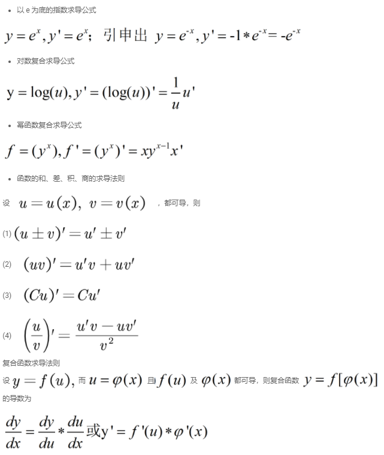
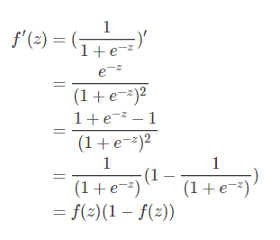
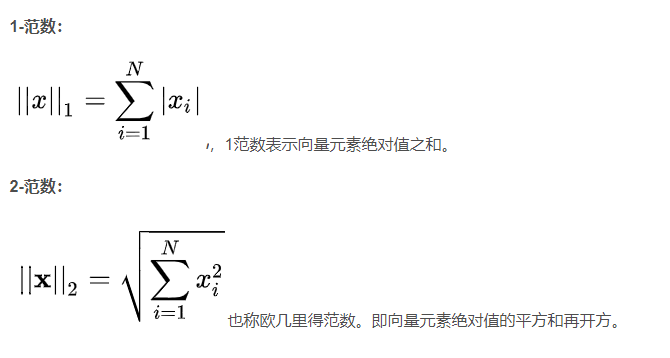
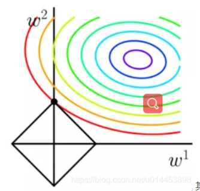

二分类问题是最简单的分类问题。我们可以把多分类问题转化成一组二分类问题。比如最简单的是OVA(One-vs-all)方法，比如一个10分类问题，我们可以分别判断输入 [公式] 是否属于某个类，从而转换成10个二分类问题

# 求导

sigmod函数

# 损失函数

对数极大似然

在参数估计中有一类方法叫做“最大似然估计”,因为涉及到的估计函数往往是是指数型族,取对数后不影响它的单调性但会让计算过程变得简单,所以就采用了似然函数的对数,称“对数似然函数”。

最大似然估计法的思想很简单：在已经得到试验结果的情况下，我们应该寻找使这个结果出现的可能性最大的那个X作为真X的估计。求X的极大似然估计就归结为求L(X)的最大值点，而由于对数函数是单调增函数，所以对L(X)取log。

极大似然损失函数也就变成了，给定一组结果，出现这个结果的概率（连乘公式）的倒数（因为损失函数需要最小化），我们对这个公式取log, 不影响原先损失函数的单调性，也意味着，最优解不变。因此取log可以将损失函数转换为负对数形式

Loss = 1 / (p(x1y1)*p(x2y2))
转换为 - (log p(x1y1) + log p(x2y2) ......)

# 预处理

pad是针对小批量梯度方法的实现手段，为了方便张量计算而将小批量样本形成一个规整的张量而采取的措施。
padding方法是模型独立的、为了便利计算的一种妥协，不仅Transformer训练需要，其他模型也都需要。

# 正则化
L1 正则化

彩色的圈是J0 的等值线，最里面的是J0取得最小值时，w^{1}和w^{2} 的取值位置

RNN是通过time step的方式处理可变长数据，Transformer是通过计算动态生成的self-attention得分矩阵来处理可变长数据。