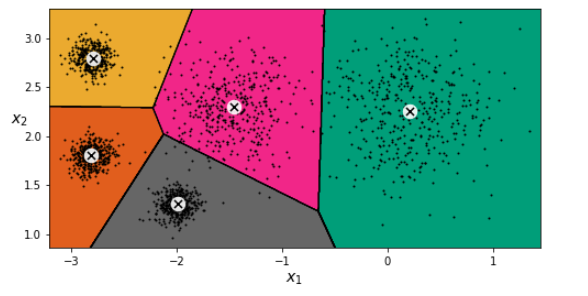

K-means 有哪些缺点？聚类最终的效果有哪些评价标准？

解答
无法解决高维数据的问题，原因是它的算法基于距离，而高维空间内数据点之间的距离差距不明显
它的本质类似一个局部搜索，非常依赖初始化，很容易陷入局部最优

A. K 不确定
        对于初始条件和聚类的个数 K ，并没有一个标准的方法来给定。 初始条件不同会对结果产生比较大的影响，因为有时算法会跳入局部最优。所以解决方法之一，就是多次运行算法，随机分割，比较结果之间的差异。

B. 局部最优
        如果要达到全局最优，需要用到其他一些技术，比如模拟退火或者遗传算法等等, 不过代价就是算法的复杂度大大增加。另外一种可能性, 就是该算法就不可能达到全局最优. 应用的时候需要借助其他的一些工具, 比如我们提到的Kernel.

C. 噪声敏感
        一些离数据中心很远的点，也必须被分配到某一个聚类中，这就会产生中心的偏离 (这种偏离有时影响是很大的)。

D. 线性算法
        K-means 算法是线性的算法, 不能处理非线性的数据, 所以一些常见的分类效果很差. 比如本文将用以说明的测试集. 测试集类似于具有相同圆心的圆环形数据. K-means 算法将不能有效地把两个圆环分开.

F. 应用限制
        对于中心的定义，限制了应用的范围, 只能对于数值变量的应用。 对于一些定性的变量，需要改变相似度的度量来获得更好的解释。 

decision boundary for K-means clustering linear

K-means clustering produces a Voronoi diagram which consists of linear decision boundaries.