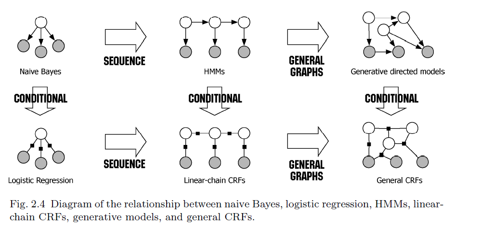

mltivariate prediction problem,存在两个需要考虑的地方
1.  output variableshave complex dependencies.
2.   the outputvariables may represent a complex structure such as a parse tree.
   
A natural way to represent the manner in which output variablesdepend  on  each  other  is  provided  by  graphical  models.

Bayesian net-works,  neural  networks,  factor  graphs,  Markov  random  fields.

Itis then possible to describe how a given factorization of the proba-bility density corresponds to a particular set of conditional indepen-dence relationships satisfied by the distribution

大部分图模型，尤其是nlp总都是生成模型，需要学习p(x,y).此时因为x维度很高，并且x内部特征之间可能存在复杂依赖，对于生成模型也需要对x的依赖关系进行建模，在复杂的情况下无疑是很困难的。
dimensionality of x be very large. Modeling thedependencies among inputs can lead to intractable models, but ignoringthem can lead to reduced performance.

A solution to this problem is adiscriminativeapproach.
在这个方法中我们通过数学模型来拟合后验分布p(y|x).
简单总结就是.
1. 图模型可以用来预测具有相互依赖的多变量输出，predict multiple variables that depend on each other. 但是生成图模型，在输入x维度很高的时候需要的数据量过大，没法处理。
2. 判别式模型，相比生成模型，可以处理高维的输入特征。
两者的结合称为 Structuredprediction methods, They  combine  the  ability  of  graphical  modelsto compactly model multivariate data with the ability of classifica-tion methods to perform prediction using large sets of input features.

CRF就是一个判别式的图模型。CRF结合了图模型和
 CRF combine the abilityto compactly model multivariate outputs y with the ability to leveragea large number of input featuresxfor prediction.

  The advantage to aconditional model is that dependencies that involve only variables inxplay no role in the conditional model， so that an accurate conditional model  can have much simpler structure than a joint model. 

The differ-ence between generative models and CRFs is thus exactly analogousto the difference between the naive Bayes and logistic regression classi-fiers.

Indeed, the multinomial logistic regression model can be seen asthe simplest kind of CRF, in which there is only one output variable.

 Although early applications of CRFs used linear chains, recentapplications of CRFs have also used more general graphical structures.

 modeling, inference, and parameter estima-tion using CRFs

# graph modeling

描述变量之间的依赖关系非常复杂。要建模变量之间所有的关系非常难，比如如果要建模所有两两之间的关系就需要2^n计算量。因此我们需要factorization, 简单来说就是需要往关系图中添加一些先验（条件独立性质），通过这些性质可以将大图拆分成小的部分分别计算，再根据贝叶斯定理累乘。简单来说graph的作用就是下面的描述

Graph captures the way in which the joint distribution over allrandom variables can be decomposed into a product of factorsdepending only on a subset of these variables， 简单来说graph描述了变量之间的依赖关系.

The insight of the graphical modeling perspective is that a distribution over very many
variables can often be represented as a product of local functions that
each depend on a much smaller subset of variables.

This factorization
turns out to have a close connection to certain conditional independence
relationships among the variable.

the conditional
independence viewpoint is most useful for designing models,
and the factorization viewpoint is most useful for designing inference
algorithms.

图模型可以分为三种
1. Bayesian networks (directed graphical models)
2. Markov random fields (undirected graphical models)
3. Factor graphs

# 有向图，贝叶斯网络
https://deisenroth.cc/teaching/2016-17/probabilistic-inference/
https://ermongroup.github.io/cs228-notes/

# 无向图

上面这个表示所有第s个位置为ys的y的和.

无向图的思路一样，我们需要根据独立性关系，将图分解成不相交factor.
无向图中的factor称为最大团，也就是最大的全连接子图.

我们通过势函数来度量factor的compatibility，也可看做概率

势函数也称为local functions or compatibility functions.
Z是一个Normalization常量，用于保证概率和为1.computing Z is intractable in general, but much work exists on how to
approximate it.

另外，为了保证f函数取值满足概率的定义，需要f输出恒定为正，所以f函数在实践当中一般都会是一个exp指数函数，所以后面在举例时通常会直接将exp写出来。

## factor graph
The reason for the term “graphical model” is that the factorization
factorization (2.1) can be represented compactly by means of a
graph.

一个无向图，我们可以使用factor graph和markov network来刻画它的依赖性，相当于两个视角。然而markov network存在模糊性，也就是可能存在多种划分方式（对应多个factor graph).
Directed Models也是一种，这个模型通过定义基于parent的独立性来划分。

a factor graph directly describes the way in which a
distribution p decomposes into a product of local functions.
factor graph.

factor graph向图中加入了一些势节点(factors)，使用G = (V,F,E)表示，V是随机变量，F中的每个节点都是一个最大团的节点, 任何连接到主节点的节点都属于这个团.概率公式可以表示为

下面的图片是一个例子，正方形代表factor node. N(a)代表a所有的相邻节点.

## markov network

a Markov network, which directly represents conditional independence relationships in a multivariate distribution.
Given a factorization of a distribution p, a corresponding

首先定义无向图表示的随机变量之间存在的成对马尔可夫性局、部马尔可夫性和全局马尔可夫性。
1. 局部马尔可夫是指ya跟yb条件独立与yo(a), o(a)代表a所有的相邻节点

we
say that a distribution p is Markov with respect to G if it satisfies the
local Markov property
Markov network can be constructed by connecting all pairs of variables that share a local function.

A Markov network has an undesirable ambiguity from the factorization perspective.

## directed model

上面的公式是按照Parent划分。
directed model可以看作，对所有的factor内部进行Local normalization,使得势函数与条件概率相等，上面的式子相比factor graph，其实就是将Z放到了每个factor里进行Norlazation.
Directed models are often used
as generative models.
An example of a directed model is the naive Bayes model

hmm models p(x, y) in a Bayesian network
memm models p(y|x) in a Markov network
crf models p(y|x) in a Markov network

## 隐变量

可观测变量用X表示，不可观测用Y表示。

# 生成式与判别式
我的理解是判别式直接用函数拟合后验分布，生成式需要对整个依赖关系以及条件概率进行建模。
Generative models are models that describe how a label vector y can probabilistically “generate” a feature vector x.

Discriminative models work in the reverse direction, describing directly how to take a feature vector x and assign it a label y.

In principle, either
type of model can be converted to the other type using Bayes’s rule

生成式模型a family of joint distributions that factorizes as p(y,x) = p(y)p(x|y), that is, it
describes how to sample, or “generate,” values for features given the
label.

判别模型直接学习p(y|x).
a conditional distribution p(y|x) does not include
a model of p(x), which is not needed for classification anyway.
The difficulty in modeling p(x) is that it often contains many highly dependent features.

By modeling the conditional distribution
directly, we can remain agnostic about the form of p(x). Discriminative
models, such as CRFs, make conditional independence assumptions
among y, and assumptions about how the y can depend on x, but do
not make conditonal independence assumptions among x.

To include interdependent features in a generative model, we have
two choices. 
生成模型想要处理具有依赖关系的复杂特征，有两个选择
1. enhance the model to represent dependencies
among the inputs, e.g., by adding directed edges among each xt.
But it is hard to imagine how to model the dependence between the capitalization
 of a word and its suffixes.
2. 进行独立性假设，比如HMM,朴素贝叶斯都假设X内部相互独立.

独立性假设容易导致输出overconfident, 因为X内部的依赖部分被当作独立事件重复计算了，这会对性能造成影响。
比如naive Bayes classifier performs
well in document classification, it performs worse on average
across a range of applications than logistic regression

For example, in named-entity
recognition, a naive application of an HMM relies on only one feature,
the word’s identity. But many words, especially proper names, will
not have occurred in the training set, so the word-identity feature is
uninformative. To label unseen words, we would like to exploit other
features of a word, such as its capitalization, its neighboring words, its
prefixes and suffixes, its membership in predetermined lists of people
and locations, and so on.

## generative-discriminative pair
如果一个生成模型和一个判别模型可以相互转换，就称为generative-discriminative pair.
we can always convert between the two methods
using Bayes rule.

但正是因为我们从来没有得到真正的分布，这两种方法在实践中是不同的。
Estimating p(y)p(x|y) first, and
then computing the resulting p(y|x) (the generative approach) yields
a different estimate than estimating p(y|x) directly.

判别模型优点
1. 相比生成模型，不需要对p(X)建模，模型复杂度相比生成模型更加小
2. 训练判别模型需要的数据更少

生成模型优点
1. more natural
for handling latent variables, partially-labeled data, and unlabelled
data, when the data is entirely unlabeled,
generative models can be applied in an unsupervised fashion
2. 可以做一些文本生成，图片生成的任务

it
is often natural to represent a generative model by a directed graph
in which in outputs y topologically precede the inputs. Similarly, we
will see that it is often natural to represent a discriminative model
by a undirected graph.

但是也有特例，比如directed discriminative models, such as the MEMM

各种图模型的关系可以表示为下图.

## 多变量
图模型强大之处在于建模多变量的依赖关系。

The
named-entity recognition task is, given a sentence, to segment which
words are part of an entity, and to classify each entity by type (person, organization, location, and so on).

The challenge of this problem is that many named entity strings are too rare to appear even in a large training set, and therefore the system must identify them based only on context.

最简单的方法是，每个单词独立分类，打上entity标签，这种做法假设了输出标签相互独立，然后这明显是不对的，比如New York is a location, New York Times is an organization.

One way to relax this independence assumption is to
arrange the output variables in a linear chain(只依赖于前几个单词).
比如HMM就是其中一个例子，HMM假设输出yt依赖于观测变量ot和上一轮输出yt-1.

# 有向图

有向图也称为贝叶斯信念网络

贝叶斯网络实际的价值就是告诉我们图中没有哪些边，这个才是额外的信息量，在贝叶斯网络中表达出来的额外信息主要是条件独立和边缘独立
1. 条件独立就是当a,b共同的parent都已知的情况下, a,b独立
# native bayes and 逻辑回归

朴素贝叶斯建模了下面的概率关系。

而逻辑回归直接对对数几率建模，它假设概率只跟输入特征线性相关,特征之间相互独立。

逻辑回归可以看作一个无向图模型

逻辑回归直接使用下面的势函数来计算概率

https://zhuanlan.zhihu.com/p/93099155

# HMM
hidden
Markov model (HMM), because it is closely related to the linear-chain
CRF.

HMM是有向图模型, HMM设立了两种独立性假设，来建模联合分布.
1. yt只依赖于yt-1, 与ty1....yt-2独立
2. xt至于yt有依赖关系

HMM虽然考虑了y之间的依赖性，但是仍然假设x之间是相互独立的。

# CRF 
 逻辑回归是CRF的一个特例，输出只是一个单个变量的CRF就是逻辑回归。

Modeling, inference, and parameter estimation using CRFs.

linear-chain CRFs, CRFs with general graphical structure, and hidden CRFs that include latent variables.

CRFs can be viewed both as a generalization of the well-known logistic regression procedure, and as a discriminative analogue of the hidden Markov model.

The inference and learning procedures are often closely
coupled, because learning usually calls inference as a subroutine.

relationships between CRFs and other families of models, including other structured prediction methods, neural
networks, and maximum entropy Markov models.

CRFs can be understood both as an extension of the logistic regression classifier to arbitrary graphical structures, or as a discriminative analog of generative models of structured data, such as hidden Markov models.

这里我们重点讲一下Linear CRF, conditional distribution is in fact a CRF with a particular choice of feature functions.

一个泛化形式的CRF可以用下面公式表达。

这个式子中的关键参数就是两个状态转移矩阵，state-observation， and state transition.

上面的形式其实也可以转换成HMM，只要设置以下参数

我们引入feature functions对上式进行简化。
Each feature function has the form fk(yt,yt−1,xt).

这里的K包含了所有fij和fio.

这是一个简单版本的linear CRF, many other linear-chain CRFs use richer features of the
input, such as prefixes and suffixes of the current word, the identity of
surrounding words, and so on, which simply allow the feature functions
to be more general than indicator functions.

参数将从训练中得到。特征函数可以看做定义了互相依赖的变量之间的关联程度函数，最简单的就可以采用indicator functions，而参数则代表能量强度,或者说参数是各特征的权重。

特征函数又分为状态特征函数和转移特征函数，两者其实是合为一体的，势函数相当于对这种相关程度进行了加权求和。

## 特征函数
特征函数给予了CRF极大的灵活性，之前我们定义了类似HMM的CRF

但是这种结构的假设太强了，我们可以轻松定义别的CRF结构.
in an HMM,
a transition from state i to state j receives the same score, log p(yt = j|yt−1 = i), regardless of the input. In a CRF, we can allow the score
of the transition (i, j) to depend on the current observation vector simply by adding a feature 1{yt=j}1{yt−1=1}1{xt=o}.

# CRF ++
模版就是规则，特征模版就是建立特征函数的规则。
在CRF中，使用的特征函数是已知的，模型训练的参数只是各特征的权重。因此你配置的是特征的位置关系，在训练预料中出现的符合这个位置的，成为一个特征。根据你的特征模板，CRF++从训练语料中得到了好多特征函数，然后训练得到各特征函数的权重。