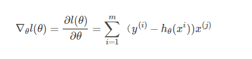

模型关键点在于
1. 模型假设/模型的先验
2. 模型的计算公式，概率分布
3. 模型的损失函数
4. 模型的最优化方法

# 逻辑回归
   
模型假设
逻辑回归的第一个假设是：假设数据服从伯努利分布。第二个假设为假设模型的输出值是样本为正例的概率。

模型公式

线性模型 [公式] 往往用来预测的是连续值，对于分类问题效果往往不好，故考虑再对预测值做一次处理，这个处理的函数称之为连接函数（link function） 。
sigmoid，或者说exponential family所具有的最佳性质，即maximum entropy的性质。

我们现在关心的是，给定某些假设之后，熵最大的分布。也就是说这个分布应该在满足我假设的前提下越均匀越好。比如大家熟知的正态分布，正是假设已知mean和variance后熵最大的分布。

逻辑回归采用对数似然损失函数

L(Y,P(Y∣X))=−logP(Y∣X)

梯度公式

也可以写成向量形式
