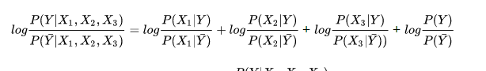
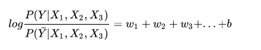
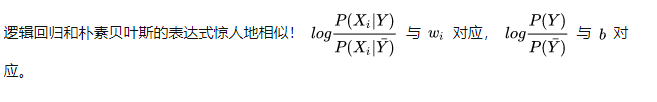

生成模型需要详细描述概率步骤, 生成模型必须和贝叶斯绑定，通过数据直接学习概率转移矩阵，比如我们需要p(y|x)

对于生成模型，必须要学到p(xy), p(x|y)得概率分布，再根据贝叶斯公式计算得到p(y|x)。

对于判别模型，直接通过数学模型，对后验概率进行拟合，不会通过显示的概率模型来计算。

比如朴素贝叶斯和逻辑回归，就是同一个假设下的（x1,x2...相互独立）生成模型和判别模型

朴素贝叶斯公式如下

逻辑回归公式如下

一个是生成模型，一个是判别模型，所以生成和判别的所有区别它们都有；一个是贝叶斯，一个是最大似然，这是两种概率哲学的区别；一个需独立假设才能算出来，但这个假设啊，sometimes naive；一个需要假设问题对参数是线性的，这个假设虽然too simple，但配合特征交叉等技术，效果常常也是可以赛艇的；

