# 传统

传统扩散模型，一般的文章都会提到能量模型（Energy-based Models）、得分匹配（Score Matching）、朗之万方程（Langevin Equation）等等，简单来说，是通过得分匹配等技术来训练能量模型，然后通过郎之万方程来执行从能量模型的采样

如今生成扩散模型的大火，则是始于2020年所提出的DDPM（Denoising Diffusion Probabilistic Model），虽然也用了“扩散模型”这个名字，但事实上除了采样过程的形式有一定的相似之外，DDPM与传统基于朗之万方程采样的扩散模型可以说完全不一样，这完全是一个新的起点、新的篇章。
准确来说，DDPM叫“渐变模型”更为准确一些

有意思的是，DDPM的数学框架其实在ICML2015的论文《Deep Unsupervised Learning using Nonequilibrium Thermodynamics》就已经完成了，但DDPM是首次将它在高分辨率图像生成上调试出来了，从而引导出了后面的火热。由此可见，一个模型的诞生和流行，往往还需要时间和机遇

https://kexue.fm/archives/9119

# 理论基础

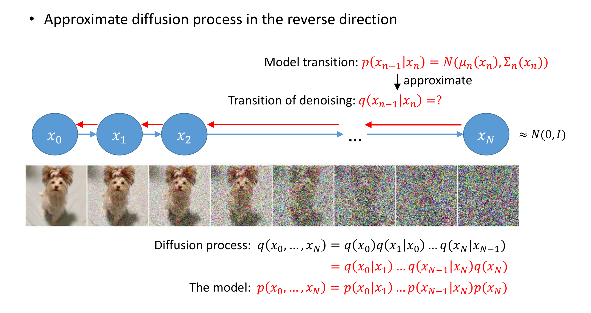

diffusion模型是一种逐渐变换进行隐变量推断的过程，相比于vae直接假设隐变量是正态分布，并且一步完成x到隐变量z的变换，
diffusion采用多部变幻的过程，每一步变换的概率分布都符合正态分布，同时最终的隐变量z也是标准正态分布，类似多段直线拟合曲线的思路，这种方式生成的图片清晰度更高

正向传导:
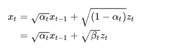
$\hspace{1em} \alpha_t + \beta_t = 1$

这里$z_t$属于标准正态分布，相当于加入图像中的噪音，$\alpha_t$是常数,是自己定义的变量, 相当于不断减少原始图像，增加随机噪音, $\beta_t$(论文中2时从0.0001 -> 0.02) (这是因为一开始加一点噪声就很明显,后面需要增大噪声的量才明显), 随着T增大越来越接近纯高斯分布,

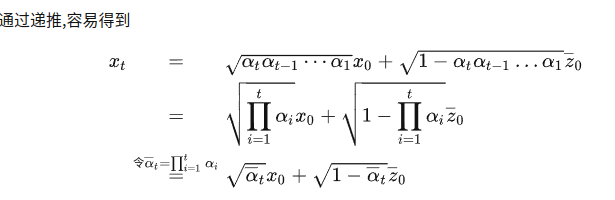

$\overline{z_0}$是一个标准正态分布我们可以从x_0得到任意时刻的x_t的分布:
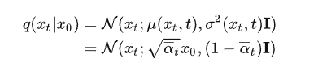

加噪过程是确定的,没有模型的介入. 其目的是制作训练时标签

逆向过程可以通过各种方式求导出来，比如贝叶斯，最终的结果是
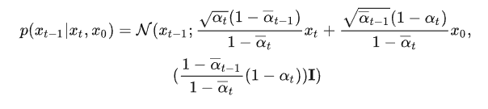

逆向过程也是一个正态分布，但是这个正态分布的均值依赖于$x_0$, 这不是我们想要的，一个“异想天开”的想法是通过$x_t$来预测$x_0$, 根据上文的加噪过程,我们可以很容易制造训练所需的数据对! (Dalle2的训练采用的是这个方式,可能这就是大力出奇迹吧). 优化目标可以表示为:

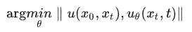

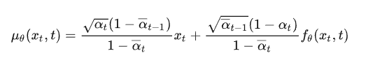
因为上面$q(x_{t-1}|x_t, x_0)$正态分布的方差是确定的, 因此只需要最小化均值分布和模型计算出的分布的最小值. 这里$f_{\theta}$就是模型预测出的$x_0$.

DDPM作者表示直接从$x_t$到$x_0$的预测数据跨度太大了,且效果一般.我们可以将上面$x_0$在生成过程中的推导公式带入$\mu_{\theta}$

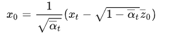

从而得到$\mu_{\theta}$的公式

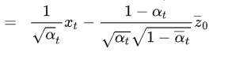
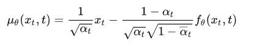

此时对齐均值的问题就转化成:给定$x_t, t$, 预测$x_t$加入的噪音$\overline{z_0}$, 它是一个正态分布

这就是反向的采样过程所用的分布，连同采样过程所用的方差也一并确定下来了

具体推导参考
https://kexue.fm/archives/9164

这里的$\mu(x_t)$是来预估$x_0$的，要是能预估准的话，那就直接一步到位了，还需要逐步采样吗？ 真实情况是，至少开始的相当多步内不会太准。它仅仅起到了一个前瞻性的预估作用，然后我们只用$p(x_{t-1}|x)$来推进一小步，这就是很多数值算法中的“预估-修正”思想，即我们用一个粗糙的解往前推很多步，然后利用这个粗糙的结果将最终结果推进一小步，以此来逐步获得更为精细的解。

## 模型训练
训练的目标就是这所有时刻两个噪声的差异的期望越小越好(用MSE或L1-loss).

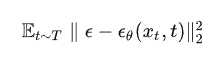

## 采样生成

## 优化目标
我们希望q和p的概率分布尽可能相等，因此我们可以用kl散度（衡量两个分布的差异）作为损失函数

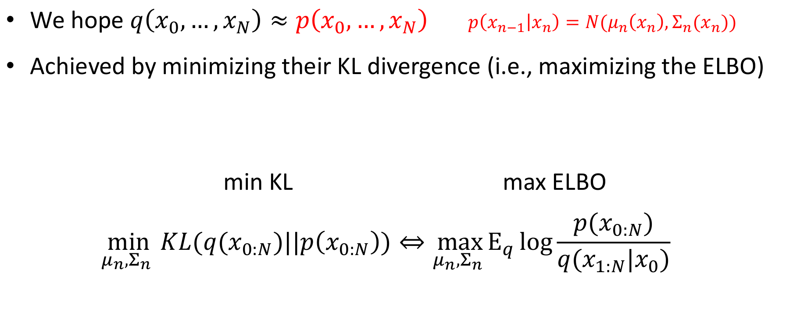

# vae视角

vae中只建模了p(z|x), p(x|z)和p(z)，并且假设他们是正态分布，这限制了模型的表达能力，最终通常得到偏模糊的生成结果

为了突破这个限制，DDPM将编码过程和生成过程分解为T步

编码: $x = x_0 \rightarrow x_1 ...... \rightarrow x_T = z$
解码: $z = x_T \rightarrow x_{T-1} ...... \rightarrow x_0 = x$

这里$p(x_t|x_{t-1})$和$q(x_{t-1}|x_t)$都表示为正态分布，仅仅负责建模一个微小变化，为什么分解为多步会比单步要好？这是因为对于微小变化来说，可以用正态分布足够近似地建模，类似于曲线在小范围内可以用直线近似，多步分解就有点像用分段线性函数拟合复杂曲线，因此理论上可以突破传统单步VAE的拟合能力限制
$p(x_t|x_{t-1}) = \mathcal N(x_t; \alpha_{t}x_{t-1},\beta^2_t I)$

这里建模的正态分布，均值由$x_{t-1}$缩放得来，相比之下传统VAE的均值方差都是用神经网络学习出来的，因此DDPM是放弃了模型的编码能力，最终只得到一个纯粹的生成模型，$q(x_{t-1}|x_t)$则被建模成均值向量可学习的正态分布

$q(x_{t-1}|x_{t}) = \mathcal N(x_{t-1}; \mu{x_t},\sigma^2_t I)$

$\alpha_t, \beta_t, \sigma_t$都不是可训练参数，而是事先设定好的值, 所以整个模型拥有可训练参数的就只有$\mu(x_t)$

同样的道理，DDPM的优化目标是联合分布p(x)和q(x)的kl散度，
$KL(p||q) = \int p(x) \frac{p(x)}{q(x)} d_{x_0} \cdots d_{x_t}$
$p(x) = p(x_T|x_{T-1}) \cdots p(x_1|x_0)p(x_0) $
$q(x) = q(x_0|x_1) \cdots q(x_{T-1}|x_t) q(x_T)$

由于目前分布p不含任何的可训练参数，因此KL散度中关于p的积分就只是贡献一个可以忽略的常数，所以优化目标等价于等价于最大化

$target = -\int p(x) (\log q(x_T) + \sum_{t=1}^T \log q(x_{t-1}|x_t))$
$\hspace{3em} = $

$q(x_t)$一般都用正态分布，没有参数，也就是积分是一个常数,又因为$q(x_{t-1}|x_{t})$最多依赖到$x_t$

对于每一个decode节点$q(x_{t-1} | x_t)$, 优化目标是
$target = - \int \prod_{t=T}^{0}p(x_t|x_{t-1}) p(x_0) \sum_{t=1}^{T} \log q(x_{t-1}|x_t)$
$\hspace{3em} = - \int p(x_t|x_{t-1}) p(x_{t-1}|x_0)p(x_0)\log q(x_{t-1}|x_t)$

因为假设$x_t$只依赖$x_{t-1}$

之后的推导比较复杂可以参考，最终结果就是得到标准的损失函数
https://kexue.fm/archives/9152

# 多视角

diffusion可以从多种视角看，比如VAE, score-based, SDE其实都是一样

I think this is exacerbated by the fact that there are multiple formalisms (e.g. VAE-style, score-based, SDE, ...) and everything has 2-3 different names, depending on who you ask!

# bayes视角

# 发展史
* 2015年提出理论基础，不是传统扩散模型，而是vae变种
* 2020年来自加州大学伯克利分校的一篇题为DDPM去噪扩散概率模型的NeurIPS论文，在更加庞大的数据集上展现出与当时最优的生成对抗网络（GAN）模型相媲美的性能
* DDIM, 在提升了DDPM采样效率的基础上，仅用50步就能达到1000步采样的效果,其作为确定性的采样方法还为后续的研究开创了一种类似于GAN Invesion的方法，用于实现各种真实图像的编辑与生成
* score-based的方案验证，最终得到了统一
* 2021年的二月，OpenAI发布了“Improved Diffusion”：这篇论文提出了后来被广泛采用的Cosine Noise Schedule，Importance sampling，以及Stride Sampling加速采样等技术
* 2021年五月OpenAI所发布的“Classifier Guidance”（亦被称为Guided Diffusion）。这篇论文提出了一项重要的策略，即通过基于分类器的引导来指导扩散模型生成图像。借助其他多项改进，扩散模型首次成功击败了生成领域的巨头“GAN”，同时也为OpenAI的DALLE-2（一个图像和文本生成模型）的发布奠定了基础
* 2021年的十二月，DDPM的一作发布了“Classifier Free Guidance”：对“Classifier Guidance”进行了改进，使得扩散模型的引导过程仅需使用扩散模型本身，而不再需要依赖分类器进行实现。这一创新极大地丰富了扩散模型的应用范围与灵活性
* 来自浙江大学的“PNDM”和清华朱军团队的“Analytic-DPM”，将扩散模型的采样加速推向极致

https://zhuanlan.zhihu.com/p/651613931

https://zhuanlan.zhihu.com/p/653376314

