# 总结

SVM. 硬间隔，用于线性可分的情况下，优化目标是离分类平面函数距离最近的点，到超平面的几何距离。硬间隔约束了最小函数距离为1，线性不可分的情况下同样不成立。

显然线性不可分的情况下，分类错误的点函数距离是负数，最小化他们的几何距离没有任何意义，类似硬间隔，到超平面函数距离为1的平面，不再约束所有点函数距离大于1，而是改为1-松弛变量，相当于提供了一定的错误容忍度，同时将松弛变量加入到优化目标中，作为惩罚, 函数距离大于1的点，松弛变量为0，不会被惩罚。

同时软间隔的定义也可以看作hinge loss + 正则项.
因为最小化几何距离可以看作最小化w^T * w, 相当于参数正则, 后面的惩罚系数也只对支撑向量起作用

为什么要通过对偶问题得到SVM原问题的最优解？
对偶问题更好求解，因为可以简化约束条件。
SVM本质是一个二次规划问题。

拉格朗日函数是原问题的一个下界。
拉格朗日对偶问题是个最优化问题，他的目标是最大化拉格朗日函数（最大化下界）。
对偶问题求解出来的最大下界不一定是原优化问题的最小值，这两者之间的差成为 gap. gap为0的情况下，称为强队偶，否则是弱对偶。

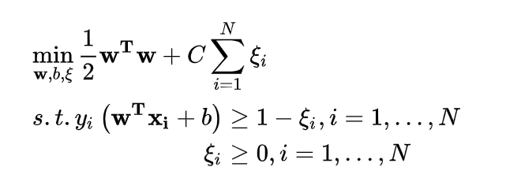

支持向量是拉格朗日系数大于0的样本点，其他样本点拉格朗日系数为0，因此除了支持向量都对优化问题没有影响，最后w,b的最优解也只包含支持向量。

核函数的理解：核函数就是一个函数，接收两个变量，这两个变量是在低维空间中的变量，而核函数求的值等于将两个低维空间中的向量映射到高维空间后的内积.
核函数包含高斯核和线性核。高斯核用于线性不可分的情况。核函数需要保证，得到的内积矩阵是半正定的。

当特征维数 d 超过样本数 m 时 (文本分类问题通常是这种情况), 使用线性核;
当特征维数 d 比较小. 样本数 m 中等时, 使用RBF核;
当特征维数 d 比较小. 样本数 m 特别大时, 支持向量机性能通常不如深度神经网络

SVM的损失函数可以写成损失函数+正则化的样子, 此时SVM损失函数跟逻辑回归很相似，但是SVM采用的是hinge loss, 也就是max(0, 1 - 函数距离), 也就是只有函数距离小于1的点才会带来损失。

当原问题不是凸优化的时候，KKT条件是判断强对偶的一种必要条件。
当原问题是凸优化问题的时候，KKT条件是判断强对偶的充要条件。

上面说的二次规划算法，算法复杂度正比于训练集规模，而SMO算法采用一种迭代更新的策略，一次只更新两个变量，直至满足KKT条件。

# 面试题
二分类转换，经典的拆分算法有“一对一”，“一对多”
## 和函数
优点：因为线性核不需要额外的计算，所以速度很快，适合数据量较小的情况；
缺点：因为只是简单的线性问题求解，所以只适合线性可分的数据分布；

高斯核

优点：适合线性不可分的情况，一般都能有好效果；只有一个grmma参数，非常好调整；适合特征<样本的情况。
缺点：RBF核：分类结果非常依赖于参数。有很多人是通过训练数据的交叉验证来寻找合适的参数，不过这个过程比较耗时。我个人的体会是：使用libsvm，默认参数，RBF核比Linear核效果稍差。通过进行大量参数的尝试，一般能找到比linear核更好的效果。至于到底该采用哪种核，要根据具体问题，有的数据是线性可分的，有的不可分，需要多尝试不同核不同参数。如果特征的提取的好，包含的信息量足够大，很多问题都是线性可分的。当然，如果有足够的时间去寻找RBF核参数，应该能达到更好的效果。

优点
SVM有多种核可以选择，在选对核函数的基础上，可以处理各种非线性问题，整体收益较高。
SVM 的最终决策函数只由少数的支持向量所确定,计算的复杂性取决于支持向量的数目,而不是样本空间的维数,这在某种意义上避免了“维数灾难”
强调支持向量样本，在一定程度上具有一定的鲁棒性
支持不均衡数据的学习
缺点
SVM算法对大规模训练样本时只能选择线性核，其他核函数耗时太长无法满足性能要求。但是线性核的准确率较低，无法满足准确性要求，所以只能运用在小规模机器学习问题上。
用SVM解决多分类问题存在困难，经典的算法只给出了二分类的情况

## 和LR区别
两种方法都是常见的分类算法，从目标函数来看，区别在于逻辑回归采用的是logistical loss，svm采用的是hinge loss

逻辑回归通过非线性映射，大大减小了离分类平面较远的点的权重，相对提升了与分类最相关的数据点的权重。两者的根本目的都是一样的。此外，根据需要，两个方法都可以增加不同的正则化项，如l1,l2等等。所以在很多实验中，两种算法的结果是很接近的。

SVM大数据处理方面，性能不太好.速度慢并且效果也很难保证.
线性SVM依赖数据表达的距离测度，所以需要对数据先做Normalization，  LR不受其影响

在解决非线性问题时，SVM采用核函数的机制，而LR通常不采用核函数

在计算决策面时，SVM算法里只有少数几个代表支持向量的样本参与了计算，也就是只有少数几个样本需要参与核计算（即kernal machine解的系数是稀疏的）。然而，LR算法里，每个样本点都必须参与决策面的计算过程，也就是说，假设我们在LR里也运用核函数的原理，那么每个样本点都必须参与核计算，这带来的计算复杂度是相当高的。所以，在具体应用时，LR很少运用核函数机制。

LR学习算法有: 改进的迭代尺度算法，梯度下降，拟牛顿法

SVM学习算法: 序列最小优化算法（SMO）

# SVM实践

SVM对缺失数据敏感？

这里说的缺失数据是指缺失某些特征数据，向量数据不完整。SVM 没有处理缺失值的策略。而 SVM 希望样本在特征空间中线性可分，所以特征空间的好坏对SVM的性能很重要。缺失特征数据将影响训练结果的好坏。

# 支持向量

线性可分是指，可以找到一个超平面，将数据集刚好分为两类。

超平面可以表示为

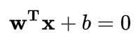

这里w是超平面的法向量（平面上任意向量和法向量内积为0）的缩放版本(法向量长度为1, w缺少这个约束).

SVM 目标是找到一个最优的分离超平面，尽可能地降低(对新数据)分类的错误率。直观的讲，就是希望数据集中的样本离这个超平面的距离越远越好。

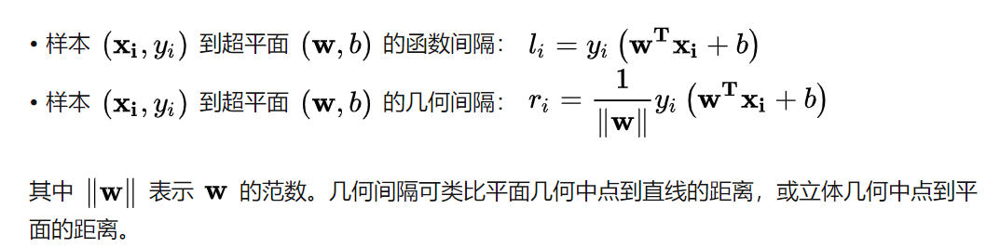

样本(xi, yi)到超平面任意一点的构成的线段与法向量的内积: w^T * (xi - x') = w^T *xi + b，此时我们还需要， 因为要处理分类标签，因此我们将内积乘以yi, 约束正例位于法向量一侧，这也方便了优化问题的定义。
但是内积距离受到w,b大小的影响（w,b同比例缩放并不会影响超平面，但是会影响。因此我们采用几何距离, 几何距离也可以理解为xi在法向量的投影长度.

## 硬间隔
在线性可分得情况下，我们可以定义基于硬间隔的最优化目标

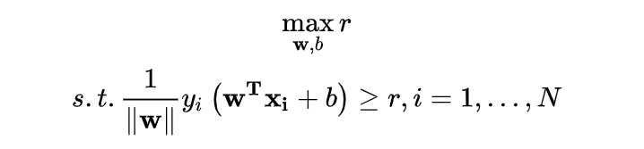

这里r代表数据集X到超平面，所有样本的最小值，约束条件定义了这个属性，同时分类错误的样本会得到很大的惩罚（r为负数），所以也相当于约束了不会出现分类错误（线性可分）

若将w,b同比例缩放，不会改变超平面的方程，也不会改变样本到超平面的几何间隔，但会改变函数间隔。
所以我们不妨设置更严格的约束，让函数最小间隔l设为1，此时l = r||w|| = 1（此时线性可分的情况下，最优解依旧在这个约束空间中）, 并去除二范数根号 优化目标变为

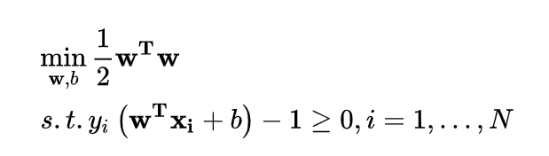

这是个凸二次规划(convex quadratic programming)问题， 就可以得到超平面。

线性不可分的情况下，假设最小函数距离l = 1就不成立了, 没有可行解。如果从最开始的公式求解，
硬间隔受异常点影响非常大，线性不可分的情况下总会出现异常点，此时r就变成了异常点的几何距离.

# 软间隔

为使SVM适用于线性不可分的数据集，需要对目标函数和约束条件进行修改。

首先，在约束条件中引入非负的松弛变量(slack variable) ，松弛变量是线性规划常用的技术，其思想跟softmax之类很相似，比起强制约束所有x都在约束范围内，松弛变量允许了一定范围的分类错误，松弛变量对违反约束的样例进行了一定惩罚，通过松弛变量将约束引入到了目标函数中.

此时我们设定一个软分类平面，类似于硬间隔下距离超平面最近的点，这个平面上的点到分类超平面函数距离为yi(w^Txi + b) = 1
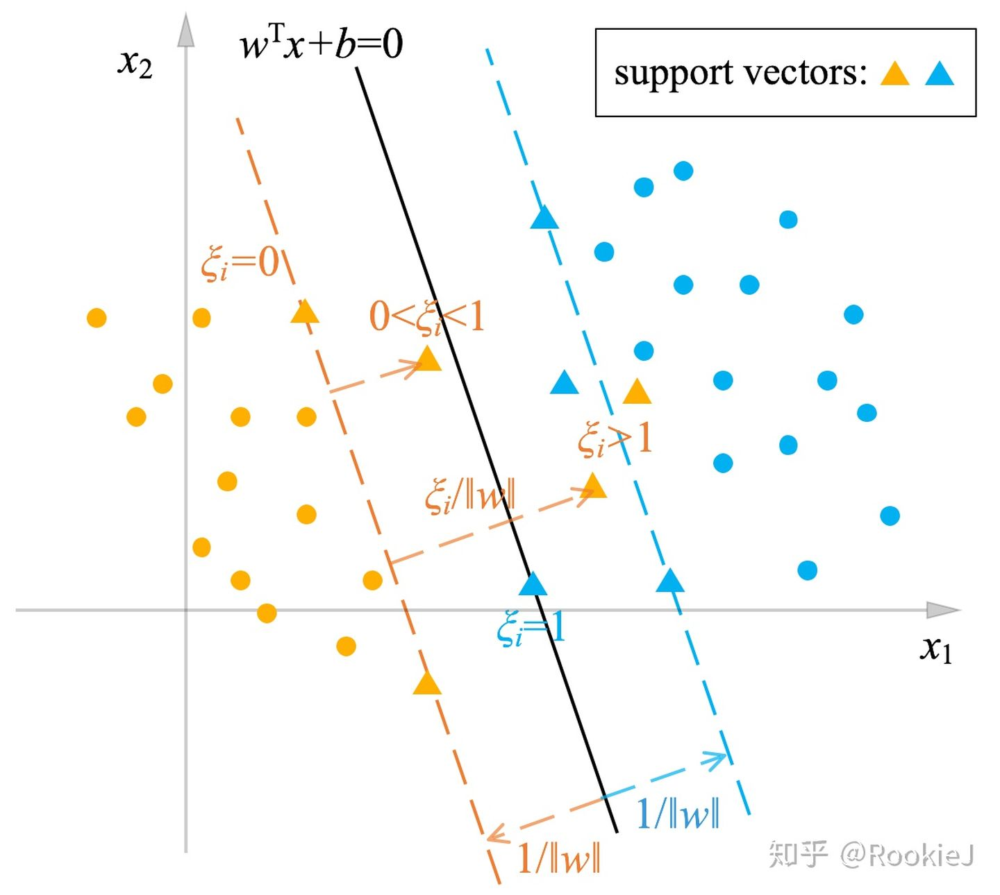

但是这里我们不再约束这些点为到超平面最近的点，我们在约束条件中加入松弛变量， 约束变为函数距离大于1-松弛变量
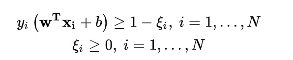
通过加入松弛变量，即使是线性不可分，此时约束空间依旧存在，此时我们只需要在优化目标中引入松弛变量加以惩罚。就可以得到

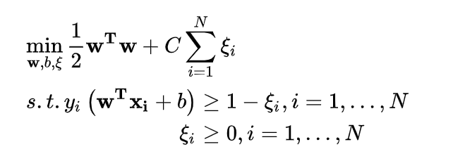

这里C>0代表可选择的惩罚参数，是对错误的惩罚(error penalty), 松弛变量代表了与支持向量的偏移程度。此时我们的优化目标就变成了最大化支持向量到超平面的几何距离。

新的优化问题 [公式] 允许距离分离超平面函数间隔小于1，甚至是被误分类的样本的存在。这同样也是一个凸二次规划问题

此外，也可以定义更灵活的惩罚因子。

## 支持向量

支持向量对应了， (a) 最优拉格朗日乘子>0的样本. 如下图所示

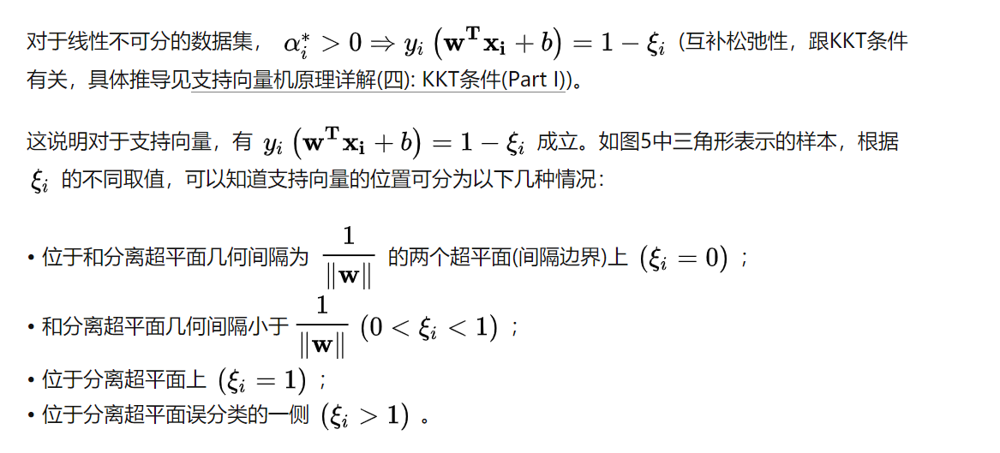

从上面看来，支持向量是真正起到约束作用的样本点，他们的松弛变量都被约束到了最边界的地方。
上面的公式只是充分条件，反过来是推不出来的。

线性可分的情况下(a) => 函数距离为1（互补松弛性，跟KKT条件有关)

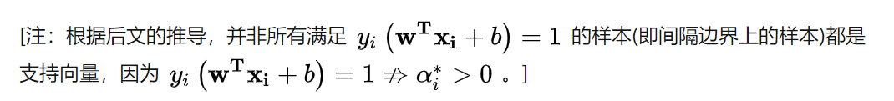

# hinge loss

软间隔也可以看作hinge loss

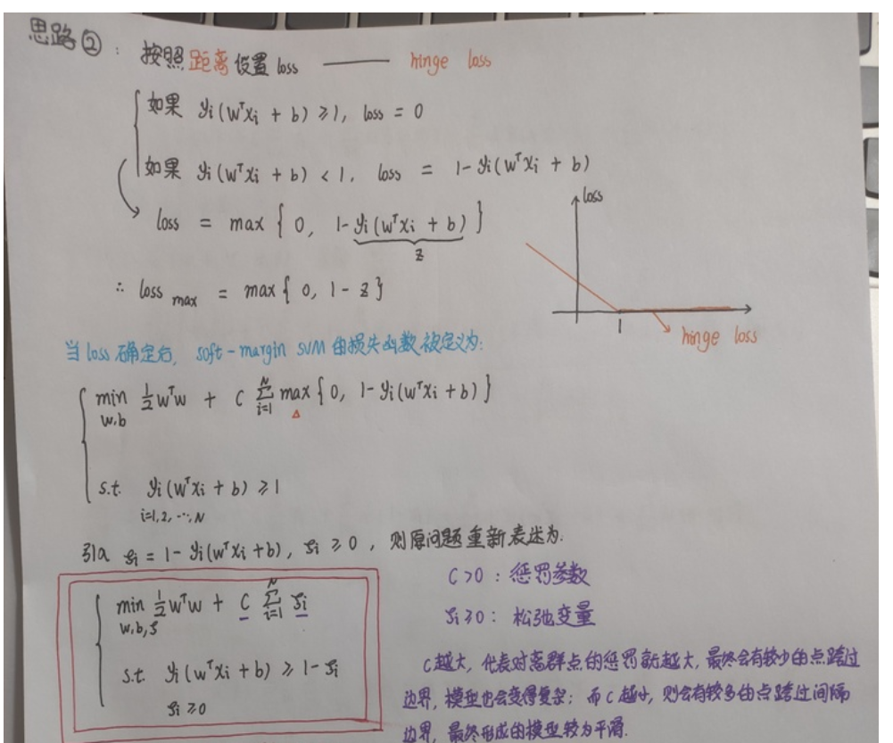

# 拉格朗日对偶

拉格朗日函数是原问题的一个下界。
拉格朗日对偶问题是个最优化问题，他的目标是最大化拉格朗日函数（最大化下界）。
对偶问题求解出来的最大下界不一定是原优化问题的最小值，这两者之间的差成为 gap. gap为0的情况下，称为强队偶，否则是弱对偶。

KKT条件是判断强对偶的一种必要条件。

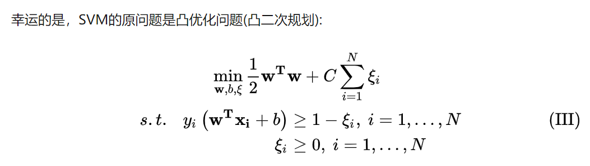

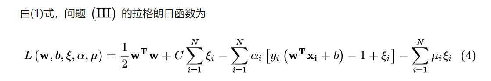

注意这里因为约束是>=所以拉格朗日函数中是减号

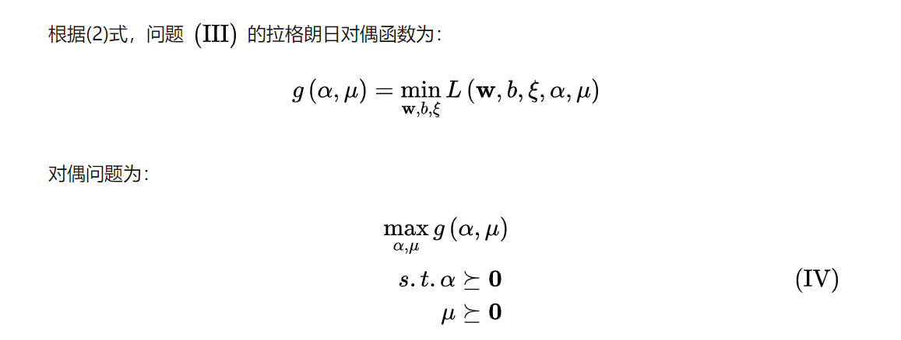

拉格朗日函数是一个凹函数，局部最优就是全局最优，