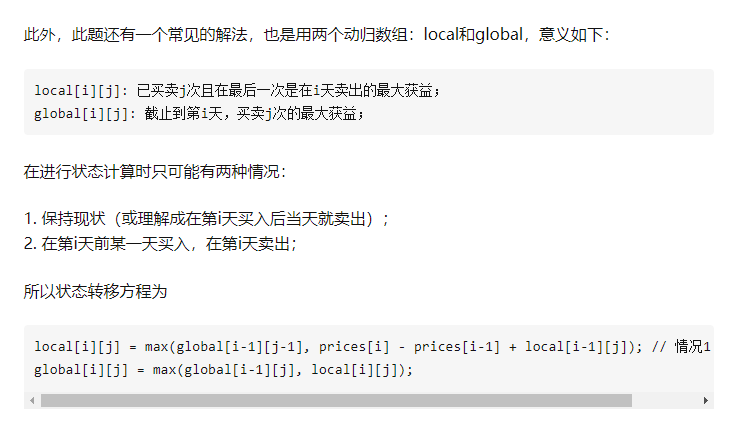

# 买卖一次

保存当前最小值，循环拿到最大差

# 无限次买卖无惩罚
贪心，当天股价低于明天就买入，然后明天卖出


# 买卖两次
可以用相同的动态规划解决


# 最多k次交易

最容易理解的dp， 我们可以用一个三维dp解决

dp[i][j] 表示前i天进行j次交易的最大收益,

我们可以通过一个三重循环解决这个问题.
dp[i][j] = max(dp[k][j-1]+price[j] - price[k]) for k in range(0, j)


但是这种方法其实很纯. 我们可以把右边的max也抽象成一个动态规划，那么我们使用两个数组




另一种方法是,
我们可以定义两个数组dp0[i][j], dp1[i][j]
代表已经做了j次交易并且手上没有股票/有股票的最大收益。

dp0[0][:] = 0
dp1[0][:] = -prices[0]
dp1[i][0] = max(dp[i-1][0], -prices[i])

dp0[i][j] = max(dp0[i-1][j], dp1[i-1][j-1] + prices[i])
dp1[i][j] = max(dp[i-1][j], dp[i-1][j] - prices[i]) //这里时dp[i-1][j]是因为j代表已经完成j次交易，而买入新股票还不算完成

``` c++
int maxProfit(int k, vector<int>& prices) {
    int n = prices.size();
    if(!n || !k) return 0;

    if (k > n / 2) { // 当k很大时相当于不限制次数
        int res = 0; int hold = prices[0];
        for (int i = 1; i < n; i++)
            res += max(0, prices[i] - prices[i - 1]);
        return res;
    }

    vector<vector<int>>dp0(n, vector<int>(k+1,  0));
    vector<vector<int>>dp1(n, vector<int>(k+1,  0));

    for(int j = 0; j <= k; j++) dp1[0][j] = -prices[0]; // i = 0
    for(int i = 1; i < n; i++){
        dp1[i][0] = max(dp1[i-1][0], -prices[i]); // j = 0

        for(int j = 1; j <= k; j++){ // j > 0
            dp0[i][j] = max(dp0[i-1][j], dp1[i-1][j-1] + prices[i]); // 保持 or 卖出
            dp1[i][j] = max(dp1[i-1][j], dp0[i-1][j] - prices[i]); // 保持 or 买入
        }

    }
    return dp0[n-1][k];
}
```


# 交易但是有交易费用
``` java
    //dp0, 代表手上没股票时的最大收益，dp1代表受伤没有股票时的最大收益
    int dp0 = 0, dp1 = - prices[0];
    for(int i = 1; i < n; i++){
        int pre_dp0 = dp0;
        // 唯一和122不限次数不同就是减去fee
        dp0 = max(dp0, dp1 + prices[i] - fee); 
        dp1 = max(dp1, pre_dp0 - prices[i]);
    }
    return dp0;

```


# 冷冻期

卖出后必须至少隔一天才能继续买，也即新增了一个状态："处于冷却期"

dp0[i]: 第i天结束，手头没有股票时的最大利润
dp1[i]: 第i天结束，手头有股票时的最大利润
cool[i]: 第i天结束, 距离最后一次卖出事件 > 1天最大利润
状态转移方程为：

dp0[i] = max(dp0[i-1], dp1[i-1] + prices[i]); // 保持 or 卖出
dp1[i] = max(dp1[i-1], cool[i-1] - prices[i]); // 保持 or (冷却 -> 买入)
cool[i] = max(cool[i-1], dp0[i-1]); // 第i-1天结束时没有股票说明第i天可以是冷却期


```python
    int dp0 = 0, dp1 = - prices[0], cool = 0;
    for(int i = 1; i < n; i++){
        int pre_dp0 = dp0;
        dp0 = max(dp0, dp1 + prices[i]);
        dp1 = max(dp1, cool - prices[i]);
        cool = max(cool, pre_dp0);
    }
```