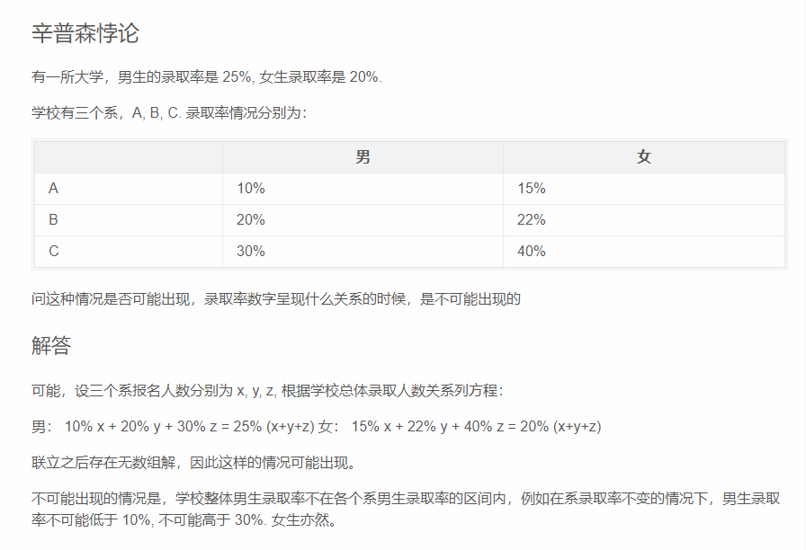

https://www.zhihu.com/question/330408241

# 筛子游戏

https://www.zhihu.com/question/30470526

概率和游戏策略
游戏规则如下：你总共最多能够投三次骰子，每次投完之后你可以选择：

很直观的思路就是当前筛子数组，大于用剩下次数能拿到的最大期望分数，就保留，此时可以表示为下面的递推公式

在倒数第二轮时，可以应用上述思路，得出应当在 4 收手的策略。在这一策略下，倒数第二轮的数学期望为 1/6 * 6 + 1/6 * 5 + 1/6 * 4 + 1/2 * 3.5. 即，在投出 4 以上时，获得此次点数，在投出 4 以下时，获得最后一次投掷的数学期望。如此计算得到的值为 4.25.

第三轮时，已知“继续”选项的期望为 4.25, 因此策略为 5 以上收手。在这一策略下，倒数第三轮的期望为 1/6 * 6 + 1/6 * 5 + 2/3 * 4.25 最终得到结果为 4.67

dp数组的值

# 辛普森悖论

# 查柜子

我有一个柜子，柜子有均匀分布的七个抽屉，在这七个抽屉中找我想要找的文件。如果文件在这个柜子中的概率是80%，我找了六个抽屉没有找到文件，那么文件在第七个抽屉的概率是多少呢？

A = 第七个抽屉有文件
B = 前六个抽屉没有文件
C = 文件在这个柜子里
P(A|B)

= P(AB)/P(B)

= P(B|A)P(A)/P(B)

= P(B|C)P(C)/P(B)

= 1/7 * 0.8 / （1 – 6/7 * 0.8）

# 