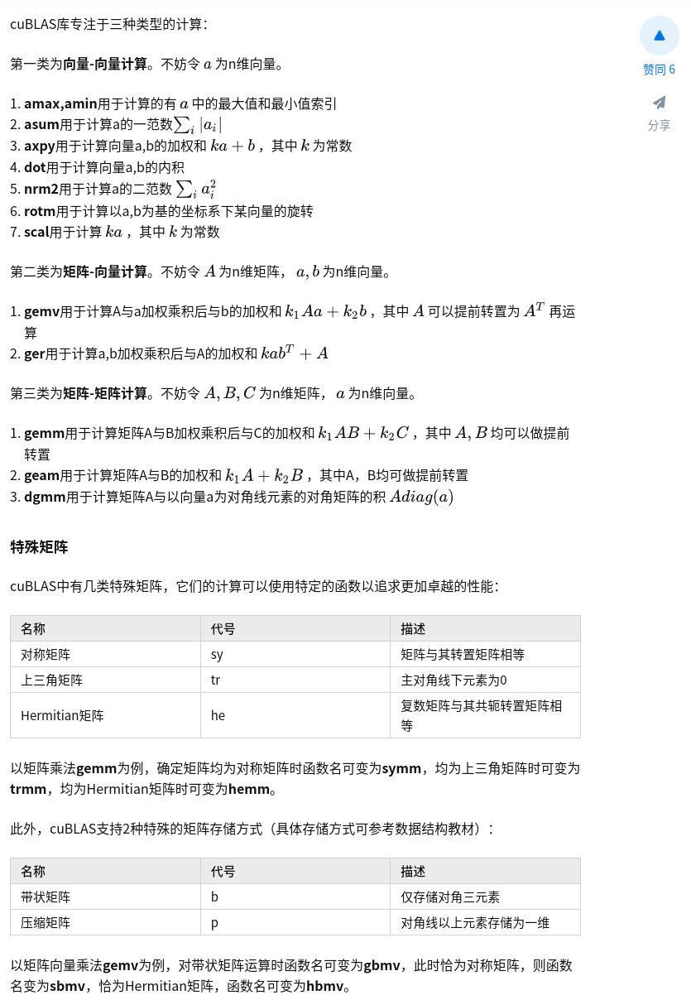
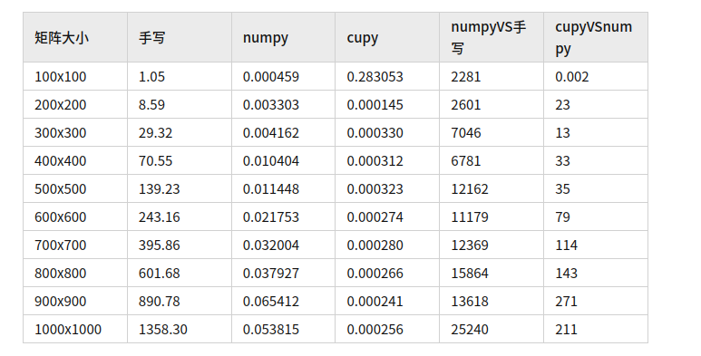

# numpy底层

BLAS实现在每种操作上都进行了高度优化，例如使用AVX向量指令集，甚至能比你自己用C实现快上许多

2020年，Numpy的论文登上了Nature, array programming with numpy.

stride，broadcast，view等功能

# blas

BLAS 代表基本线性代数子程序，并且是处理线性代数运算的低级例程的标准。 低级例程包括向量和矩阵加/乘，线性组合等操作。

常见算子包含下面几种:

目前的科学计算软件并没有使用Strassen算法，而是用内存布局的优化+BLAS的方法

常见算子可以参考:
https://github.com/OpenMathLib/OpenBLAS/blob/develop/benchmark/hemv.c

https://zhuanlan.zhihu.com/p/595030011

https://xilinx.github.io/Vitis_Libraries/blas/2021.1/benchmark.html

https://blog.csdn.net/qq_39036287/article/details/106885443

# lapack

LAPACK 代表线性代数软件包，并包含更高级的操作。 LAPACK 提供了用于矩阵分解（例如 LU，Cholesky 和 QR）以及解决特征值问题的例程。 LAPACK 主要取决于 BLAS 例程。

https://github.com/apachecn/apachecn-ds-zh/blob/master/docs/master-num-comp-numpy/8.md  

# 相关库
https://github.com/nschloe/awesome-scientific-computing

https://github.com/rossant/awesome-math

# truffer
Truffer没有实现矩阵求逆、SVD分解、QR分解、特征值等基本操作
