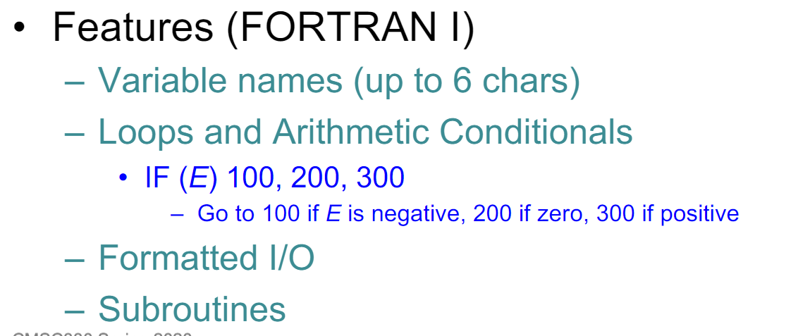
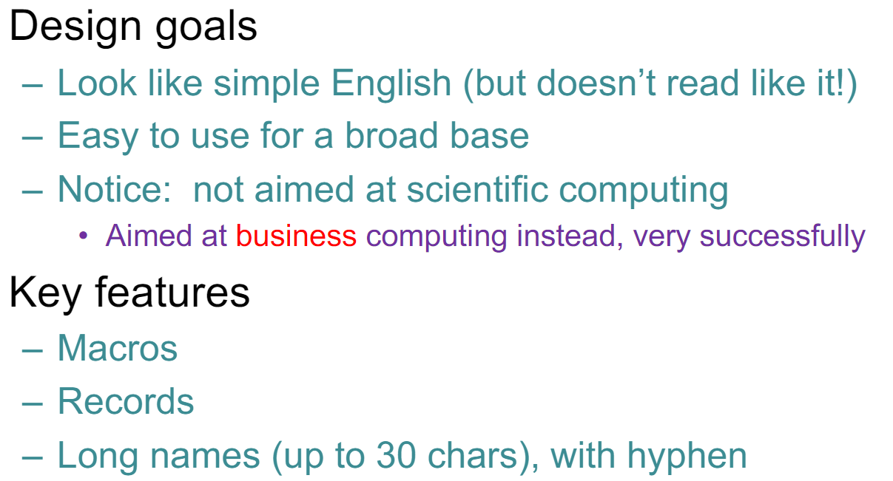

# 历史

## FORTRAN (1954 -1957)
Developed at IBM by John Backus

语法奇怪，need many characters of lookahead to tell the difference between the two for a parser

## COBOL (1959)

Look like simple English (but doesn’t read like it!)
主要用于数据处理，是目前国际上应用最广泛的一种高级语言。它采用 300 多个英语单词作为保留字

## LISP (1958)
Developed by John McCarthy at MIT

Key ideas:
* Symbolic expressions instead of numbers
* Lists, lists, lists
* Functions, functions, functions
    * Compose simpler functions to form more complex functions
    * Recursion
* Garbage collection (mark/sweep)

关键在于 Invented maplist function， 
LISP programs can easily manipulate LISP programs.
Just do list operations to put programs together.

Running a LISP program could kill a timeshared machine.
Idea: design a machine specifically for LISP,可惜被淘汰了

很多人提到Lisp就会想到FP，其实Haskell比Lisp纯粹很多，FP对Lisp并不是什么重要的特性。Lisp被创造时的众多特有功能都被各种新兴语言学走了，其实Lisp剩下的唯一杀手锏就是Homoiconicity了。Lisp是具Homoiconicity的语言中最流行的（如果现在快不行了的Tcl语言不算的话）。也就是说它的AST和代码几乎可以划等号，这也使得它很容易hack，任何非Homoiconic的编程语言的宏都不可能比Lisp强大。

Scheme is Dialect of LISP

## Algol

Led to Pascal, C, C++, and Java•“Algol-like”languages

Had formal grammar (Backus-Naur Form or BNF)

## C (1972)

Designed to build Unix

Two key features
* Arrays and pointers closely related
* Type system lets you use values at any time

## Smalltalk (Early 1970s)
* Object oriented programming ideas from Simula
* Everything is an object
* Intended for non-experts, especially children
* Language and language editing environment integrated into operating system

Objective-C Influenced by Smalltalk

Differences from Java–Send messagesto objects (vs. calling object method)

## C# (2001)

Differences from Java
* Allows restricted pointers
* User defined value types (e.g., C structs)
* SQL-like language integrated queries

