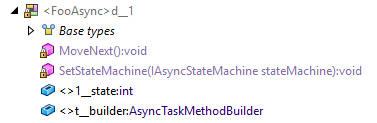
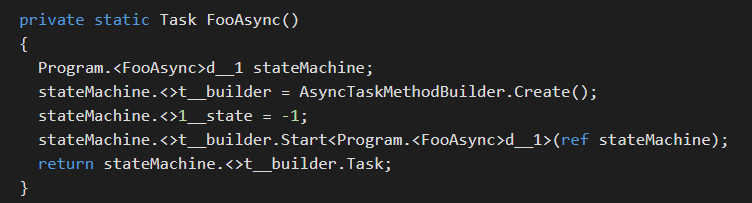
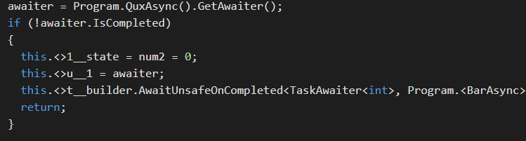

# 0. awaiter

What is awaitable ?
定义了下面的方法的都是awaitable, 都可以使用await关键字
* It has a GetAwaiter() method, Its GetAwaiter() method returns an awaiter. 
* An object is an awaiter if:
	* It implements INotifyCompletion or ICriticalNotifyCompletion interface;
	* It has an IsCompleted, which has a getter and returns a Boolean;
	* it has a GetResult() method, which returns void, or a result(会阻塞)

此外
* INotifyCompletion has one method: void OnCompleted(Action continuation);
* ICriticalNotifyCompletion implements INotifyCompletion, also has this method: void UnsafeOnCompleted(Action continuation);

通过UnsafeOnCompleted我们可以绑定callback上去，因此我们可以看出awaiter同时提供了阻塞和非阻塞的等待支持  

下面我们看一个TaskAwaiter怎么是西安的

## 0.1 Task<TResult>
internal bool TrySetResult(TResult result)
设置res,并调用FinishStageThree

# 1. 状态机模型
## 1.1 StateMachine
每个async方法都会生成一个状态机模型
IAsyncStateMachine interface from System.Runtime.CompilerServices namespace

* MoveNext() - Moves the state machine to its next state.
* SetStateMachine(IAsyncStateMachine) - Configures the state machine with a heap-allocated replica.

IAsyncStateMachine只维护状态转移，Continuation, Context它不管理



t__builder of type AsyncTaskMethodBuilder which is used for creation of asynchronous methods and returning the resulting task. 

生成的async方法调用过程如下



async算法的逻辑都在MoveNext方法中，而这个方法里针对await分解成了不同的状态，await的调用转换成下面的形式


## 1.2 syncTaskMethodBuilder

上文提到了MoveNext中通过AwaitUnsaftOnCompleted来完成异步逻辑的转移

这个函数主要流程是
1. 调用GetCompletionAction构造一个Action
2. action作为Continuation, 并通过awaiter的OnCompleted来注册回调，一般来说这个awaiter都是TaskAwaiter(当然还有YieldAwaiter啥的)

注册回调的过程如下
```c#
if (continueOnCapturedContext)
{
    // If the current context is really just the base SynchronizationContext type(equivalent to not having Context),  then ignore it(avoiding unnecessary posts and queueing).
    var syncCtx = SynchronizationContext.CurrentNoFlow;
    if (syncCtx != null && syncCtx.GetType() != typeof(SynchronizationContext))
    {
        tc = new SynchronizationContextAwaitTaskContinuation(syncCtx, continuationAction, flowExecutionContext, ref stackMark);
    }
    else
    {
        // If there was no SynchronizationContext, then try for the current scheduler.
        var scheduler = TaskScheduler.InternalCurrent;
        if (scheduler != null && scheduler != TaskScheduler.Default)
        {
            tc = new TaskSchedulerAwaitTaskContinuation(scheduler, continuationAction, flowExecutionContext, ref stackMark);
        }
        
}

......

AddTaskContinuation(tc)

Run(Task task, bool canInlineContinuationTask)
{
    // If we're allowed to inline, run the action on this thread.
    if (canInlineContinuationTask &&
        m_syncContext == SynchronizationContext.CurrentNoFlow)
        RunCallback(GetInvokeActionCallback(), m_action, ref Tast_currentTask);
    // Otherwise, Post the action back to the SynchronizationContext.
    // call m_syncContext.Post
    else
        RunCallback(GetPostActionCallback(), this, ref Task.t_currentTas;
}
```

continueOnCapturedContext是由ConfigureAwait来设置
注册回调的过程，首先捕获了SynchronizationContext,如果没有的话就采用TaskScheduler（默认是ThreadPool), 注意注册回调的函数是在调用时执行的，而不是回调，因此context取决于调用者

此时会通过m_syncContext.Post将回调交给scheduler决定，比如如果是wcf，回调就会跑在UI线程


而调用GetCompletionAction构造的Action， 主要用于捕获Excutation Context, 并通过context.Run(callback)的方式来执行MoveNext

```c#
// The builder needs to flow ExecutionContext, so capture it.
var capturedContext = ExecutionContext.FastCapture()
runner = new MoveNextRunner(capturedContext, m_stateMachine);
action = new Action(runner.Run);


class MoveNextRunner
{
    ......
    internal void Run()
    {
        if (m_context != null)
        {
                ContextCallback callback = s_invokeMoveNext;
                if (callback == null) 
                    s_invokeMoveNext = callback = InvokeMoveNext; 
                ExecutionContext.Run(m_context, callback, m_stateMachine, 
                preserveSyncCtx: true);
        }
        else
        {
            m_stateMachine.MoveNext();
        }
    }
    ......
    private static void InvokeMoveNext(object stateMachine)
    {
        ((IAsyncStateMachine)stateMachine).MoveNext();
    }
}

```

同时action会缓存下来，下次调用的时候直接返回，这是因为这个action的作用就是捕获上下文，对于不同的状态机状态，没有区别