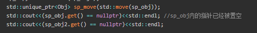
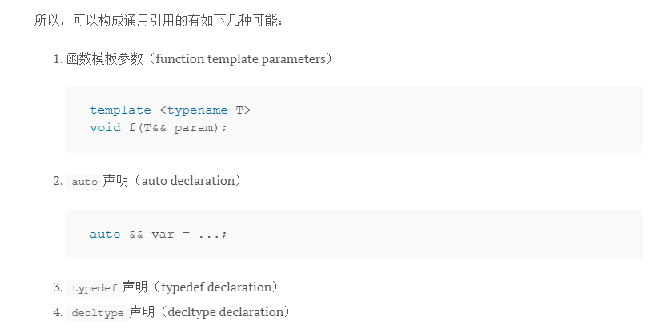

# 1. 智能指针

## unique_ptr
C++11引入了右值引用后，move语义有了语法层面的支持，这给auto_ptr最初的设计理念提供了语言层面的支持，最终标准库提供了资源独占型的智能指针--std::unique_ptr。

   std::unique_ptr是通过删除拷贝构造函数的方式禁止智能指针之间的拷贝，同时提供了移动构造函数来转移智能指针内实际指针的所有权，以此实现了资源独占。

由于std::unique_ptr是独占的，它的对象是不能通过值传递给函数的

void test(std::unique_ptr<Obj> sp_ptr) //compile err

 std::unique_ptr支持自定义deleter

## shared_ptr
无法防止循环引用的问题，而且引用计数本身也有可能受到并发的影响

# 2.RAII
和有GC的语言不同，C++有确定性的析构的语义，所以RAII是最好的选择。
Java，C#这种带GC的语言都有finally关键字，因为这类语言都没有确定的析构的语义，所以需要finally作为补充，毕竟靠GC没法搞定网络/数据库连接，文件等资源的管理

AII是一种资源管理方式，来源于C++，也是Rust使用的资源管理方式

# 3. 右值语义

对于右值（rvalue）的重新定义，语言实现了移动语义（move semantic）和完美转发（perfect forwarding）

右值代表一个赋值表达式的右边。
“移动”代表将资源移交给另一个实例， 通过移动构造函数，事实上我们是做了一个浅拷贝（shallow copy），并将原始的类资源设为空指针

int&事实上是对于int类型左值的引用。而对于右值呢？在新标准当中我们使用int&&来表示. 在需要构造函数的时候，根据引用类型选择构造函数进行调用。
const int &既可以绑定左值，也可以绑定右值，函数重载时const reference可以绑定所有的值，而其他类型的引用只能绑定自己类型的值

所有命名对象都只能是左值引。如果已知一个命名对象不再被使用而想对它调用转移构造函数和转移赋值函数就需要std:move().
std::move()的作用是将左值转换为右值。转换后原始对象不再可用.
鼓励大家对所有的变量(有名字)使用std::move()转成右值

如果我们想要实现我们所说的，如果传进来的参数是一个左值，则将它作为左值转发给下一个函数；如果它是右值，则将其作为右值转发给下一个函数，们需要std::forward<T>()。
在通用引用的情境下，尽可能使用forward()了，因为这样可以在不改变语义的情况下提升性能。

通用引用

因为上面的T是自动推导的，所以不确定T到底是不是右值，尽可能使用forward()。
